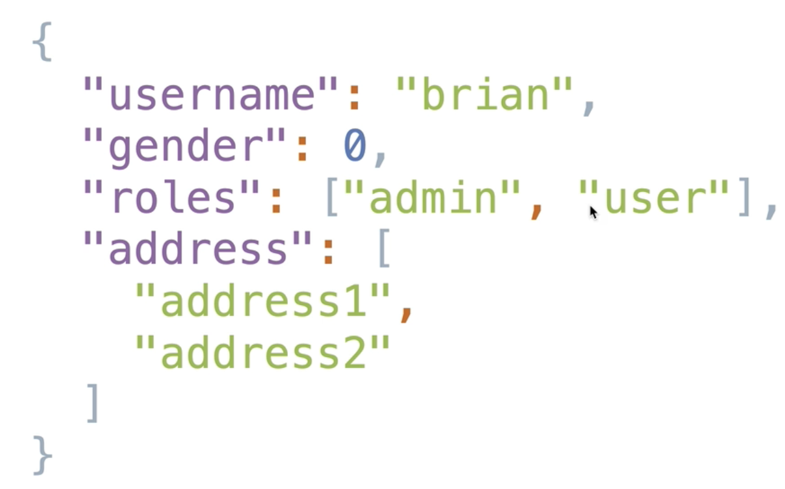
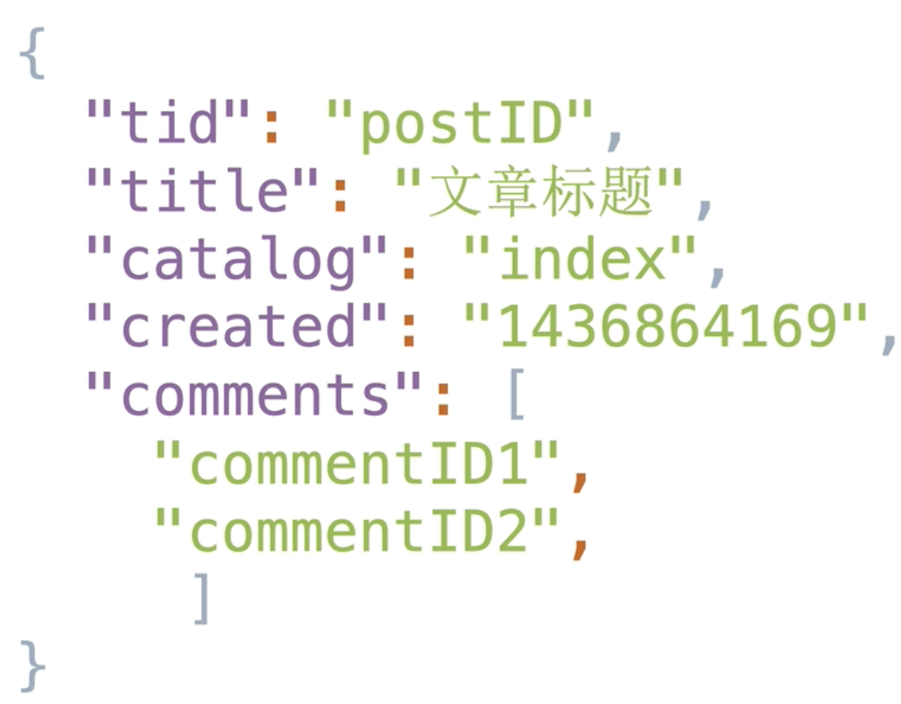
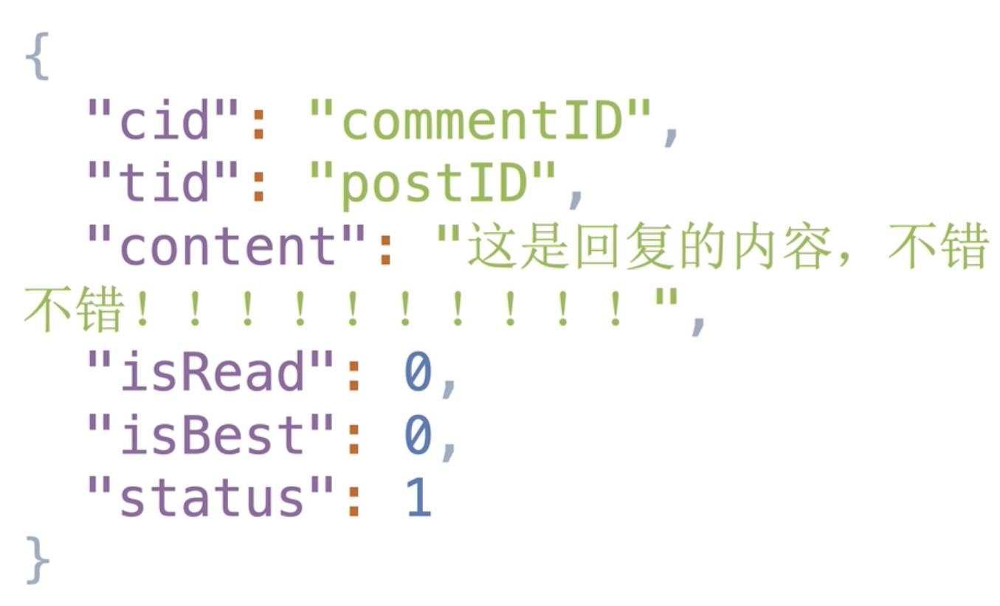
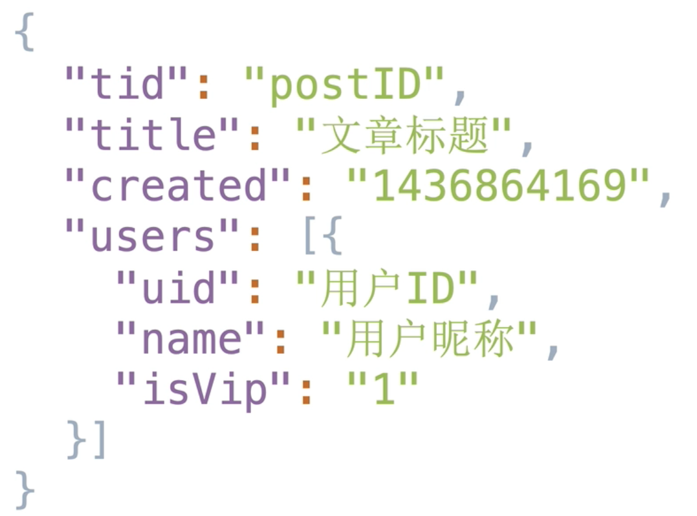

# `NoSQL`数据库的优势

+ 数据结构不固定，易扩展，适合爬虫项目这种数据结构千变万化的存储；
+ 高性能，适合高并发场景，适合消息类型的场景；
+ 架构的扩展不易导致性能的降低，高可用；
+ 较容易映射复杂数据（`key-value`）；
+ 无事务特性要求（`ACID`：原子性、一致性、独立性、持久性）；

# 数据库概念

`关系型数据库`：采用了`关系模型`来组织数据的数据库，如省、市、区的下属关系；

`非关系型数据库（NoSQL）`：对不同于传统的关系数据库的数据库管理系统的统称；

# `NoSQL`数据库设计方法

## 内嵌

是指存在关联关系的文档，放在同一文档中，以数组的形式存放；

如下图是`NoSQL`数据库一条数据的`JSON`表达，`roles`字段中存储属于该对象的同级信息，而在关系型数据库中，因为`roles`内的数据大于1，因此一条数据会被拉伸成多条数据进行存放，莫名其妙地浪费了空间；

该方法适合于一个字段内一对较少地、不易变动的数据的场景；

内嵌解决了以下经典关系型数据库所存在的问题：

+ 减少了关联查询，我们查询一次`roles`就能获得旗下的所有`role`；
+ 适合于单类需要描述的属性，将几个同级属性绑定在一个对象上的一个字段，更加容易去描述对象；
+ 不经常变化的属性，对于一个字段非常容易去扩展、嵌套关联，以及查询该对象的信息；

## 父子引用

父引用是指存在一对多的情况中，放在同一文档中，以数组的形式存放；

如下图，一本书可以有多条`comment`，但是如果我们使用内嵌的解决方案，那么`comments`会很大很大，不容易去查看，因此可以摘录`comment`的`ID`，即父对象引用子对象；

子引用是指存在一对多的情况中，由于数据库文档存放限制，进行反向引用；

子引用是和父引用相配合的，上面的例子中，一本书对应于多条`comment`，在我们的一条`comment`数据中，也可以反向地指向一本书，来实现父子对象地关联；

该设计方法适合以下场景：

+ 引用数据内容是否非常多；
+ 引用数据量是否非常大，而且在增加，并且有突破对象文档上限地可能；
+ 数据是否需要单独访问，比如之前的`comment`例子，我们可能需要单独访问`comment`表，而不是先通过`book`表取出所有的`comment`然后组成临时表导致无谓的资源浪费；

## 反范式

是指按既定的用法，范式就是一种公认的模型或模式；

如下图，当我们在拿到一篇文章时，往往需要再去读取这篇文章的用户，这时，我们可以为`users`增加`name`等冗余数据，而不是直接抛下一个`uid`做父子引用，这是一种不同于经典模型的方式；

该设计方法的使用需要严谨一些，我们需要考虑以下内容：

+ 是否有提升性能的空间，比如上面的例子，我们在读到一篇文章需要连带读取用户；
+ 数据量的变化是否非常庞大，庞大到更新会异常低效，若数据量很大且经常更新，则非常不适合使用反范式；
+ 先考虑读写比，才考虑反范式（★）；

