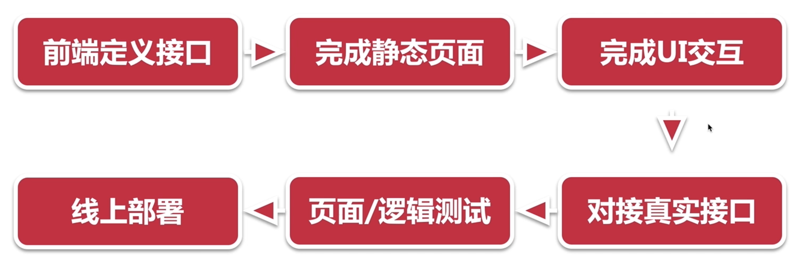
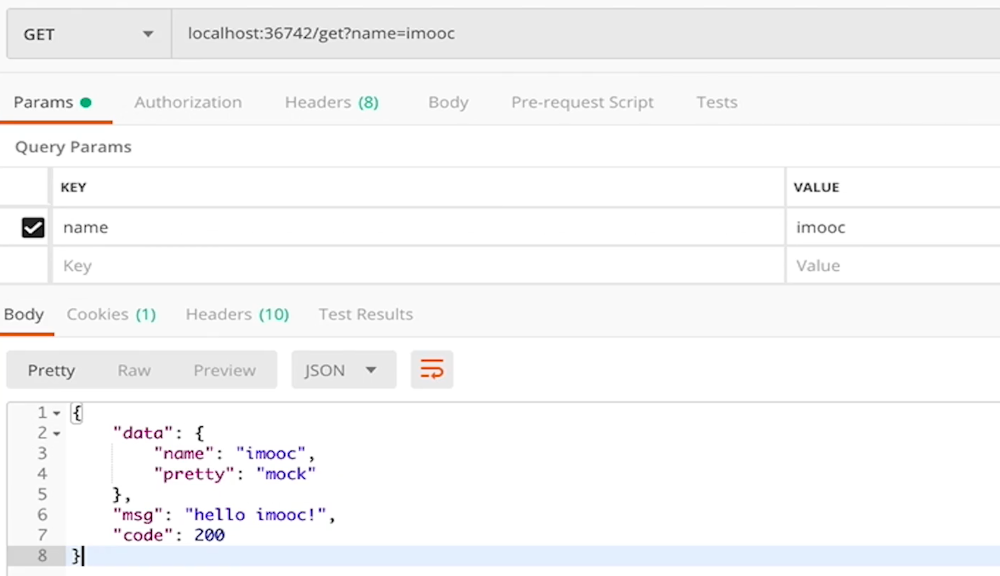

# `Mock`数据开发流程



# `DOClever`的`docker`安装

我们建议使用`docker-compose`进行安装，我们的`docker-compose.yml`内容如下：

```
version: "2"
services:
  DOClever:
    image: lw96/doclever
    restart: always
    container_name: "DOClever"
    ports:
    - 20080:10000
    volumes:
    - /srv/doclever/file:/root/DOClever/data/file
    - /srv/doclever/img:/root/DOClever/data/img
    - /srv/doclever/tmp:/root/DOClever/data/tmp
    environment:
    - DB_HOST=mongodb://mongo:27017/DOClever
    - PORT=10000
    links:
    - mongo:mongo

  mongo:
    image: mongo:latest
    restart: always
    container_name: "mongodb"
    volumes:
    - /srv/doclever/db:/data/db
```

一般我们将一些配置文件放置在`/home`目录下，我们执行以下操作来创建一个`doclever`的容器：

```
cd /home
mkdir doclever
cd doclever
vi docker-compose.yml //然后复制粘贴我们的docker-compose.yml文件内容
docker-compose up -d //这个操作要在doclever目录下进行，会使用doclever目录下的docker-compose.yml作为默认配置文件创建镜像
```

> 如果发现配置错误，比如端口被占用了，可以直接修改`docker-compose.yml`文件然后再次运行`docker-compose up -d`命令来刷新容器，内部的数据都被持久化到了本地，刷新不会导致数据的清空；

在我们的容器创建完成后，我们可以使用`docker ps | grep doclever`命令来查看我们的正在运行的容器；


在上图中我们可以看到容器`ID`、镜像名称、容器内的运行脚本、创建时间、运行时间、端口映射、容器名称等信息；

然后我们要放行`20080`端口，否则我们无法在网络上访问到；

我们可以使用以下命令来查看我们的防火墙状态：

```
firewall-cmd --state //返回running说明正在运行
```

然后使用如下命令来查看端口的放行情况：

```
firewall-cmd --list-state
```

> `ubuntu`系统使用`ufw allow`来列出端口放行情况；


接着我们执行以下命令来放行端口：

```
firewall-cmd --add-port=20080/tcp \ # 放行端口 
--zone=public \ # 允许与流出数据包相关的流入数据包的进入，否则拒绝（宽泛解释）
--permanent \ # 端口放行永远生效
firewall-cmd --reload //重启防火墙
firewall-cmd --list-state //查看验证端口是否被正确放行了
```

这样我们放行了端口；

接着我们进入该浏览器页面首页，跟随`登录->管理总后台`，输入起始默认账号密码：`DOClever（同一个）`；

管理总后台的密码过于简单，为了安全性，我们需要进行修改，进入管理总后台后，跟随`设置->修改管理密码`进行管理员密码的修改；

但是一般的用户成员直接在`登录->注册`中进行注册即可；

# `DOClever`的使用

`DOClever`有这几个非常有用的特性：

+ 当我们前端后端开发完成后，可以将我们的`mock`数据的数据源转接到真实的后台接口数据进行数据返回；
+ 提供接口版本控制；
+ 提供桌面端应用；

当我们进入了`DOClever`的控制台，这里首页会显示我们创建的接口项目，我们可以点击`新增项目`来创建项目，输入名称和描述即可新增项目：


然后我们进入我们新建的项目；

点击左上角的`+`号我们可以新建一个接口的分组：


然后在任意一个分组的旁边我们可以点击`+`号来添加一个新的接口，无论在哪一个分组下新建都可以，因为在配置接口时我们还可以修改分组：


在新建接口时，我们可以勾选`自动保存`以防突然的网络问题导致接口丢失；

我们在新建接口的页面上，基本信息板块可以设置名称、分组、路径、请求方法、接口处于的状态等；

如果我们选择的请求方法是`get`，那么我们下方的参数板块的`Body`属性等属于`post`类请求方法的属性会隐藏起来；

在参数面板中，我们可以在`query`属性下添加`query`数据，可以选中`未填值`来为一个`query`添加一个可选的值，这个值是用来测试我们的接口用的，在实际的开发过程中并没有什么作用：


自然地，由于是`mock`我们需要返回值，我们可以在`result`属性下添加返回的数据，我们也可以使用`导入JSON`功能直接将一个`JSON`格式的字符串导入到我们的项目中；


完成接口编写后，我们可以点击`保存`来保存我们的接口；

我们可以点击右上角的运行来进入我们的接口测试面板，然后修改接口路径、`query`、`body`等数据；


最后点击右上角的`运行`来测试我们的接口，下图是返回的数据的样式；


那么如何在我们的项目中使用`mock`数据呢？

我们点击控制台上方的`设置->Mock`，这里描述了如何在我们的项目中使用`Mock`；


我们首先需要下载`net.js`，该文件实际上是一个小型的转接服务器；

下载完毕后，使用`node net.js <Mock Server地址> <真实后台地址>`来启动这个服务器（如图中所示，`Mock Server`已经为我们生成，可以直接使用）：


我们发现这个`net.js`服务器跑在`36742`端口，我们只需要将请求发到这个端口即可，这个服务器会做这样一件事情，如果我们的这个接口所处于的状态是开发中，那么这个服务器就会将我们的请求转发到`DOClever`服务器，如果状态是开发完成，那么这个服务器就会将我们的请求转发到真实的后台服务器上，当然，如果在`DOClever`上没有这样的一个接口也是会发送到真实的后台服务器上的，这样大大方便了前端后端的隔离开发和快速联调；

我们可以使用`postman`来尝试一下：



我们发现，我们的请求成功了，而且获取到了`DOClever`上的接口的返回数据；

同时在我们`net.js`服务器的终端内也打印了接口的请求`URL`和接口状态、性质等信息：


而当我们将接口的状态改成已完成后：


我们再次发起请求，我们会发现数据被发送到真实后台地址`localhost:8081`上了：


