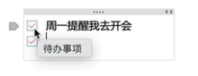
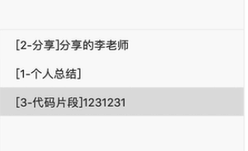

# 文档管理工具

在我们日常开发中，往往前端、后端需要进行接口`API`的协同，于是需要接口文档管理工具来规范我们的文档，一款好的接口文档管理工具具有以下特征：

+ 接口模板、分组；
+ 权限控制、团队协作；
+ 版本控制、本地部署；

其中，本地部署主要用于内网使用、已有系统功能的调优和修改、商业化数据保护等；

我们可以使用以下软件来实现接口`API`协同：

+ `EOLINKER`：`API studio`的解决方案，云平台，提供桌面版；
+ `Apizza`：一个接口协作管理工具、云平台；
+ `MinDoc`：非常简洁的、专注文档内容的接口协作管理工具；
+ `ShowDoc`：一个非常适合互联网`IT`团队 协作的`API`文档、技术文档工具；
+ `gitbook`、`hexo blog`等等；

这些工具基本都是以一个项目为`工作空间`，提供多人协作的能力，其中`MinDoc`和`ShowDoc`支持企业内网部署，且都专注于接口文档本身，淡化接口测试和`mock`；

我们进一步了解`EOLINKER`这款云平台接口文档管理工具；

在`EOLINKER`管理平台上，提供了`api、monitor、database`等服务，我们可以选择`API studio`以进入`API`管理平台：


在`API`管理平台的主界面上，我们可以新建`API`项目或点选已有项目进行管理：


在一个`API`项目中，我们可以在`API`栏目下操作我们的`APIs`：


我们可以进入我们的`API`来查看`API`内容：


我们可以选择`编辑`来编辑我们的`API接口文档`：


可以选择`额外说明`使用`markdown`编写`API说明`：


除此之外，我们还能对`版本控制`、`mock数据`、`测试环境设置`、`API测试`等进行控制，如`测试环境的设置`，我们能配置测试的`API url`前缀、全局变量等：


由此说明`EOLINKER`本身是一个以`API`为中心的文档、测试、项目管理的平台，功能相当完备；

第二，我们介绍以下`MinDoc`：

在项目管理的首页上，我们可以选择项目：


我们新建或选择一个项目，进入查看：


左侧是文档目录，主体是`markdown`文档；同样地，类似其他平台，我们可以点选右上角`成员`来为当前项目添加新开发者；

`MinDoc`是一个比较简单纯粹的文档管理工具，功能较少，以文档内容的编写为中心；

最后，我们对`ShowDoc`进行进一步了解，它具有`数据字典模板`、`接口模板`等独有特性，同时还是开源免费的；

`ShowDoc`可以新建接口文档：


在一个`API文档`中，我们可以新建、操作目录或文档；


在新建接口文档时，我们点选`插入API接口模板`，文档内容是`markdown`格式：


除了`API接口文档`外，主流的，我们还可以插入`数据字典模板`等，我们也可以在`保存`时，将当前的文档保存为模板；

在页面头部，我们可以选择文档的保存位置和顺序，以及历史版本，方便我们回退版本：


# ShowDoc的私有化部署

往往我们的项目鉴于数据安全的考虑部署在内网，因此我们可以将`ShowDoc`部署在内网的`Docker`上运行；

首先我们查看`docker`版本：

~~~c
docker --version
~~~

然后去拉取`ShowDoc`镜像：

~~~
# 原版官方镜像安装命令(中国大陆用户不建议直接使用原版镜像，可以用后面的加速镜像)
docker pull star7th/showdoc 
# 中国大陆镜像安装命令（安装后记得执行docker tag命令以进行重命名）
docker pull registry.cn-shenzhen.aliyuncs.com/star7th/showdoc
docker tag registry.cn-shenzhen.aliyuncs.com/star7th/showdoc:latest star7th/showdoc:latest 
~~~

`ShowDoc`需要在服务器上保存数据，我们在`/`目录下创建一个文件夹来保存数据：

~~~
mkdir -p /showdoc_data/html
chmod  -R 777 /showdoc_data //设置文件夹权限为顶级权限
~~~

然后我们`run`我们的`ShowDoc container`:

~~~
docker run -d --name showdoc -p 4999:80 -v /showdoc_data/html:/var/www/html/ star7th/showdoc
## -v命令将/showdoc_data/html文件夹的内容挂载到/var/www/html下，即两个文件夹内容同步，原因是container初始化运行时会加载一个全新的读写入层来保存数据，不会持久化保存数据，因此可以使用Volumes配置数据持久化
~~~

> 注意，服务器的端口要放行，除此之外，云服务器运营商的防火墙中要添加端口进行放行；家庭电信用户的80、443、8080端口被封禁，需要电信备案才能放行；

我们查看`showdoc`是否启动：

~~~
docker ps |grep showdoc_test // 使用管道和grep筛选数据
~~~

我们现在成功创建了一个数据持久化存储在宿主机的`container`，但是注意，在`2019-9月`版本之前的`ShowDoc`，必须要手动将数据拷贝到`container`中来同步数据，之后的版本不需要这一步操作：

```
docker exec showdoc_test \cp -fr /showdoc_data/html /var/www
//\cp表示无询问文件覆盖copy指令，-f表示无询问强制复制，-r表示文件夹递归复制;
//在linux的设计中，cp命令是命令cp -i的别名，因此cp命令会询问是否覆盖文件；
//docker exec指令表示进入容器内操作，\cp用于将宿主机文件夹复制到容器内；
```

注意，如果手动将数据同步，那么可能会修改`/showdoc_data/`的权限为读写，我们需要自己再次修改：

~~~
chmod -R 777 /showdoc_data/
~~~

然后配置防火墙，放行端口：

```
firewall-cmd --add-port=13500/tcp --permanent
```

最后重新启动防火墙：

```D
firewall-cmd --reload
```

到此，我们成功部署了`ShowDoc`，默认登录账号密码是`showdoc`和`123456`，这个账号是我们的最高权限账号；在`showdoc`账号下，我们建议修改密码，跟随`管理后台->用户管理`，点选`showdoc`后的`修改密码`进行密码修改；


在我们的日常开发过程中，为了项目的安全性，往往项目的创建不是由`showdoc`账号创建的，我们可以在`管理后台->用户管理`中新建用户，然后使用该用户登录`ShowDoc`平台进行项目管理，目的是避免项目用户意外操作管理后台造成项目损失；`

# ShowDoc工作流和配置

在任意权限的账户下，在平台上，有`团队管理`的选项以进行团队的管理：


这个功能适合于`Leader`的跨团队、协作的管理，我们可以在`团队管理`页面新建、删除、管理团队；


点击`添加团队`可以新建团队：


对于任意一个团队，我们可以`增加、删除成员`、`管理该团队旗下的项目`、`编辑团队名`、`删除团队`；

进入`成员`，我们可以`添加成员`，`删除成员`，添加成员时会罗列可以添加的成员：


在平台首页上，我们`新建项目`，我们可以新建两种类型的项目：

+ 常规项目，由多项目目录、多项目页面，适合做`API`文档、说明文档、数据字典等；

+ 单页项目，只有单个页面，没有目录概念，所有文档以单页面呈现，适合业务少的项目；

通常新建`常规项目`；

在`常规项目`的新建中，我们输入`项目名称`、`项目描述`后，可以选择：

+ 公开项目，平台上所有成员可进入查看；
+ 私有项目，需要密码访问项目；

一般选择`私密项目`；


项目新建后，我们可以随时修改项目的信息，比如`访问密码`、`项目名称`、`项目描述`，在`高级设置`中，我们可以：

+ 转让：项目转让给他人，创建者丧失`超级管理员`权限；
+ 归档：项目变成只读，无法进行修改，重新修改需要复制项目，一般用于`1.0~2.0`的项目版本；
+ 删除；

在新建好项目后，我们需要将项目分配给团队，重新进入`团队管理`，选择团队，然后进入`项目`页面，然后选择`分配项目给团队`把项目分配给该团队；


不同角色的团队成员拥有不同的项目权限，比如测试人员不能修改接口文档，遗憾的是，`ShowDoc`没有单文档权限；

我们在该团队的`项目`页面选择`成员权限`来配置：


我们从平台首页进入项目页面，我们可以`新建页面`、`新建目录`：


除此之外，我们还可以`导出项目`，我们可以`导出全部`或`按目录导出`：


我们新建页面，设置`标题`（、`目录`、`序号`）等元信息，如果需要编写`API接口文档`，可以直接选择插入`API接口模板`选项快速生成`API接口文档`，并在此基础上进行修改：


文档样板主要包含`title`、`URL`、`请求方式`、`上传的参数`、`返回的示例`、`返回数据说明`、`备注`等，如下所示：

~~~markdown
**简要描述：** 

- 发送验证码接口 //标题

**请求URL：** 
- ` /getCaptcha ` //URL
  
**请求方式：**
- GET    //request-way

**参数：** 

无   //post-params

 **返回示例**  //return demo

``` 
  {
    "code": 200,
    "data": {
     "pic":"svg data"
    }
  }
```

 **返回参数说明**  //return data description

|参数名|类型|说明|
|:-----  |:-----|-----                           |
|code |string   |200：表示请求成功，500：请求失败 |
|msg | string | 系统的消息|
|data | object | svg图片数据|

 **备注** //tips

- 更多返回错误代码请看首页的错误代码描述
~~~

完成后保存即可；

当我们编写完接口文档后，可以在目录位置选择该页面`编辑页面`、`分享页面`、`查看历史版本`、`复制`等：


除此之外，我们也可以新建目录：


目录功能可以帮助我们将功能模块地结构更加清晰地表示出来，一般情况下我们的页面都保存在目录下；

若我们需要修改页面的目录位置，可以到页面的`编辑页面`进行`目录选择`：


这就是一个比较完整的`ShowDoc`的工作流；

# 云笔记文档管理指南

在日常工作中，我们需要记录一些容易遗忘的`snips`，我们可以在云笔记中管理我们工作中的知识；

常用的云笔记文档软件有：

+ 印象笔记；
+ ONeNote：跨端，整理笔记的方式贴合手写笔记习惯，空间较充足，使用`OneDrive`存储服务，学生、个人用户同步较慢，商业用户同步较快；
+ 有道云笔记：支持`markdown`、协作，空间虽少但会随着使用频次增加，同步较快；

如何记好我们的笔记：

+ 清晰的目录结构（注意分类、索引）；
+ 时常更新与回顾，借助`App`利用碎片时间进行学习；
+ 使用插件+移动端`App`、提升效率；

在`Chrome`中，有许多云笔记文档软件的插件用于生成网页剪报：

如`OneNote`：


使用方式比较简单，直接在浏览器右上角点选`OneNote`图标即可；

我们以`OneNote`为例，展示笔记流程；

首先我们登录微软账号，创建一个新的笔记本：


然后我们可以在这个笔记中`创建分区`来分类我们的笔记，相当于`章节`的概念；

每一个分区都可以`创建页面`，每个页面下可以设置`标题`，同时支持表格、图片、流程图等富文本元素的粘贴；


对于重要的信息，我们可以使用标记模板，主要包含`待办事项`、`重要`、`问题`、`后续工作`、`定义`等分类，我们选择`格式->标记`来插入标记，比如`待办事项`的标记：



> 标记并不提供提醒功能；

`OneNote`提供搜索功能，可以根据输入内容搜索内容、标记，然后选择进行跳转：


在日常笔记中，我们建议在每一个页面上添加`tag`来简单描述页面的内容分类，可以使用下图的格式，如：



这就是`OneNote`的简单使用介绍；

# Hexo + github pages自建博客

大部分的技术文档网站都使用`hexo`进行快速搭建，比如`cn.vuejs.org`网站，页面都写在`src`目录下，每一层目录都是一层路由，具体可以查看`github`上的`cn.vuejs.org`项目的`src`目录；

## 创建Hexo项目

首先我们先下载`hexo-cli`命令：

~~~
npm install hexo-cli -g
~~~

然后我们创建一个`hexo blog`项目并将其运行起来；

~~~
hexo init blog //创建blog项目
cd blog
npm install  //安装依赖
hexo server //启动服务，等价于hexo s
~~~

在`hexo`项目中，`themes`文件夹下配置网站的`样式`、`布局`等，`source`文件夹下保存我们的`markdown`文档；


## Github配置仓库和远程连接

`Github`能够托管我们的项目，同时能够直接对我们的项目进行自动化部署，因此对于`blog`类型的网站，我们可以直接投递到`Github`就能完成部署，生成`Github Page`，即项目网站，非常方便，但是这要求运行代码是开源的；

为了将`Hexo`发布到`Github`上，我们首先需要创建一个接收`Hexo`项目的仓库；

基本上每一个程序员都有自己的仓库来存储自己的代码，我们以`Github`为例来创建仓库；

在用户的个人页面选择`Repositories`进入自己的仓库页面，然后新建仓库：


然后设置`Repository name`来命名仓库，并添加`Description`，然后设置库的可见性：

+ 公开仓库：任何人都可以看见该仓库，可以设置具有`commit`权限的用户；
+ 私有仓库：可以设置具有`see`和`commit`权限的用户；

我们可以设置`initialize this repository with a README`，来在仓库目录下生成一个`README.md`文件，`Github`会将该文件作为项目解释文件直接翻译展示出来；


最后`Create repositroy`即可生成我们的仓库；

然后，我们可以使用生成的`HTTPs`或`SSH`名称来从本地连接仓库；


但是，对于`SSH`的连接方式，我们还要在`Github`上配置公钥，否则无法连接；

我们获取本地主机的公钥（获取方式见`版本管理-git工具`），进入`Github`用户页面，跟随`settings->SSH and GPG keys`，然后点击`New ssh key`，输入`description`和`key`即可完成配置；


至此，我们就完成了`Github`仓库的配置，并且支持`ssh`连接；

## 打包Hexo项目、推送、域名设置

然后我们需要使用`hexo-depolyer-git`插件来推送`Hexo`到`Github`上；

使用下述命令安装：

```
 npm install hexo-deployer-git --save
```

然后我们在根目录`_config.yml`内配置`deploy`推送信息：

~~~
deploy:
  type: git  //git推送
  repo: git@github.com:solingjees/solingjees.github.io.git //仓库名称
  branch: master //分支
  name: solingjees //推送人的名字
  email: 1600346867@qq.com //推送人的邮箱
~~~

> 如果仓库是`ssh`连接，要先在`Github`上配置`ssh`协议，否则无法推送；

到此，我们完成了和`GitHub`的对接，接下来，我们要打包我们的`Hexo`项目，否则项目无法运行：

~~~
hexo generate
~~~

该命令用于生成`/public`文件夹，存储生成的静态文件，和`VueJs`的打包一个概念；

然后我们使用：

~~~
hexo deploy
~~~

进行推送，该命令会将`/public`目录下的内容推送到`Github`我的仓库的上；

我们进入仓库页面，跟随`settings->GitHub Pages`，可以看到我们部署的网站地址，网站的名称就是我们的仓库名，而且我们可以进一步定制域名；


至此，我们完成了`hexo`项目的上线，配合`GIthub Pages`能够快速部署；

