# 语义化版本

版本管理非常重要的一环是项目版本的控制，`semver`是`语义化版本（Semantic Versioning）`规范的一个实现，目前由`npm`的团队维护，实现了版本和版本范围的`解析`、`计算`、`比较`；

语义化版本遵循下述的格式：


+ 修订号的更新代表小`bug`的更新；
+ 次版本的更新代表`API`的更新或迭代；
+ 主版本的更新代表核心`API`的变化或接口的、重写等，在实际项目中更新主版本之前要测试新版本，以免出现兼容性问题甚至程序崩溃；
+ 先行版本，表示当前版本所处于的状态，如`alpha`、`beta`、`rc`等，后置的`number`代表先行版本的迭代；
+ 元数据用于使用自然语言提示该版本新增加的功能或为该版本提供特殊标记方便辨别等；

版本有许多名称来表示当前版本所处于的状态：

+ `alpha`：内部测试版本，除非是内部测试人员，否则不推荐使用，有很多`Bug`；
+ `beta`：公测版本，消除了严重错误，但是还是会有缺陷，这个阶段还会持续加入新的功能，该版本的发行旨在收集用户的错误或`idea`，来更新产品；
+ `rc`：`Release Candidate`，发行候选版本；这个版本不会加入新的功能，主要进行排错，修改`Bug`；
+ `release`：发行版本；

# 使用ssh来使连接Git远程仓库服务

`git`和`svn`都是业内比较常用的版本控制工具，但是两者存在区别：

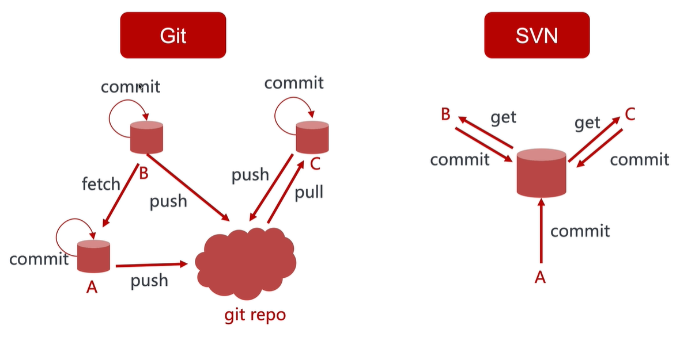

+ `Git`是分布式的版本控制工具，可以在本地进行代码的版本控制，可以脱离网络运行；`svn`必须要通过网络来进行版本控制，而且无分布式；
+ `Git`还可以在本地合并代码，并检查代码错误和冲突；

`git`是版本控制的核心，当下有这几款平台来`git code`：

+ `github`；
+ `gitlab`；
+ `gitee`：极速稳定，协同人数最高支持5人>`GitHub`，支持微信、钉钉通知；
+ `gitea`，轻量级；

为了更好地使用`git`，我们需要进行一些重要的配置，我们以`GitHub`为例；

## 为`git repository`配置`ssh`密钥以进行无密码登陆

`Github`支持两种方式来下载仓库：

+ `git clone`+`HTTPS`仓库地址（以`https://github.com`为开头），由于`HTTPS`对通信信道进行加密，和服务器之间存在证书交换的过程，因此是安全的；我们可以`clone`任何人的公开仓库，但是每一次`pull`时我们都需要输入账号和密码或者`personal access token`进行权限验证；

​      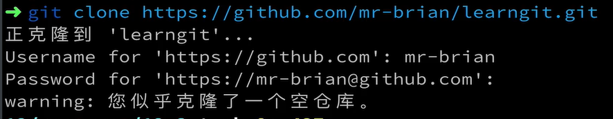

+ `git clone`+`SSH`仓库地址（以`git@github.com`为开头），和服务器之间通过本机和服务器的`SSH`密钥交换进行通信，同样是安全的方式；`SSH`方式要求使用者是拥有者或管理员，如果配置好了`ssh key`，那么操作仓库是不需要密码的，相当于是拥有最高操作权限；

我们日常使用中使用`ssh`来拉取仓库较多，因为权限最高、无需密码；

在`windows`上可以通过下载`git bash`工具来获得类`linux`的命令环境进行配置，而在`mac`或`linux`上可以直接进入`terminal`配置；

我们在命令环境中输入以下命令来生成`rsa`公钥和密钥；

~~~
ssh-keygen -t rsa  //表示rsa加密
-b 4096 //表示4096位
-C "solingjees@qq.com" //comment about this key
~~~

然后，需要交互式配置密钥的一些元信息：

首先，我们可以选择密钥保存的位置，粘贴一个新的绝对路径即可修改密钥保存的位置，默认位置在`~/.ssh`文件夹（该文件夹默认隐藏）下：


然后我们可以选择是否输入`passphrase`来给该密钥再添加一层锁，即每一次`ssh`连接时都要输入`passphrase`，目的是防止一对公私钥在被多人使用时意外泄露造成项目泄露：


然后重新输入`passphrase`，如果没有`passphrase`直接回车即可;

这样我们就创建好了一对密钥；

然后我们打开密钥保存的位置查看以下，默认在`~/.ssh`：


其中，`id_rsa.pub`是公钥文件，`id_rsa`是密钥文件；

到此，我们就生成了公钥和密钥来远程免密连接仓库、服务器，只要将公钥文件的内容复制一下并配置在仓库、服务器上即可；

我们进入`Github`用户页面，跟随`settings->SSH and GPG keys`，然后点击`New ssh key`，输入`description`和`公钥文件的内容`即可完成本地和`GitHub`的`ssh`连接；完成后，我们发现我们生成的密钥，并且在最后一行有`Read/Write`的提示，说明我们对自己的仓库具有读写的权限；


这样，我们就完成了`ssh`的配置，当我们发起一个`clone repository`的请求时，默认会使用`ssh`协议拉取本地`~/.ssh/id_rsa`文件下的私钥和`GitHub`的公钥进行验证来通信，但是对于不在`~/.ssh`下的公私钥，我们怎么配置来使得`ssh`连接时取到私钥呢？

## 配置集成多个`ssh`密钥

在很多情况下，我们不光光需要连接一台服务器或一个平台上的仓库，每一个仓库都需要一个`ssh`密钥进行登陆，而每个密钥的存放位置也可能不同，但是`ssh`连接时默认会到`~/.ssh`下取密钥，所以我们需要进行配置集成多个`ssh`密钥到`~/.ssh`目录下，这样`ssh`连接时才能正确取到密钥；

首先，我们在`.ssh`目录新建`config`文件，该文件没有任何后缀；

我们打开`config`文件，输入以下内容：

~~~
Host github-solingjees //主机别名
   HostName github.com //主机地址
   User solingjees //用户名
   PreferredAuthentication publickey //验证方式，公钥
   IdentityFile ~/.ssh/id_rsa //验证文件，私钥文件
~~~

这样，我们就完成了一个密钥的配置，其他的仓库定义方式类似，之后只要有新的仓库需要`ssh`连接，我们只要配置到`config`文件下即可进行集成；

然后我们就可以通过`ssh`来`clone`仓库：

~~~
git clone git@github.com:solingjees/test.git 
~~~

我们也可以使用主机别名`Host`来`clone`仓库：

```
git clone git@github-solingjees:solingjees/test.git
```

我们可以通过`git remote -verbose`来查看当前文件夹的全程仓库的完整信息；

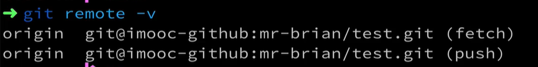

然后，我们可以通过`git remote --help`查看帮助，在`windows`上输入该命令后会在`edge`中打开，方便检视，可以使用的命令比如使用`git remote rename`修改远程仓库名称，使用`git remote remove `删除仓库；

# Git本地/远程仓库的使用及配置流程

## 创建`GitHub`远程仓库

基本上每一个程序员都有自己的仓库来存储自己的代码，我们以`Github`为例来创建仓库；

在用户的个人页面选择`Repositories`进入自己的仓库页面，然后新建仓库：


然后设置`Repository name`来命名仓库，并添加`Description`，然后设置库的可见性：

+ 公开仓库：任何人都可以看见该仓库，可以设置具有`commit`权限的用户；
+ 私有仓库：可以设置具有`see`和`commit`权限的用户；

我们可以设置`initialize this repository with a README`，来在仓库目录下生成一个`README.md`文件，`Github`会将该文件作为项目解释文件直接翻译展示出来；


最后`Create repositroy`即可生成我们的仓库；

## 生成`ssh`密钥并配置`ssh`

参照`为git repository配置ssh密钥以进行无密码登陆`即可；

## 使用项目仓库功能来管理项目仓库

`GitHub`提供了一些功能来操作我们的项目：

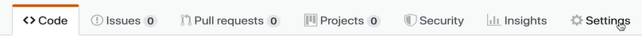

`Issues`的功能是：一个项目往往可能存在`bug`或者用户使用时出现问题，使用者能够在`Issues`中提出`bug`或`question`来求助；

`Pull request`的功能是：我们可以将某一个`Git`分支作为保护分支， 或将项目作为保护项目，普通用户无法主动合并代码到保护分支，而是发起`pull request`来请求推送项目核心开发者可以`code review`，然后开发者可以`accept`该`pull request`，将普通用户的代码合并到保护分支/保护项目中；

对于一个刚建立的还未添加代码的仓库，在`code`下，`GitHub`提供了一些提示来快速导入`code`；

`Settings`是对当前仓库的设置，其中比较重要的有：

+ `Deploy keys`：使用`ssh`密钥来单独连接这个远程仓库；
+ `Integrations & services`：可以用于增强扩展工作流的商业的、开源的工具和内置的服务；
+ `Notifications`：可以设置`emai`通知来接收`push`事件的发生；
+ `Webhooks`：可以配置当自定义事件触发时，使用扩展服务来发送`POST`请求到自定义的`URL`；
+ `Branches`：可以用于配置`master`和`protected branches`；
+ `Options`：可以对项目进行管理，诸如`合并请求`、`公开仓库`、`转让所有权`、`归档仓库`、`删除仓库`；

## 本地项目仓库的建立和远程仓库的（多）连接

我们列举了几种方式来建立本地项目仓库和推送到远程仓库；

### 直接`clone`远程仓库项目到本地

我们使用如下流程来克隆一个项目到本地，这样本地就会生成一个本地仓库：

```
git clone git@github.com:solingjees/test.git
```

进入项目文件夹，使用`git remote -v`查看远程仓库信息：

+ `Pull request`：我们可以将某一个`Git`分支作为保护分支， 或将项目作为保护项目，普通用户无法主动合并代码到`保护分支`，而是发起`pull request`来请求推送项目核心开发者可以`code review`，然后开发者可以`accept`该`pull request`，将普通用户的代码合并到保护分支/保护项目中；


其中，`origin`表示远程仓库；

这种创建方式会使得本地仓库自动和远程仓库对接，相当于`git remote orgin git@github.com:solingjees/test.git`已经被执行了;

### 在本地创建新仓库和远程仓库对接

我们新建一个文件夹作为文件源：

```
mkdir test1
```

然后进入该文件夹，使用下述命令初始化仓库：

```
git init
```

该命令会在当前文件夹下新建一个文件夹`.git`用于跟踪并管理版本，现在，`test1`文件夹变成了一个`git`仓库，`.git`被称为版本库；

仓库使用文件快照来管理所有文件，每一个文件的每一次提交都会产生一次快照，`Git`使用快照来表示每一次提交所产生的新的文件状态，只记录修改的内容，进而通过快照的管理来管理整个项目的版本迭代；

现在，我们使用下述命令将`test.txt`的内容修改加入到暂存区；

```
git add test.txt
```

然后，我们使用`git status`查看当前所在的分支和是否有文件内容修改放入暂存区；

```
git status
```

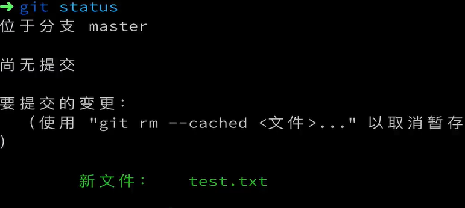

然后，我们使用下述命令来提交暂存区内的文件内容修改到本地仓库：

```
git commit -m "first commit" //-m表示添加提交tag/注释
```

然后再用`git status`查看暂存区和工作区的状态：

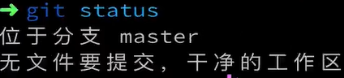

我们发现，暂存区内的文件内容修改都已经制作快照然后提交到本地仓库了；

这还只是本地仓库，往往我们需要将我们的代码提交到远程仓库上；

首先我们将本地仓库和远程仓库创建连接：

```
git remote add origin git@github.com:solingjees/test.git
// orgin代表一个远程仓库的别名，可以任意设置
//后面的ssh连接代表远程仓库的连接
```

然后我们可以将本地仓库同步到远程仓库：

```
git push -u origin master
//-u代表设置该仓库和分支为默认提交的仓库和分支，下次直接使用git push即可提交
//origin代表远程仓库别名
//master代表分支
```

这样我们就完成了一个本地新仓库的创建和对接远程仓库的配置；

### 将本地仓库推送到多个远程仓库

一个本地仓库可以有多个远程仓库进行`git push`，如果我们已经有一个本地项目仓库，那么我们可以直接将本地的项目仓库推送到一个新的远程仓库，而不需要重新创建一个新的本地项目仓库来对接远程仓库；

比如，我们使用下述命令创建两个连接；

```
git remote add origin1 git@github.com:solingjees/test1.git 
git remote add origin2 git@github.com:solingjees/test2.git 
```

然后我们就可以推送到其中任意一个仓库，比如：

```
git push origin1 master
```

如果我们有太多的远程仓库需要推送，那么可以使用`git remote set url`的命令来配置一次性多推送，这样之后`git push`（不接参数）时会推送到多个仓库中；

# git结构

首先，我们需要理解`git`本地仓库的结构，才能理解`git`命令；

+ 首先，当我们使用`git init`初始化了一个仓库时，该文件夹就会变成一个`工作区`，代表我们开发编程的位置，但是注意一点，`.git`不隶属工作区；从来没有被添加过到版本库或暂存区中（`git commit`）的文件不会被`git`监视文件的修改，也就是使用`git status`命令是看不到没有添加过到版本库/暂存区中的文件的变动的，因为没有在版本库中留下记录也就无从；（监视）
+ 假设在工作区有一个文件为`test.txt`待提交，我们需要使用`git add test.txt`命令将`test.txt`的新修改加入`git版本库`中的`暂存区（stage/index）`，`git版本库`是保存文件版本的库，内部有一个`stage`文件夹，被称为暂存区，保存目前需要被`commit`的文件内容修改；（半控制）

+ 当我们使用命令`git commit`时，`git`会将暂存区内的所有文件内容修改都制成快照保存到仓库，快照记录当前文件和上一次`commit`相比的修改，若这是第一次`commit`，快照就是文件内的全部内容，这也是该文件版本的最初版本；（全控制）

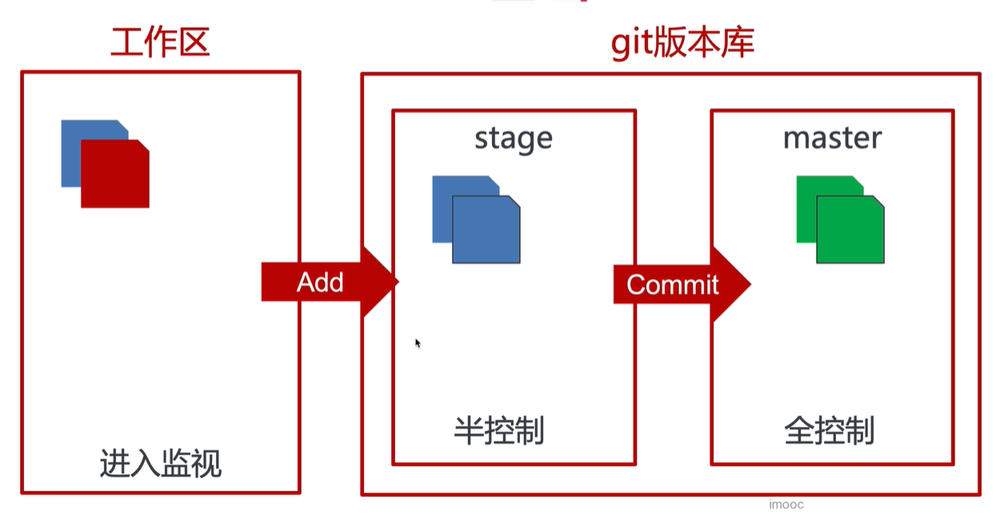

要完全理解`git`的底层原理，[git详解](https://www.cnblogs.com/mamingqian/p/9711975.html)这篇博客必看；

# git命令

对应上述三个区域，我们可以划分出三类的命令来对每一个区域进行操作，下面简述一些在日常开发中常用的命令：

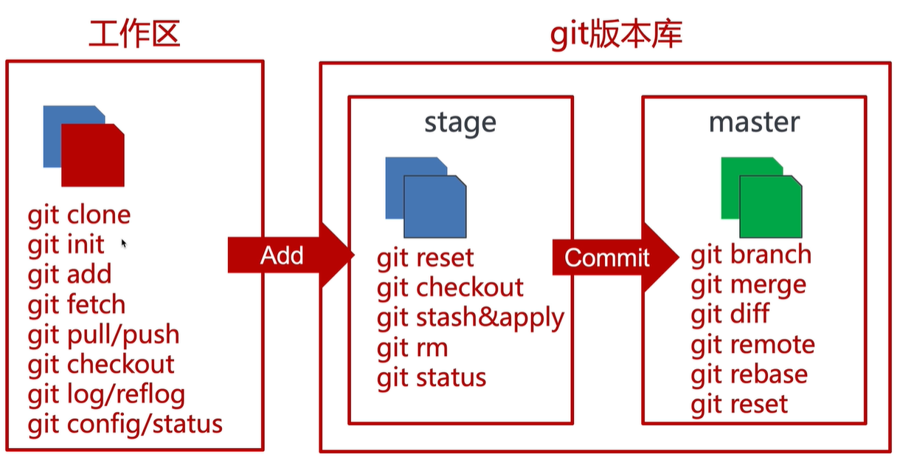

+ `git clone`：用于克隆远程仓库，相当于执行三个命令：

  + `git init`来初始化本地`git`仓库;
  + `git remote`配置远程仓库的连接;
  + `git pull`来拉取远程仓库到本地；

+ `git push`：用于将本地所有从上一次`git push`开始的所有`commit`同步到远程仓库，以下几个命令比较常用：

  + `git push 远程仓库名称 本地分支:远程分支`：该命令可以将某个本地分支的`commit`推送到远程仓库某个分支；
  + `git push 远程仓库名称 远程分支`：该命令将本地当前分支的`commit`推送到远程仓库某个分支；
  + `git push 远程仓库名称 :refs/tags/标签名`：该命令用于删除远程仓库的`tag`；（`:`起头代表删除）
  + `git push 远程仓库名称 :远程仓库分支名`：该命令用于删除远程仓库的分支；
  + `git push 远程仓库名称 远程分支 --force`：该命令非常危险，请勿使用，如果远程仓库版本比本地新，`git`会要求开发者先`git pull`更新本地代码， 然后再推送，而有些偷懒的开发者会直接使用`git push xxx xxx -f`来强制推送，导致远程仓库的更新的版本全部被覆盖，即其他开发者所推送的新版本全部被删除；

+ `git remote`：用于操作远程仓库，我们经常使用以下命令：

  + `git remote -verbose`：列出远程仓库的详细信息；

    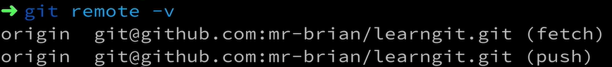

  + `git remote add 远程仓库名称 远程仓库地址`：添加本地仓库和远程仓库的连接信息；

+ `git pull`：用于本地代码更新，相当于以下两个命令的执行：

  + `git fetch `将分支的更新进行下载；
  + `git merge`将分支的更新和本地仓库进行合并；

+ `git fetch`：用于拉取远程仓库的更新，经常用的命令有：

  + `git fetch`：查看远程仓库的更新信息；
  + `git fetch origin feature:dev1`：将远程的`feature`分支下载到`dev1`分支，如果不存在`dev1`分支会自动创建；

+ `git merge`：用于合并代码，比如`git merge FETCH_HEAD`会将当前代码和`FETCH_HEAD`进行合并；

+ `git diff`：用于查看工作区文件和版本库文件的区别，对比查看修改的内容；

​        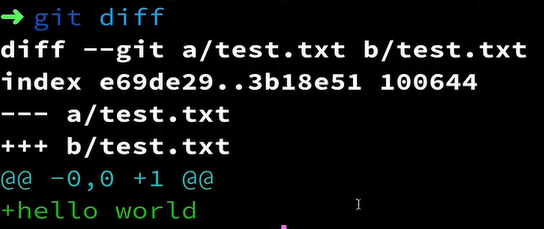

+ `git reset`：用于清除内容并回退到最近一次`commit`的版本，该命令有3种参数，分别是:
  
  + `--mixed`：当我们将一个文件添加进暂存区，我们可能又想要将其退回工作区中以免提交，我们可以使用`git reset --mixed（默认）<文件名>`来从暂存区文件列表删除指定文件；
  
  + `--hard`：可以将工作区和暂存区内的所有内容都强制退回到指定的版本，并且会删除该版本后的所有`commit`日志记录，即将所有文件修改退回最近一个版本；在`log`记录中，记录着每一次`commit`的`hash`值（如`6d89c38`）和序号（如`HEAD@{0}`），我们依照`hash`值或序号进行版本回退，如`git reset --hard  6d89c38`，同样可以使用序号，如`git reset --hard 0`；
  
  
  
  + `--soft`；
  
  使用方式如下：
  
  + `git reset HEAD <filename>`：删除当前分支的暂存区内的指定文件以免提交，`HEAD`代表当前分支；
  + `git reset --hard HEAD~100`：将当前分支的所有的修改退回到最新版本的前第100个版本；
  
+ `git log/reflog`：我们每提交一次，就会生成日志，日志中记载该`commit`所对应的`hash`值、时间、`comment`、日志序号等信息，可以显示所有的`commit`信息；`git reflog`比`git log`更加强大，可以查看所有分支的所有操作记录，包括已经被删除的`commit`记录和`git reset`操作；我们可以使用`git reflog`打印的日志`hash`值来回退到任意一个版本；

  `git reflog`日志解释：

  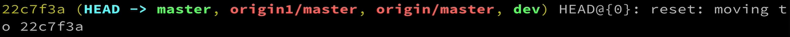

  最前面是`hash`值，`()`内记录分支，分支格式为`仓库名/分支名`，`仓库名`不添加表示本地仓库，`HEAD -> master`表示当前在本地`master`分支上，`origin1/master`表示`origin1`远程仓库的`master`分支，`()`后的`HEAD@{0}`是这条记录的序号，最后`:`起头的一部分表示记录的这个日志的事件；

+ `git config`：用于操作`git`的配置；

  我们可以使用`git config --global --list`查看全局配置，输出如下：

  ~~~
  user.email=1600346867@qq.com
  user.name=solingjees
  ~~~

  在我们`git push`之前，我们必须要设置`user.email`和`user.name`，这两个参数代表了一个提交者，如果不设置是无法`git push`的，我们可以使用如下命令设置这两个参数：

  ~~~
  git config --global user.name "solingjees"
  git config --global user.email "1600346867@qq.com"
  ~~~

+ `git branch`：操作分支，经常用的命令有：

  + `git branch dev`：创建了一个`dev`分支；
  + `git branch`：查看所有分支；
  + `git branch -D dev`：删除`dev`分支；

+ `git checkout`：用于切换分支/文件版本，我们经常使用如下命令：

  + `git checkout dev`：切换到`dev`分支；
  + `git checkout -b dev`：创建并切换到`dev`分支；
  + `git checkout -- <filename>`：将工作区中的该文件恢复到最近一次`git commit`或`git add`时的状态；

+ `git status`：显示当前暂存区的状态和工作区的修改状态等；

  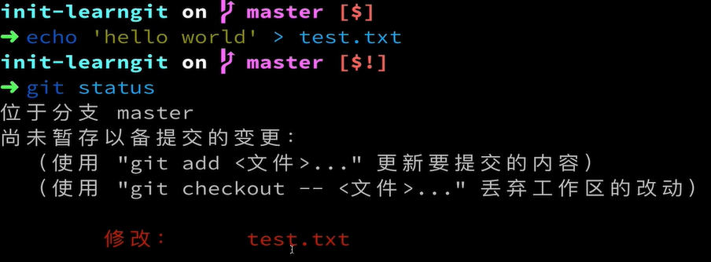

+ `git stash`：用于缓存当前分支没有`git commit`的改动，包括工作区内和暂存区的状态，都可以缓存下来，这个操作同时还会导致工作区和暂存区所有的改动都清除掉，并回退到最近一个`commit`的版本上，之后可以使用`git stash apply`命令进行恢复，恢复后原来缓存的记录还存在，也就是说可以随时退回到那个记录除非手动删除缓存记录；`git stash`命令主要在以下几种情况下使用：

  + 项目中需要切换到其他分支，但是当前分支没有开发完成，这时切换分支会出现提示来告诉开发者未提交新修改，但是开发者又不想要`git commit`，因此可以使用`git stash`来缓存工作区和暂存区进而清除工作区、暂存区的改动；
  + 在错误的分支上开发，就可以使用`git stash`缓存并清空工作区的修改，然后到新分支上进行`git stash apply`将修改恢复到新分支上；
  + 若当前开发中存在大量`bug`需要回退到干净的工作区，可以使用`git stash`来缓存修改，并清空工作区修改回退到最近一个`commit`的版本上；

  更多地，`git stash`可以缓存多次记录，我们可以使用`git stash list`来列出所有的记录；和`git stash apply`类似，`git stash pop`会回退到上一次记录，但是不同的是，恢复后原来缓存的记录会被清除掉；

+ `git tag`：为最近一次`commit`添加标签，如`git tag v1.0.0`；之后使用`git push origin master --tags`来同时提交`tag`；

  更多地，我们还常用以下命令：

  + `git tag -d <tagname>`：删除某一次`tag`；
  + `git tag -l`：展示所有的`tag`;
  + `git push origin :refs/tags/标签名`：删除远程仓库的某一个`tag`；

# Git Flow

经典的`Git Flow`模型如下：

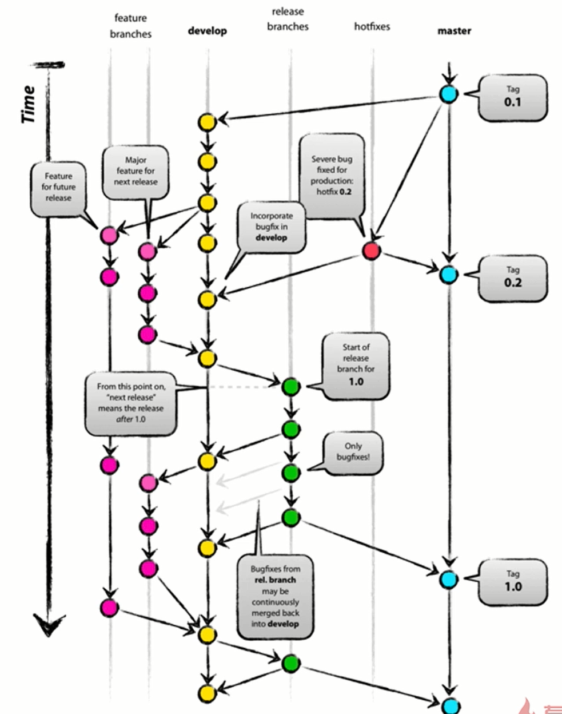

经典模型存在以下问题：

+ 开发必须在`develop`主要分支上，当我们要开发代码时，必须从`master`分支复制一份到`develop`分支上，之后在`develop`上开发完毕后，又需要重新`git merge`到`master`分支上；
+ 复杂度过高，维护的分支过多；
+ 需要多次`git merge`，分支的复杂度过高导致我们从一个`feature`的开发到最后上线，中间需要经过好几层的`git merge`，过于复杂；

现在，我们更推崇下面两种`git flow`，下面的模型适用于持续集成的场景：

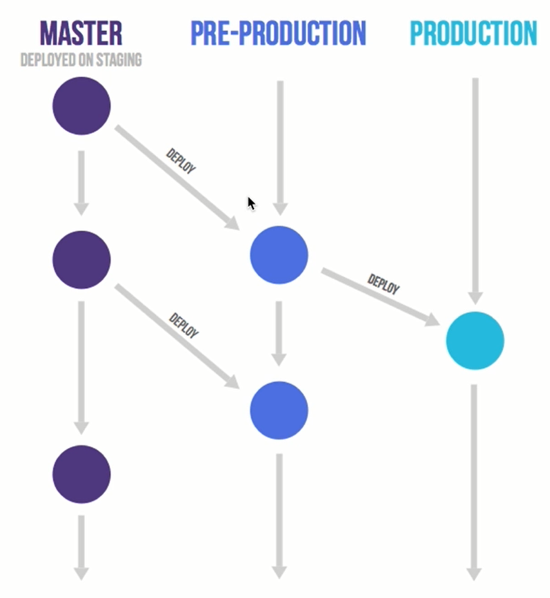

该模型具有以下的优势：

+ 适合持续集成的场景，持续集成是指持续地进行代码集成，通常会每天至少一次集成代码，以便于放入`pre-production`分支进行自动化验证，尽早发现`bug`；
+ 上游分支向下游发展：我们的`flow`都是从左侧往右侧流动，都是左侧的代码合并到右侧，并且永远都是左侧的版本领先于右侧的版本，具有严格但简单的先后顺序；

该模型的项目流程一般如下：

    有新的Bug/feature -> 生成New Branch -> 合并到master -> 合并到pre branch -> 合并到Target Branch
还有一种`react`和`vue`都使用的模型，也是比较推荐的一种模型，适用于版本项目，结构简单实用：

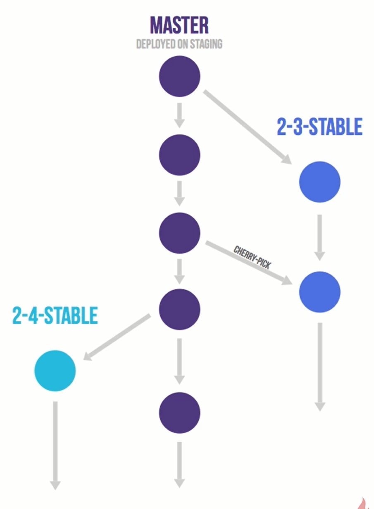

该模型存在以下的优势：

+ 适用于版本项目的场景，所有开发者都是在`master`分支上开发，然后当一个开发的版本逐渐稳定，就将该版本抽离出来变成`Stable`版本，`master`分支只作为开发分支；
+ `stable`版本从`master`检出，在`stable`版本上修复`bug`；

该模型的项目流程如下：

```
在master分支上开发 -> 代码逐渐stable -> 创建新new branch合并stable的版本代码 -> 修复stable分支上的bug -> stable version上线
```

# 两种Git Flow的Git过程

对于持续集成的场景，我们一般使用下述的设计方案：

+ 我们新建一个`feature`分支作为新`feature`的开发分支，我们的主要代码都在这个分支上进行开发；
+ 然后新建`dev`分支作为预发布分支，该分支只会使用`git merge feature`合并`feature`分支上的代码，以进行自动化测试和验证等；
+ 最后在`master`分支上，使用`git merge dev`合并`dev`分支的代码，作为我们的`release`版本的代码；

而对于版本项目的场景，我们可以这样做：

+ 我们在`master`分支上进行开发；
+ 在`master`分支上基本功能实现后，新建`stable`分支，并使用`git merge master`命令将`master`分支上的代码合并过来，在该分支上，开发者只被允许`fix bugs`和接收`master`开发中的一些新的`feature`，直到最后上线；


# 和远程仓库相关的事项

首先，对于多个开发者，每个人都要先`git pull`拉取远程仓库以更新本地仓库，或者使用`git clone`创建新仓库；

然后我们可以使用`git remote --verbose`查看远程仓库详细信息；

在日常开发中，一般只有管理员有`master`分支的管理权限，因此我们需要切换到其他分支进行开发，开发完毕后发一个`pull request`让管理员进行审核，最后合并到`master`分支；

我们使用`git branch`来查看分支，一般我们都在本地的`dev`分支进行开发，如果没有该分支，我们使用`git branch dev`来创建分支；同样地，如果不需要某分支了，可以使用`git branch -D XXX`来删除分支；

如果我们使用`git branch dev`创建了`dev`分支，我们还需要使用`git checkout dev`来切换分支，还有更好的方法结合这两个命令`git checkout -b dev`，这个命令用于创建并切换分支;

要注意一点，在我们切换分支之前，要做`git commit`或者`git stash`以进行记录的提交/保存；

## 多个开发者修改同一个远程仓库的分支

如果两个开发者同时在改一个`test.txt`，然后一个开发者`a`在另一个开发者`b`之前修改好了，使用`git add test.txt`将修改加入暂存区，然后使用`git commit -m "XXX"`来提交到本地仓库，最后使用`git push origin dev`推送到远程仓库的`dev`分支；

这时，会发生这样一件事情，另一个开发者`b`修改完了`test.txt`并在本地`git commit`了，准备`git push`到和开发者`a`同一个分支，这时会报错无法推送，更新被拒绝：

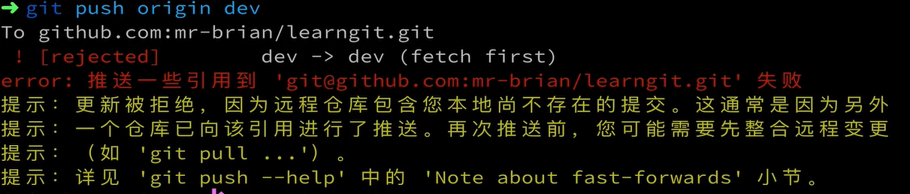

这是因为远程仓库的`dev`分支已经被开发者`a`更新了，因此出现`远程仓库包含您本地尚不存在的提交`，在开发者`b`推送之前，必须`git pull origin dev`将远程仓库和本地仓库进行合并，合并完后，再次使用`git status`查看状态，发现是这样的结果：

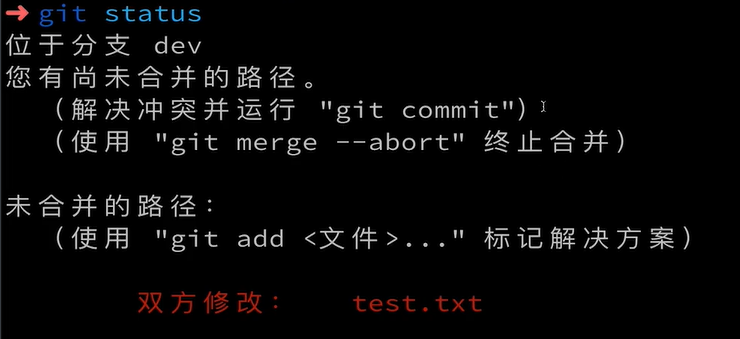

即双方都修改了`test.txt`文件；

我们打开`test.txt`文件，发现该文件使用和先前不一样的格式：

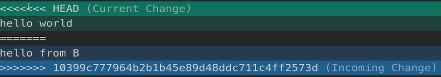

在同时修改的位置上显示了两个开发者的修改，前者为开发者`b`的修改，后者为开发者`a`的修改，这就成为了一个冲突；从这里我们看出`git`的智能，它不会生硬地将不一致的代码进行取舍，而是通过特殊的处理进行保留；

在我们的实际开发中，我们不被允许留下冲突的代码，而`git`也是这么设计的：在我们没有解决这个冲突之前，不被允许提交到远程仓库；

实际上，我们删除开发者`a`的修改即可完成冲突的解决：

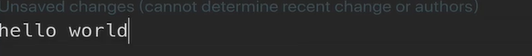

然后开发者`b`重新`git commit`到本地仓库，使用`git status`来查看修改记录：

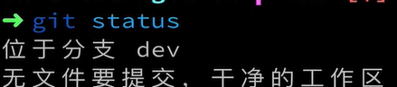

我们发现也没有`both modified`的提示了，这样开发者`b`就可以重新同步到远程仓库了；

在实际开发过程中，我们要避免出现这样的情况，因此 一般情况下，一个团队里的成员会开发不同的模块，而尽量不去修改公共模块；

额外说明一点，`git`的`code merge`比`svn`要更加先进，对冲突代码的检测和提示也更加智能；

## 视远程仓库情况选择性更新本地分支

上面我们是使用`git pull`拉取代码进行合并，但是有时候我们想先看看远程仓库的更新状况，然后再合并代码；我们可以使用`git fetch`来获取远程仓库的更新，包括代码的修改、分支的创建/修改等等，这个命令会在命令行上显示有更新的分支和增加/删除的分支等消息：

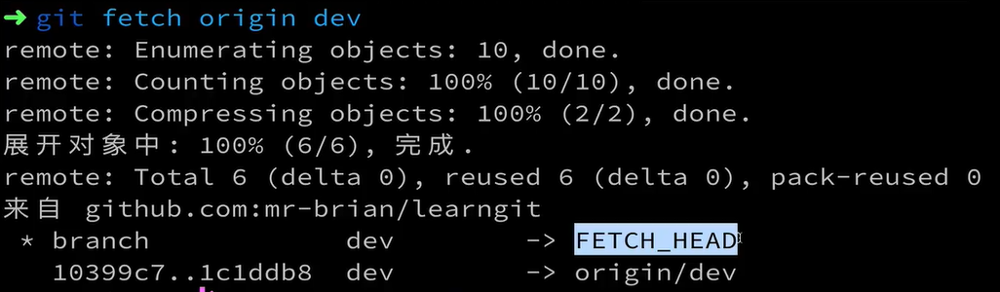

`git fetch`会将分支的更新内容缓存到一个变量/对象中，比如上图的`FETCH_HEAD`便是远程仓库的`dev`分支在本地仓库的缓存；

如果我们确有需求要使用缓存的更新的分支，使用`git merge FETCH_HEAD`来将分支更新和本地仓库当前分支进行合并，该命令会直接覆盖本地上的相应的代码；

## 合并远程仓库其他分支的代码到本地分支

在实际开发过程中，我们可能还会将其他开发者开发的分支合并到我们的代码中；

比如，开发者`a`创建了新分支`feature`，并使用`git push origin feature:feature`推送到远程`feature`分支上；

如果开发者`b`需要将远程仓库的`feature`分支合并到本地`dev`分支，可以首先使用`git fetch`查看远程仓库是否有更新：

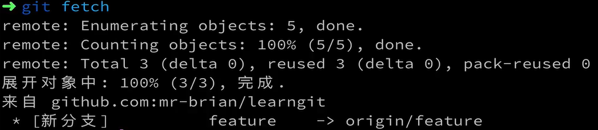

如果发现有新分支`feature`，就可以使用`git fetch origin feature:dev1 `来将远程仓库的`feature`分支合并到本地`dev1`分支，如果本地`dev1`分支不存在，会自动创建；

这样我们就把远程仓库的分支下载到本地的`dev1`分支了，接下来，我们可以使用`git merge`来合并`dev1`分支的代码到其他分支；

同样地，我们也可以使用`git pull`来合并`git fetch`和`git merge`；

如果我们已经`git merge`远程仓库分支的代码，但是之后希望撤销`git merge`，我们可以使用`git reset --hard head^`，`^`表示将当前版本之前的版本，个数越多版本越推前，如`head^^`表示当前版本之前的版本的之前的版本，或者使用`~<数字>`来代替，如`git reset --hard head~1`和`head^`具有一样的效果；或者可以首先使用`git reflog`查看所有的事件，然后使用`git reset --hard <事件hash值>`或`git reset --hard head~<事件{}内数值>`进行回退；

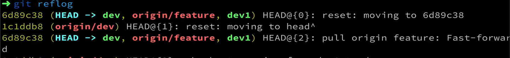


# Git Flow中的常见问题

## 为当前提交的版本设置`tag`

在版本项目的场景中，比如`react`，在我们已经完成了一个重要版本的开发后，我们往往需要给这个版本打上一个`tag`来表示版本号；

在我们`git commit`重要版本后，可以使用`git tag v1.0.0`给最近一次`git commit`的版本打上标签，如`v1.0.0`；

之后`git push origin master --tags`推送到远程仓库`master`分支时，会连带上最近一次`commit`的标签，这样我们就完成了一个重要版本在远程仓库上的发行；

在`GitHub`中，我们在项目内可以搜索到项目的`v1.0.0`的版本；

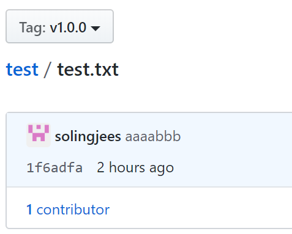

同样地，我们可以操作`tag`；我们可以使用`git tag -d <filename>`来删除本地`tag`，如果需要删除远程`tag`，使用`git push origin :refs/tag/<tagname>`来删除远程仓库的`tag`；

## 错误的提交的处理

对于错误地放入暂存区地文件，我们可以直接使用`git reset HEAD <filename>`命令来将当前分支中被错误添加到暂存区的文件进行删除；

如果一个文件本身被`git`错误地监控，我们可以使用`git reset --hard head~<版本序号>`退回到文件被监控前的版本，并删除工作区和暂存区的所有的修改；

当我们错误地修改了被监控的文件内容，我们同样可以使用`git reset`命令来切换版本，但是如果我们只是希望部分文件的修改被删除，我们可以就可以使用`git checkout -- <filename>`来实现，该命令是将版本库/暂存区中的最新的版本文件来替换工作区中的文件；

# GitLab私有化部署

我们在日常的开发中，往往需要建立我们的私有仓库，但是又不想要将仓库放置在开源网络上，这时候我们就需要私有化部署我们的仓库；我们以`GitLab`为例来部署我们的私有仓库；

## GItLab私有化部署的硬件配置

`GitLab`是比较大型的应用，比起一般的网页，更加需要大量的性能支撑；

+ `GitLab`会使用至少`2G`的内存，因此会占用比较多的内存资源，由于`docker`的运行本身会占用内存资源，因此服务器内存至少`4G`起步才能无卡顿地运行；
+ 如果内存是`4G`，官方推荐`SWap`空间分配`4G`起步，来保证运行；
+ `CPU`核心数至少`2`核；

这个性能勉强使用，能够支持`100`个开发者数量以内的团队的使用；

更多的配置参见[GitLab服务器配置](https://docs.gitlab.com/12.9/ee/install/requirements.html)

## 使用docker安装GitLab

首先，我们按照官网的指示，在本地建立以下三个文件夹：

```
/srv/gitlab/config
/srv/gitlab/logs
/srv/gitlab/data
```

这三个文件夹作为镜像文件夹的映射，同时要注意对`/srv`文件夹下的所有文件夹或文件提供全部权限：

```
chmod -R 777 /srv/gitlab/config
...
```

否则我们的配置会失败，因为可能没有写入权限；

### 使用`docker run`安装`GitLab`

在完成本地文件夹的配置后，我们输入以下命令来拉取镜像并启动镜像：

```
sudo docker run --detach \   # 后台运行该命令
  --hostname gitlab.example.com \  # 域名
  --publish 443:443 --publish 80:80 --publish 22:22 \
  # 433端口是https端口、80是http端口、22是ssh端口，一般外部端口会自行设定防止攻击
  --name gitlab \ #镜像名
  --restart always \ #容器退出时总是重启容器
  --volume /srv/gitlab/config:/etc/gitlab \ #config
  --volume /srv/gitlab/logs:/var/log/gitlab \ #log
  --volume /srv/gitlab/data:/var/opt/gitlab \ #data
  gitlab/gitlab-ce:latest
```

然后可以使用下述命令来查看生成的容器；

```
docker ps | grep gitlab
```

然后使用下述步骤放行防火墙端口：

```
firewall-cmd --add-port=13800/tcp --permanent
firewall-cmd --reload
```

如果是云服务商提供的服务，则还需要到控制台上设置规则；

`GitLab`的安装可能出现一系列的问题，我们可以使用下述命令来查看容器生成过程的日志来监视运行：

```
docker logs -f gitlab
```

通过查看日志来排查安装过程中的错误，可能出现以下错误：

+ 超过时间限制：切换源，或者升级服务器配置；
+ `run`命令不能执行：修改权限；

如果日志一切正常，说明安装成功；

### 使用`docker-compose`安装`GitLab`

```
gitlab_test:
  image: 'gitlab/gitlab-ce:latest'
  restart: always
  hostname: '47.240.64.77'
  environment:
    GITLAB_OMNIBUS_CONFIG: |
      external_url 'https://gitlab.example.com' # 配置url
      # Add any other gitlab.rb configuration here, each on its own line
  ports:
    - '13800:80'
    - '13843:443'
    - '13822:22'
  volumes:
    - '$GITLAB_HOME/gitlab/config:/etc/gitlab'
    - '$GITLAB_HOME/gitlab/logs:/var/log/gitlab'
    - '$GITLAB_HOME/gitlab/data:/var/opt/gitlab'
```

其中，`$GITLAB_HOME`是环境变量，首先需要在系统中配置才能使用，当然，可以不使用`$GITLAB_HOME`；

### 使用`docker-gitlab`快速安装配置`GitLab`（推荐）

国外有大牛`sameersbn`带头编写了[docker-gitlab](https://github.com/sameersbn/docker-gitlab)这个`image`，自带`docker-compose.yml`并且已经自定义配置好了大部分的参数，比如`redis`、`SMTP`等，我们只要在这个基础上修改即可，非常方便；

同时还将`gitlab`的数据库等其他服务剥离出来，使得我们可以不通过`gitlab`来访问它们；

我们可以跟随该`image`文档的`Installation`进行安装，或者参见`Quick Start`，只使用`docker-compose.yml`进行快速安装；

```yml
version: '2'

services:
  redis:
    restart: always
    image: sameersbn/redis:4.0.9-2
    command:
      - --loglevel warning
    volumes:
      - redis-data:/var/lib/redis:Z

  postgresql:
    restart: always
    image: sameersbn/postgresql:10-2
    volumes:
      - postgresql-data:/var/lib/postgresql:Z
    environment:
      - DB_USER=gitlab
      - DB_PASS=password
      - DB_NAME=gitlabhq_production
      - DB_EXTENSION=pg_trgm

  gitlab:
    restart: always
    image: sameersbn/gitlab:12.9.2
    depends_on:
      - redis
      - postgresql
    ports:
      - '13800:80'
      - '13822:22'
    volumes:
      - gitlab-data:/home/git/data:Z
    environment:
      - DEBUG=false

      - DB_ADAPTER=postgresql
      - DB_HOST=postgresql
      - DB_PORT=5432
      - DB_USER=gitlab
      - DB_PASS=password
      - DB_NAME=gitlabhq_production

      - REDIS_HOST=redis
      - REDIS_PORT=6379

      - TZ=Asia/Kolkata
      - GITLAB_TIMEZONE=Beijing //设置当前的时区，一定要设置Beijing（首字母大写），否则502

      - GITLAB_HTTPS=true //允许https
      - SSL_SELF_SIGNED=true //ssl自签名证书，这是开发者自己签名的证书，而不是权威机构所签发的，所以浏览器不承认，可能出现安全问题
      
      - GITLAB_HOST=47.240.64.77 //设置GITLAB的网址
      - GITLAB_PORT=13800 //设置端口
      - GITLAB_SSH_PORT=13822 //设置ssh端口
      - GITLAB_RELATIVE_URL_ROOT=
      - GITLAB_SECRETS_DB_KEY_BASE=long-and-random-alphanumeric-string
      - GITLAB_SECRETS_SECRET_KEY_BASE=long-and-random-alphanumeric-string
      - GITLAB_SECRETS_OTP_KEY_BASE=long-and-random-alphanumeric-string

      - GITLAB_ROOT_PASSWORD=12345678 //设置root用户的登录密码
      - GITLAB_ROOT_EMAIL=1600346867@qq.com //设置root用户的邮箱

      - GITLAB_NOTIFY_ON_BROKEN_BUILDS=true
      - GITLAB_NOTIFY_PUSHER=false

      - GITLAB_EMAIL=notifications@example.com
      - GITLAB_EMAIL_REPLY_TO=noreply@example.com
      - GITLAB_INCOMING_EMAIL_ADDRESS=reply@example.com

      - GITLAB_BACKUP_SCHEDULE=daily
      - GITLAB_BACKUP_TIME=01:00

      - SMTP_ENABLED=false
      - SMTP_DOMAIN=www.example.com
      - SMTP_HOST=smtp.gmail.com
      - SMTP_PORT=587
      - SMTP_USER=mailer@example.com
      - SMTP_PASS=password
      - SMTP_STARTTLS=true
      - SMTP_AUTHENTICATION=login

      - IMAP_ENABLED=false
      - IMAP_HOST=imap.gmail.com
      - IMAP_PORT=993
      - IMAP_USER=mailer@example.com
      - IMAP_PASS=password
      - IMAP_SSL=true
      - IMAP_STARTTLS=false

      - OAUTH_ENABLED=false
      - OAUTH_AUTO_SIGN_IN_WITH_PROVIDER=
      - OAUTH_ALLOW_SSO=
      - OAUTH_BLOCK_AUTO_CREATED_USERS=true
      - OAUTH_AUTO_LINK_LDAP_USER=false
      - OAUTH_AUTO_LINK_SAML_USER=false
      - OAUTH_EXTERNAL_PROVIDERS=

      - OAUTH_CAS3_LABEL=cas3
      - OAUTH_CAS3_SERVER=
      - OAUTH_CAS3_DISABLE_SSL_VERIFICATION=false
      - OAUTH_CAS3_LOGIN_URL=/cas/login
      - OAUTH_CAS3_VALIDATE_URL=/cas/p3/serviceValidate
      - OAUTH_CAS3_LOGOUT_URL=/cas/logout

      - OAUTH_GOOGLE_API_KEY=
      - OAUTH_GOOGLE_APP_SECRET=
      - OAUTH_GOOGLE_RESTRICT_DOMAIN=

      - OAUTH_FACEBOOK_API_KEY=
      - OAUTH_FACEBOOK_APP_SECRET=

      - OAUTH_TWITTER_API_KEY=
      - OAUTH_TWITTER_APP_SECRET=

      - OAUTH_GITHUB_API_KEY=
      - OAUTH_GITHUB_APP_SECRET=
      - OAUTH_GITHUB_URL=
      - OAUTH_GITHUB_VERIFY_SSL=

      - OAUTH_GITLAB_API_KEY=
      - OAUTH_GITLAB_APP_SECRET=

      - OAUTH_BITBUCKET_API_KEY=
      - OAUTH_BITBUCKET_APP_SECRET=

      - OAUTH_SAML_ASSERTION_CONSUMER_SERVICE_URL=
      - OAUTH_SAML_IDP_CERT_FINGERPRINT=
      - OAUTH_SAML_IDP_SSO_TARGET_URL=
      - OAUTH_SAML_ISSUER=
      - OAUTH_SAML_LABEL="Our SAML Provider"
      - OAUTH_SAML_NAME_IDENTIFIER_FORMAT=urn:oasis:names:tc:SAML:2.0:nameid-format:transient
      - OAUTH_SAML_GROUPS_ATTRIBUTE=
      - OAUTH_SAML_EXTERNAL_GROUPS=
      - OAUTH_SAML_ATTRIBUTE_STATEMENTS_EMAIL=
      - OAUTH_SAML_ATTRIBUTE_STATEMENTS_NAME=
      - OAUTH_SAML_ATTRIBUTE_STATEMENTS_USERNAME=
      - OAUTH_SAML_ATTRIBUTE_STATEMENTS_FIRST_NAME=
      - OAUTH_SAML_ATTRIBUTE_STATEMENTS_LAST_NAME=

      - OAUTH_CROWD_SERVER_URL=
      - OAUTH_CROWD_APP_NAME=
      - OAUTH_CROWD_APP_PASSWORD=

      - OAUTH_AUTH0_CLIENT_ID=
      - OAUTH_AUTH0_CLIENT_SECRET=
      - OAUTH_AUTH0_DOMAIN=
      - OAUTH_AUTH0_SCOPE=

      - OAUTH_AZURE_API_KEY=
      - OAUTH_AZURE_API_SECRET=
      - OAUTH_AZURE_TENANT_ID=

// 文件内配置volumes的映射，注意，每一项都是一个mapping，而不是string
volumes:
  redis-data:/srv/gitlab/redis    //error
  postgresql-data:
  gitlab-data:
```

如果不了解如何配置`volumes`属性，可以将文件中的以下字段使用`volumes`路径进行替换：

```
  redis-data => /srv/gitlab/redis
  postgresql-data => /srv/gitlab/postgresql
  gitlab-data => /srv/gitlab/data
```

然后我们可以在任何位置新建`docker-compose.yml`文件，并将上面的配置复制进来，最后在当前位置下执行命令：

```
cd /srv
vi docker-compose.yml
docker-compose up -d //使用之前的配置来下载创建运行镜像
docker ps | grep srv //筛选模糊搜索带有srv字样的记录
```

这样之后，我们就能使用我们的`root`邮箱、密码来登录`gitlab`，而不需要再给`root`设置密码；

## 设置GitLab备份和恢复

### 自动化备份

如果是使用`docker-gitlab`来创建我们的`gitlab`，该`image`已经在`docker-compose.yml`中帮我们配置好了`GitLab`的备份，其中比较重要的配置有：

+ `GITLAB_BACKUP_SCHEDULE`：默认配置为`daily`； //每天备份
+ `GITLAB_BACKUP_TIME=01:00`：默认配置为`01:00` //每天1：00备份

除此之外，我们要自行添加一个配置：

+ `GITLAB_BACKUP_EXPIRY`：`604800` //只保存最近7天的备份

否则，每天的备份都会被保存下来，会挤爆服务器硬盘；

我们使用以下命令来添加该配置：

```
vi docker-compose.yml
在相应位置添加该行：- GITLAB_BACKUP_EXPIRY=604800
docker-compose up -d //更新container
```

我们不需要将`container`暂停来应用镜像，只要使用`docker-compose up -d`即可完成热更新；

### 手动备份

我们可以使用以下命令在`docker-compose.yml`所在的位置来手动生成备份；

```
docker-compose rm -sf gitlab //可以不写，但是建议，停止并删除container
docker-compose run --rm gitlab app:rake gitlab:backup:create
```

### 恢复备份

我们使用如下命令来恢复备份；

```\
docker-compose run --rm gitlab app:rake gitlab:backup:restore # List available backups
```

然后会询问要恢复的备份：
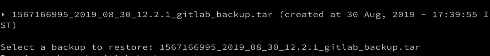

输入备份的全名（包括`.tar`后缀），然后回车；

或者直接在`docker-compose run`的命令中指定要恢复的备份`ID`：

```
docker-compose run --rm gitlab app:rake gitlab:backup:restore BACKUP=1417624827 # Choose to restore from 1417624827
```

由于考虑这种操作的安全性，之后的交互式内容会询问是否继续等其他内容，直接选择继续即可；

最后即可完成恢复到指定版本；

## Git权限控制

在实际的开发中，为防止误操作、代码泄露、提高代码质量，我们需要做好以下的事情：

+ 以组为单元，设置管理员，分配开发人员、管理人员、测试人员、产品经理、干系人等角色的权限，比如只有管理员或每一个组的组长有资格合并代码到`release`分支；
+ 熟悉`Merge Request`，写好`git commit`，目的是使得每一次的`commit`都有实际的意义，方便回溯；
+ 及时回收权限，或者设置过期时间，以防止离职人员等的访问，导致代码的窃取和泄露；

### 成员权限

我们在邀请一个新成员到项目组中时可以设置该成员的权限和过期时间，但是一般过期时间不会设置，因为一般成员都是长期在项目里的；离开项目组的成员直接将权限修改即可；

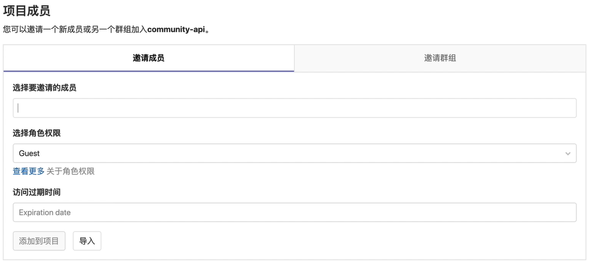

角色权限分成这几类：

+ `Maintainer`：超级管理员；
+ `Developer`：开发者；
+ `Reporter`：如测试人员这类具有克隆/下载仓库、提`Issues`要求的角色，但是这类人不能修改代码；
+ `Guest`：只有查看权限；

他们之间的权限比较：

```
Gitlab Adminastrator > Maintainer > Developer > Reporter > Guest
```

详细的权限设置参见[gitlab的权限](http://www.solingjees.site:13800/help/user/permissions)；

删除用户和权限变更一般都是项目经理负责的，`gitlab`管理员也可以可以在`管理中心`设置；

极不建议删除用户，因为删除后会连带删除该用户的`commit`信息，导致部分的`commit`可能无法溯源；

### 组权限

创建组时同样可以设置组的可见性；

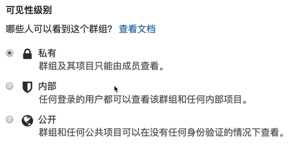

往往我们会将一个团队组织为一个组方便管理，组内的成员的权限和成员类似，但是角色多了`Owner`代表组的拥有者（组长），拥有组内最高权限；

除此之外，组成员的权限和该组所管理的所有项目中的权限是一致的，也就是如果一个成员是`Developer`，那么该该成员在该组所管理的所有项目中都是`Developer`；

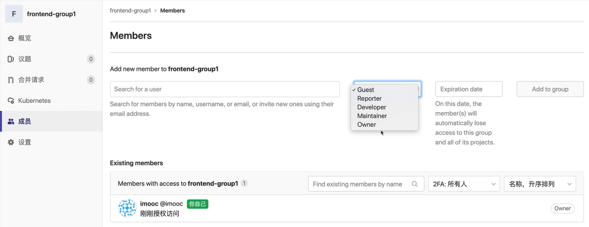

### 保护分支

在一个项目中，不同的分支对于不同的成员也会有不同的权限；

`master`分支默认为保护分支，保护分支可以设置以下内容：

+ 设置允许`merge`的角色才能`merge`代码到该分支；
+ 设置允许`push`的角色才能发起`push request`；

如下所示，我们能将一个分支设置为保护分支；

我们在一个项目中，`Maintainer`跟随`settings->repostory->Protected Branches`即可设置保护分支；

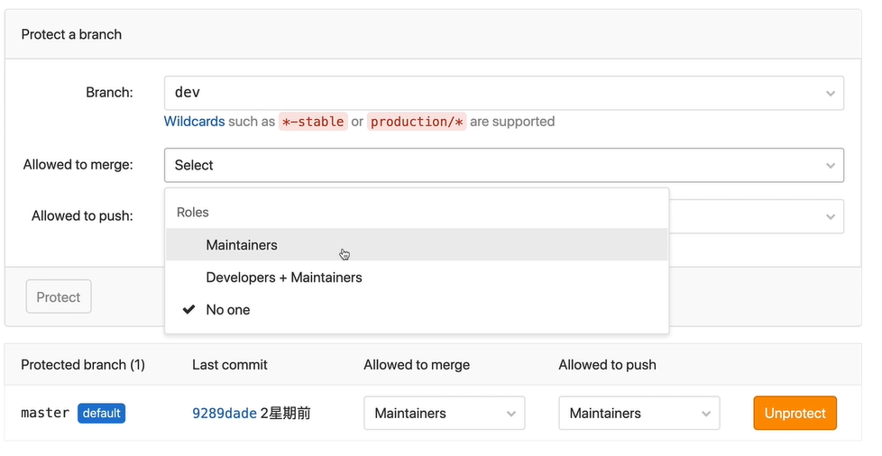

## Git的个性化设置

点击用户头像，跟随`User settings->Prefrence->Localization`来设置语言；

# gitignore

### 快速生成`gitignore`

在我们的实际开发中，我们不需要将一些文件提交，比如`.idea`、`DS_Store`这类由`IDE`、操作系统生成的文件，以及我们经常使用的`node_modules`；但是我们总会不小心将其`git commit`，因此`gitignore`应运而生，用来截断部分我们不需要提交的文件；

但是我们自己编写`gitignore`很麻烦，我们必须要非常理解当前不需要的文件，涉及到平台、`IDE`的文件系统；

因此我们可以使用`github/gitignore`这个库来处理，这个库提供了大量的编写好的`gitignore`文件模板，我们只要复制使用我们需要使用的`gitignore`文件里面的内容即可，如`Node.gitignore`：

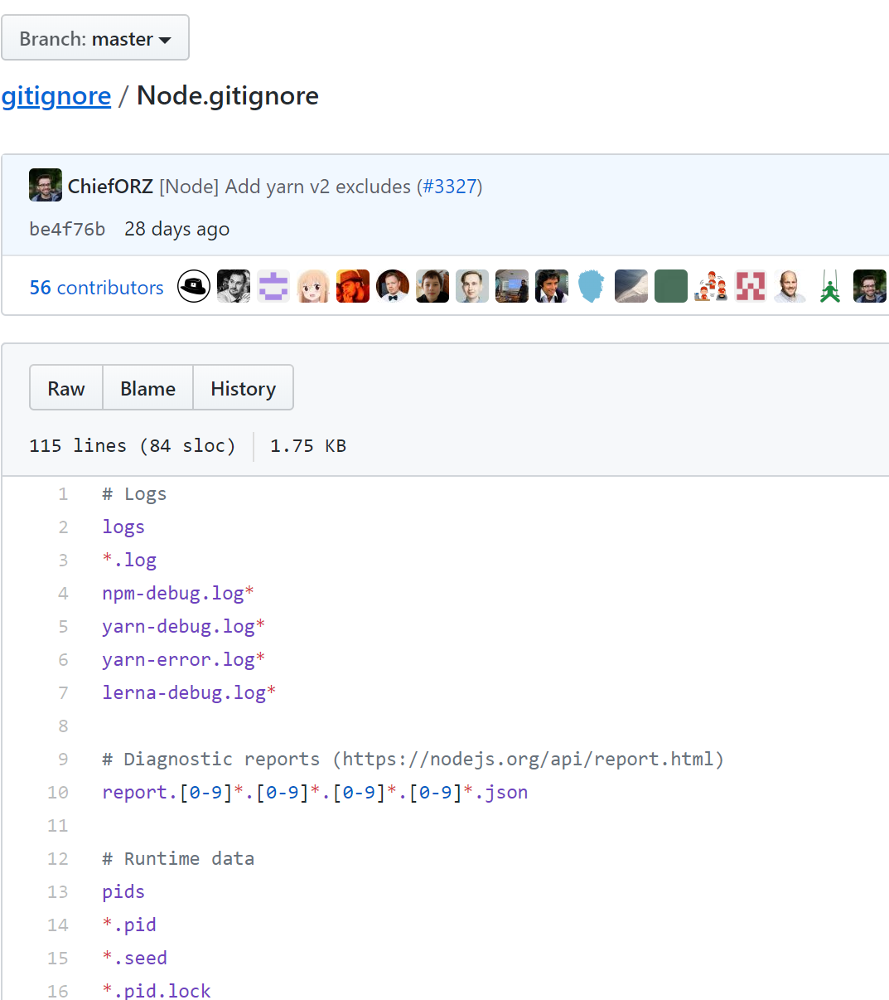

但是，这种模板只是适应一个场景，我们在开发中都是处于复杂场景的，比如一个开发者在`macos`上的`webstorm`中使用`node`开发项目，这时便受到了`macos`、`node`、`JetBrains`三个模块的不需要提交的文件的困扰，我们需要`ignore`这三个模块的不需要提交的文件；

为了处理这个问题，我们可以进入[gitignore.io](http://gitignore.io/)这个网站在线对多个模块生成一个`.gitignore`文件，而不是将`github/gitignore`中的对应`gitignore`文件中的内容一个接一个复制到`.gitignore`文件中；比如生成一个`ignore macos,node,JetBrains`的`.gitignore`文件：

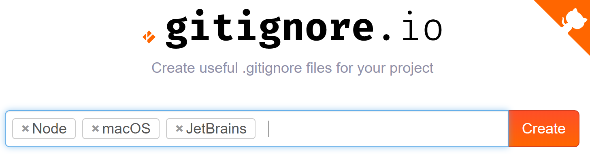

除了上述两种方式外，还有一种很方便的方式；

在`vs code`的插件市场中，我们可以搜索`.gitignore Generator`进行安装，这个插件和`gitignore.io`基本一致；然后我们跟随`查看->命令面板`打开搜索，输入选择`Generate .giyognore File`，之后便会打开一个面板选择要`ignore`的模块即可，默认会选择一些选项；

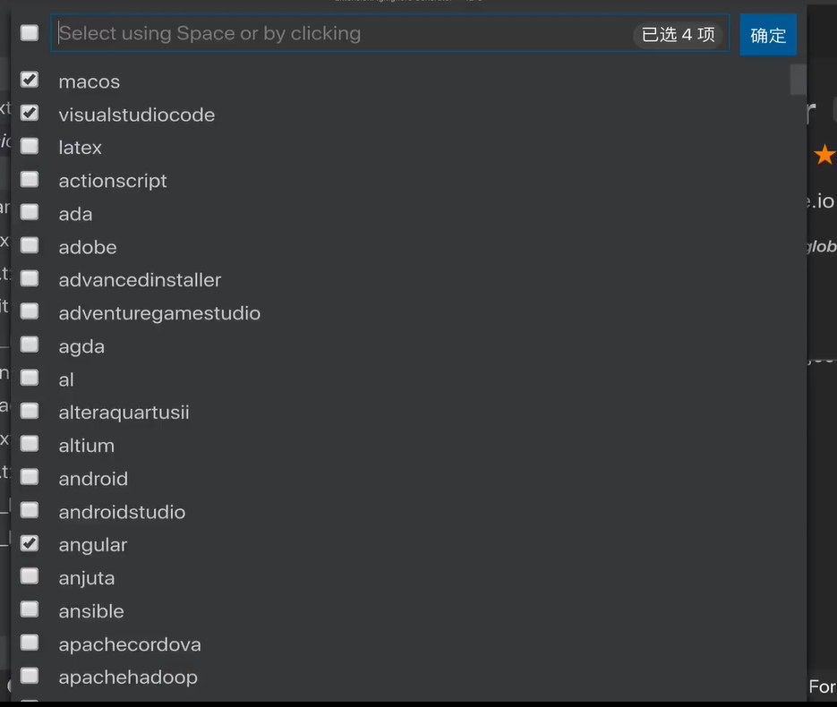

之后点击`确定`即可在当前打开的目录下创建一个配置好的`.gitignore`文件；

### `gitignore`在项目中的使用

我们使用`node`进行项目开发，我们在项目目录中新建`.gitignore`文件，然后粘贴`gitignore`的内容到该文件中，在`vs code`中会使用灰色表示已经被`gitignore`的文件；

当我们对`gitignore`掉的文件进行编辑，`git`不会监视到，自然也不会上传；

之后我们再去`git add`和`git commit`时就会发现那些修改掉的文件`git`并没有监视到并提示上传；

但是要注意，原先就被`git`监视的文件是不会被`gitignore`的，即使在`.gitignore`文件中写入了也是不行的；于是我们可以使用如下命令来删除暂存区/版本库中的该文件，但不删除工作区的文件：

```
git rm --cached -r .
```

这样之后，我们就可以重新使用`git add`和`git commit`进行提交；

实际上，`git rm`空有其名，并不会真实删除，因为我们还能回滚版本就说明没有删除，只是生成了一个新的`commit`记录，该记录内的`tree`不包含暂存区内的文件而已，这样`git`就不会继续监听文件的变化了；

# `GUI`工具操作`git`

在日常开发中，使用图形化界面来操作`git`能提升我们的工作效率；

第一款是`SourceTree`；

首先我们需要进入`bitbucket`的官网注册`bitbucket`的账号并登录，之后会要求设置自己的用户名即可完全创建自己的账号，之后在`Confirm access to your account`中选择`Grant access`即可完成授权，之后浏览器会打开本地下载好的`SourceTree`；

下一步会要求创建`user-name`和`user-email`，这是我们在`git commit`时的用户名和邮箱；

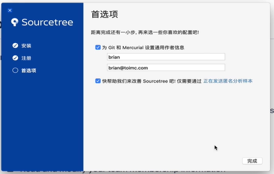

接下来，我们选择要`git`管理的工程项目文件夹，如果该工程项目使用了`git`进行管理，`SourceTree`会扫描到版本库，然后点击`添加多个仓库`即可完成使用`SourceTree`管理项目的引入；

之后我们打开双击已经引入的项目，即可进入项目的`git`管理；

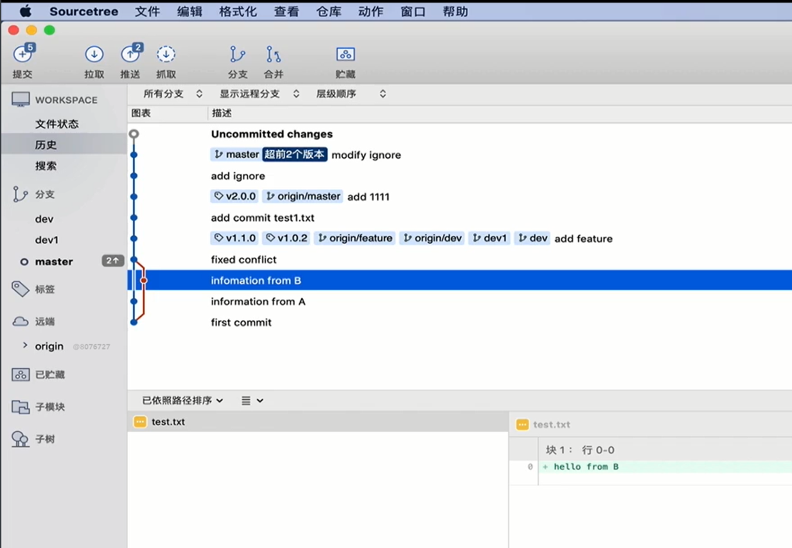

第二款是`vs code`；

`vs code`的插件市场中有一款插件为`GitLens`，用于`git`的项目管理；安装后会在左侧列栏找到`Gitlens`图标以进入`GitLens`的操作面板；

在`Gitlens`的界面中，`FILE HISTORY`和`LINE HISTORY`都可以看到单文件的历史：

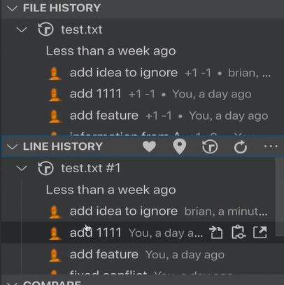

在右侧的两列我们可以看到该文件历史的变动：

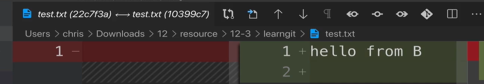

`REPOSITORIES`非常强大，可以看到项目仓库的操作历史、文件修改历史、贡献者信息和操作历史、分支的操作历史等等；

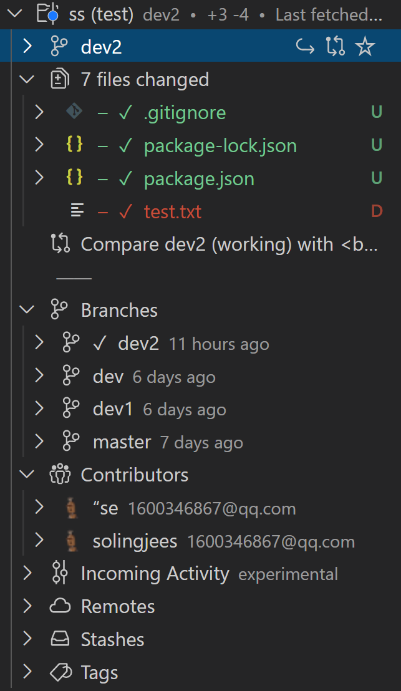

我们可以在`Branches`目录上右键调出操作菜单来操作分支，比如删除分支；

`vs code`会将我们的操作以命令的形式写在终端上；

在`Remotes`目录下，我们可以看到所有远程仓库的所有分支信息，对远程仓库的分支，我们可以进行下载并切换、比较分支等等操作；

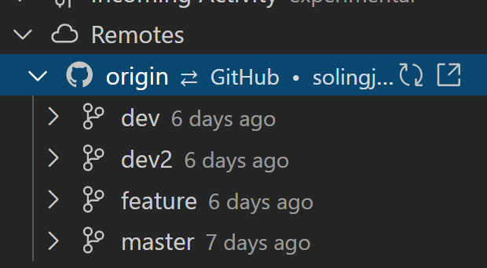

第三款是`webstorm`；

`webstorm`的`git`操作放置在`VCS`选项卡下的`Git`中；

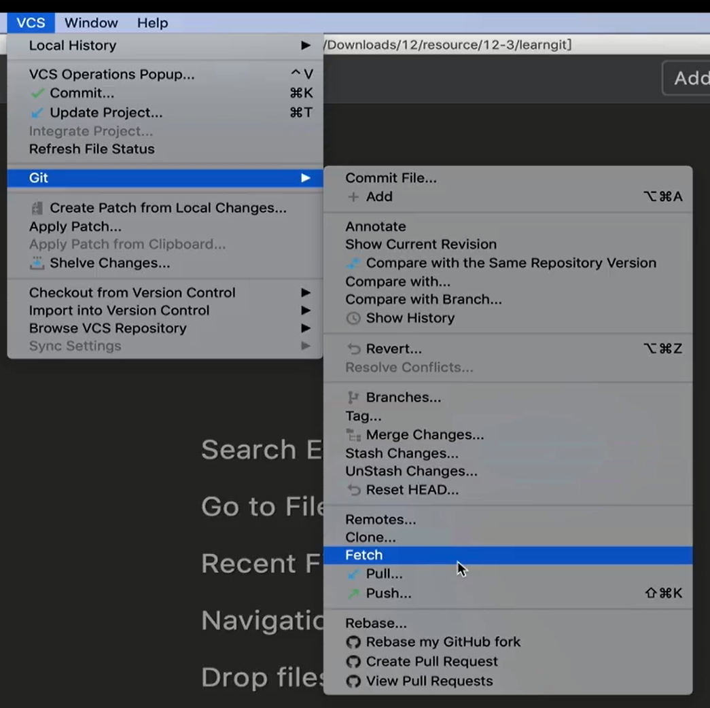

比如在`commit`中，我们可以选择文件查看版本变化；

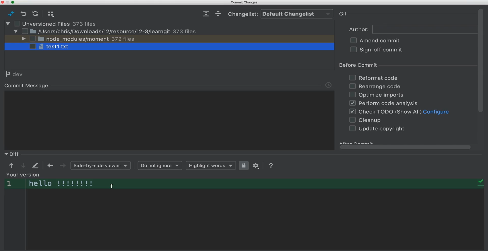
