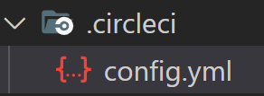
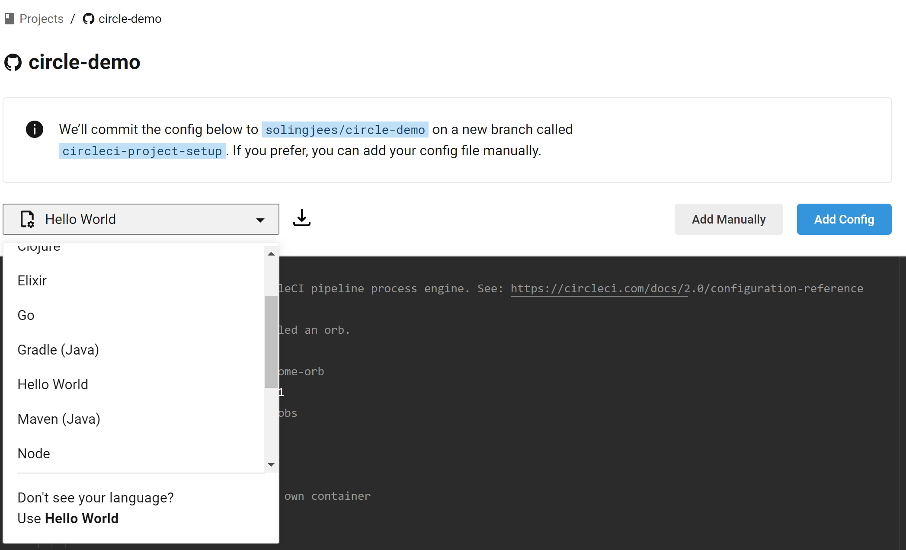
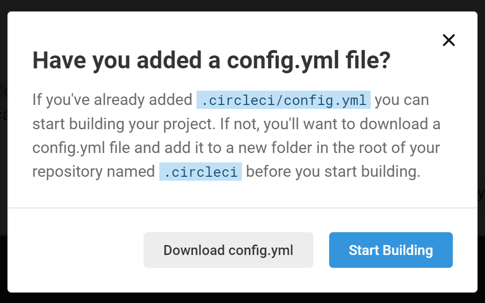
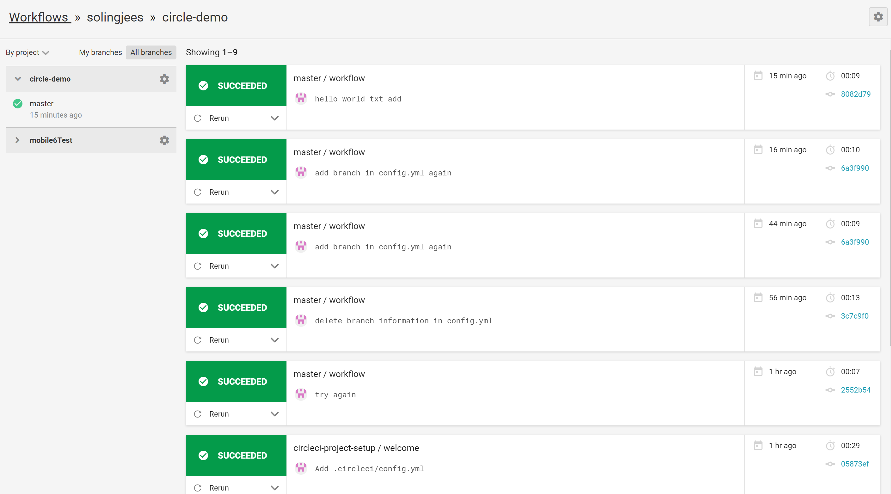
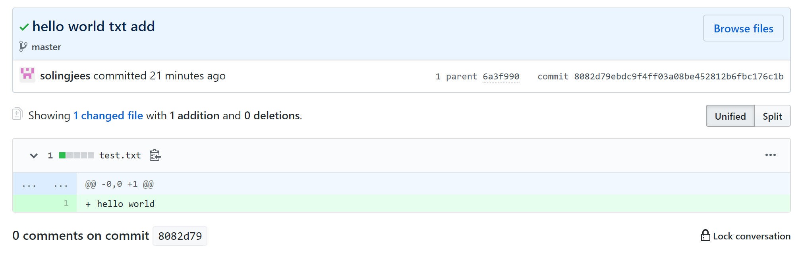
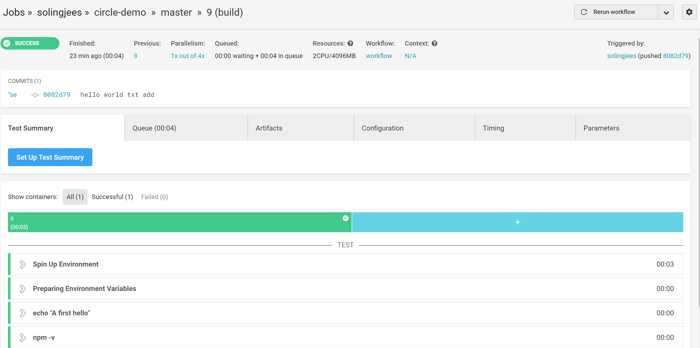

# `CI/CD`工具

| 分类     | Jenkins                | Travis CI   | Circle CI   |
| -------- | ---------------------- | ----------- | ----------- |
| 本地部署 | 支持                   | 云平台      | 云平台      |
| 配置     | 高度可配置             | `YAML`文件  | `YAML`文件  |
| 跨平台   | 是（基于`Java`）       | `Linux+Mac` | `Linux+Mac` |
| 多服务器 | 是（支持伺服机`Task`） | 否          | 否          |
| 费用     | 免费                   | 69$/c/m     | 50$/c/m     |

# `Circle CI`

由于是云平台，不支持本地化部署，因此我们直接进入`Circle CI`官网；

进入官网后，首先我们需要使用`GitHub`账号登陆绑定`Circle CI`平台以进入控制台；


左侧的菜单项的功能如下：

+ `JOBS`：对所有任务的操作；
+ `WORKFLOWS`：项目的工作流；
+ `InSIGHTS`：显示项目的全貌、统计等信息；
+ `ADD PROJECTS`：手动添加新的`Circle CI`项目、管理`Circle CI`项目；
+ `TEAM`：管理我们的项目团队和权限设置；
+ `SETTINGS`：
  + `PLAN-Plan Overview`：价格计划和不同`Circle CI`版本功能，免费版只支持中小型的开源项目；
  + `PLAN-plan Usage`：当前版本`Circle CI`的项目使用情况；
  + `ORGANIZATION-Projects`：所有被`Circle CI`管理的项目；
  + `ORGANIZATION-Contexts`：传递给`CI/CD`流程的环境变量；
  + `VCS`；
  + `Security`；

## `Cricle CI`项目的基础搭建流程

### 新建`GitHub`仓库

方法不再赘述，如果`Circle CI`的版本是免费版，则`git`仓库必须是`public`的；

然后我们使用`git clone`将项目部署到本地，并使用`code .`来打开这个项目；

### 在项目中配置`circleci`

我们在项目根目录下新建`.circleci`目录，该目录保存着我们所有关于`circleci`的配置；

在该目录下再创建`config.yml`文件；



然后，我们在`config.yml`中进行配置，如下简单示例：

```yml
 version: 2 # circleci version
 jobs: #  a workflow can coordinate them!
   build: # This is our first job.
     docker: # it uses the docker executor
       - image: circleci/node:10 # specifically, a docker image with node 2.4.1
     # Steps are a list of commands to run inside the docker container above.
     steps:
       - run: echo "A first hello" # This prints "A first hello" to stdout.
       - run: npm -v 
```

> `circleci`接收到我们的配置后，会执行`jobs`下的`build`任务，该任务会启动一个`image`为`circleci/node:10`的`docker`镜像，这个镜像是一个`node`环境，之后会在该环境里执行`steps`属性下的步骤，首先`run echo "A first hello"`，然后` run npm -v `；这样我们就完成执行了一个`circle ci`任务；

当我们修改完成后，我们使用`git add . + git commit -m "xxx" + git push origin master`将我们的代码推送到远程仓库的`master`分支上；

### `circle CI`项目的启动

然后我们进入我们的控制台，现在`Circle CI`提供了新的控制台`UI`，操作更加简单；

我们进入`ADD PROJECTS`菜单栏，这个部分会显示我们`GitHub`下的所有的项目，然后我们点选我们的要使用`Circle CI`自动化构建的仓库后的`Set Up Project`对其进行配置；


在配置中，如果这是一个还没有`.circleci/config.yml`配置的项目，那么可以选择要目标运行的环境来生成对应环境的模板，然后只要在该模板的基础上修改即可完成配置，比如`node`环境，然后点选`Add Config`就添加好了配置；但是注意，这样生成的配置是建立在新分支`circle-project-setup`下的，而不是`master`分支下，因此之后在实际使用中，要注意先将该分支下的文件`git merge`到其他工作分支，才能自动化构建其他工作分支；



如果项目已经使用`.circleci/config/yml`文件配置好了`Circle CI`，就点选`Add Manually`进行人工配置，`Circle CI`会寻找我们根目录下的`.circle/config.yml`文件进行配置：



上图是`Add Manually`的提示，表示如果我们已经有了配置文件就可以直接`Start Building`；

当我们构建完成，`Circle CI`会监视每一次`git commit`的操作，然后会使用`config.yml`进行自动化构建；

### `Cricle CI`项目的检视

当`Circle CI`项目`Building`完成，会自动跳转到`WORKFLOW`下对应`project`的面板，该面板记录每一次`commit`的构建信息；



每一次构建不一定会只有一个`job`，我们可以点选记录来查看该次构建的信息；


进一步地，我们可以点选记录末尾的蓝色`commit hash`值来跳转到`GitHub`来查看该次`commit`的修改：



我们还可以查看每一个`job`更加详细的信息，比如构建的过程：首先设置环境，然后准备环境变量，接着执行我们的命令：




在`job`页面我们发现，`Circle CI`默认使用了一个`2CPU/4096MB`的机器来构建我们的项目，还有一些其他的信息，比如构建时间、构建的`commit hash`等等；

至此，我们就简单了解了一个项目的`Circle CI`创建流程；