# `Circle CI`

`Circle CI`是大量开源项目都在使用的自动化构建/测试的平台，`Vue`便是使用`Circle CI`自动化构建的，我们只要简单在我们的项目中配置一下就可以放在`Circle CI`平台上进行自动化构建，将我们的上线部署等操作脱离开发核心环节，提升我们的工作效率；

## 面板基础了解

由于是云平台，不支持本地化部署，因此我们直接进入`Circle CI`官网；

进入官网后，首先我们需要使用`GitHub`账号登陆`Circle CI`平台，然后使用`GitHub`登陆时会要求授权，授权完成后，我们就能将自己`GitHub`上的所有仓库链接到`Circle CI`，登录成功后会直接进入控制台；

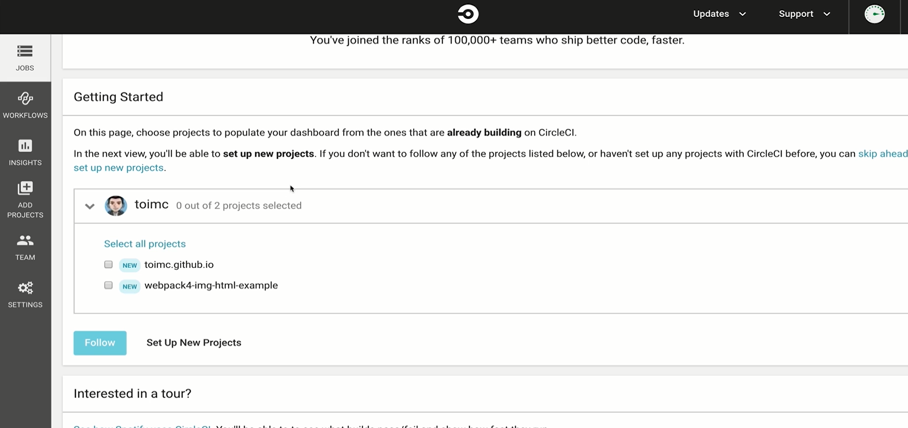

左侧的菜单项的功能如下：

+ `JOBS`：记录所有`Circle CI`所关注的项目的`Jobs`执行情况，一次构建可以进行多个`job`；

  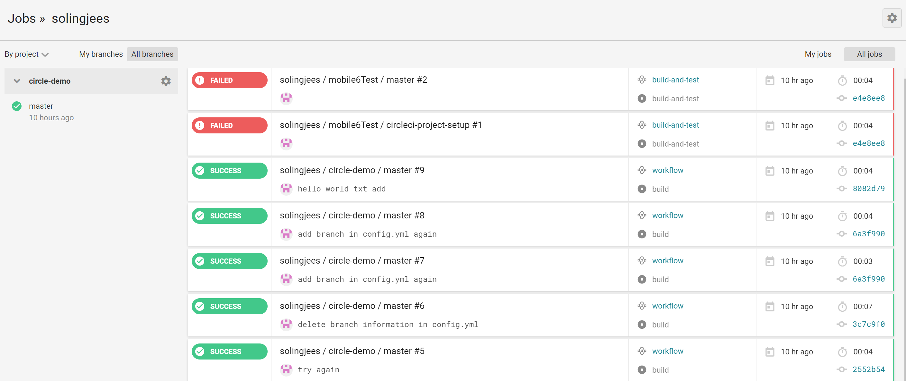

+ `WORKFLOWS`：记录所有`Circle CI`关注的项目的`workflow`情况，一个`workflow`代表一次构建；

  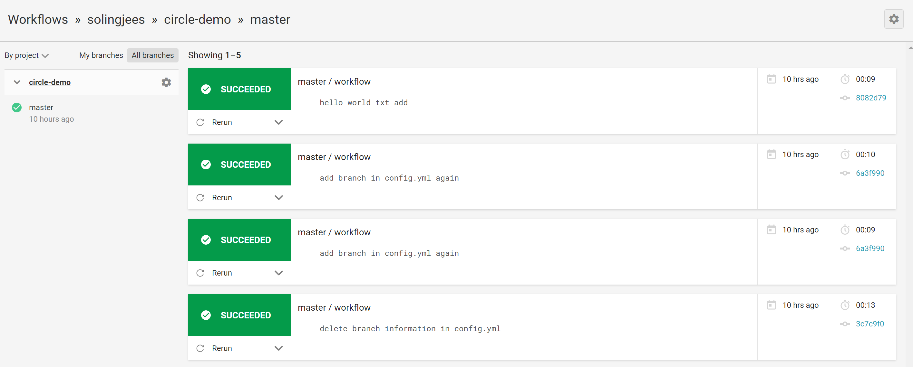

+ `InSIGHTS`：显示项目的统计等信息，如`Job`构建时间中位数、最近`Job`构建时间等等；

  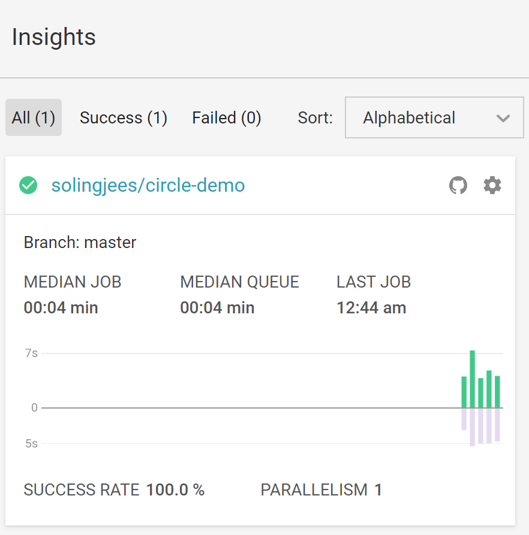

+ `ADD PROJECTS`：创建新的`Circle CI`项目监视/关注服务、管理`Circle CI`所关注的项目，我们可以添加一个新的项目关注服务，或者删除关注；

  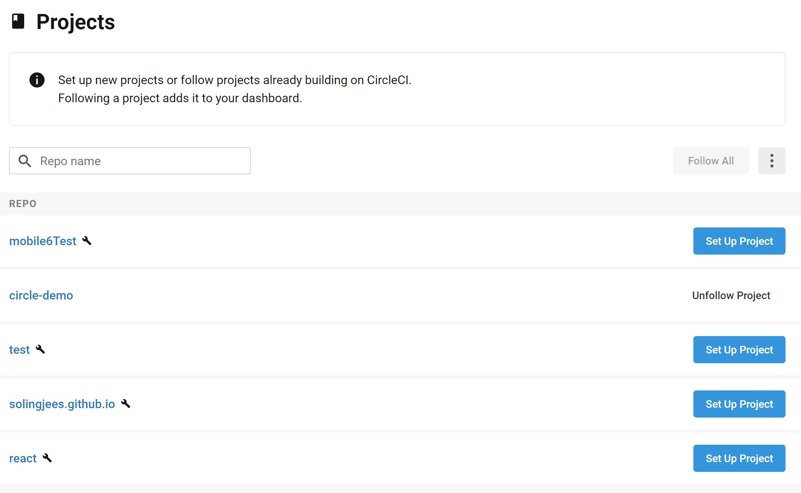

+ `TEAM`：管理我们的项目团队和权限设置；

  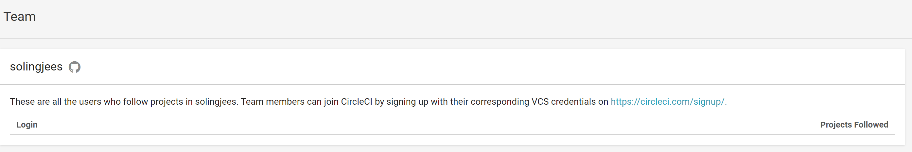

+ `SETTINGS`：
  
  + `PLAN-Plan Overview`：显示当前收费计划下，`Circle CI`项目的概况，如`credits`消耗（每周限制的可以构建的量）、版本（免费版本只支持中小型的开源项目）等等；
  
    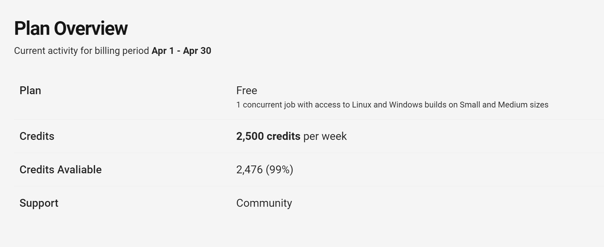
  
  + `PLAN-plan Usage`：当前收费计划下，版本`Circle CI`的不同的项目的使用情况，如`credits`的使用情况；
  
    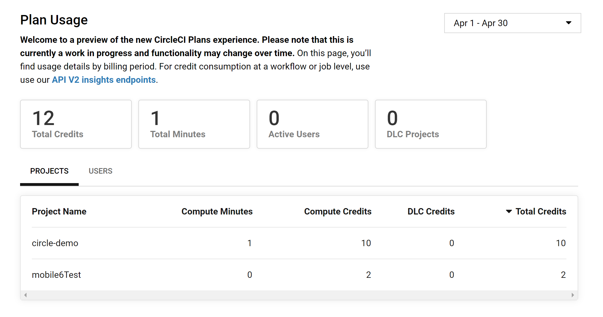
  
  + `ORGANIZATION-Projects`：`GitHub`项目的设置，可以更加细粒度地配置项目；
  
    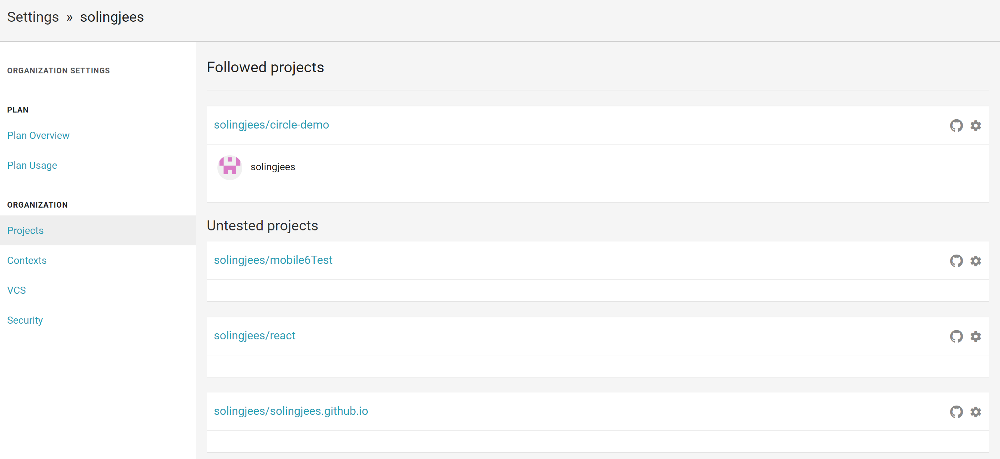
  
  + `ORGANIZATION-Contexts`：传递给`CI/CD`构建过程的环境变量；
  
    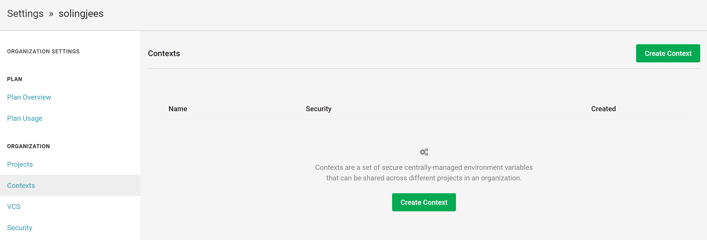
  
  + `VCS`；
  
  + `Security`；


## `Cricle CI`关注服务的基础搭建流程

### 新建`GitHub`仓库

方法不再赘述，如果`Circle CI`的版本是免费版，则`git`仓库必须是`public`的；

然后我们使用`git clone`将项目部署到本地，并使用`code .`来打开这个项目；

### 在项目中配置`circleci`

`Circle CI`需要知道整个构建的流程，因此我们需要在我们的项目中配置`Circle CI`；

我们在项目根目录下新建`.circleci`目录，该目录保存着我们所有关于`circleci`的配置；

在该目录下再创建`config.yml`文件；

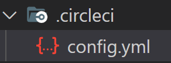

然后，我们在`config.yml`中进行配置，如下简单示例：

```yml
 version: 2 # circleci version
 jobs: 
   build: # This is our first job.
     docker: # it uses the docker executor
       - image: circleci/node:10 # specifically, a docker image with node
     # Steps are a list of commands to run inside the docker container above.
     steps:
       - run: echo "A first hello" # This prints "A first hello" to stdout.
       - run: npm -v 
```

> `circleci`找到我们的配置文件后，会执行`jobs`下的`build`任务，该任务会启动一个`image`为`circleci/node:10`的`docker`镜像，这个镜像是一个`node`环境，之后会在该环境里执行`steps`属性下的步骤，首先`run echo "A first hello"`，然后` run npm -v `；这样我们就完成执行了一个`circle ci`任务；

当我们修改完成后，我们使用`git add . + git commit -m "xxx" + git push origin master`将我们的代码推送到远程仓库的`master`分支上；

### `circle CI`新建关注服务

然后我们进入我们的控制台，现在`Circle CI`提供了新的控制台`UI`，操作更加简单；

我们进入`ADD PROJECTS`菜单栏，这个部分会显示我们`GitHub`下的所有的项目，然后我们点选我们的要使用`Circle CI`自动化构建的仓库后的`Set Up Project`对其进行创建`Circle CI`关注服务；

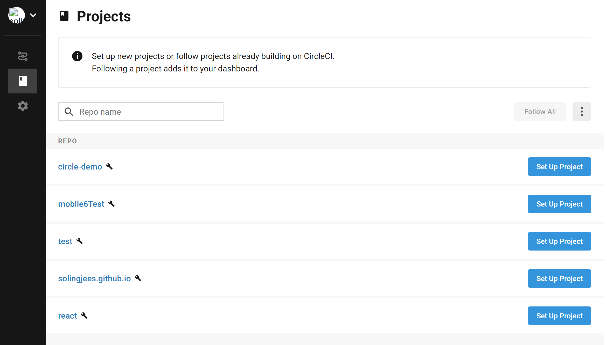

在配置中，如果这是一个还没有`.circleci/config.yml`配置的项目，那么可以选择要目标运行的环境来生成对应环境的模板，然后只要在该模板的基础上修改即可完成配置，比如`node`环境，然后点选`Add Config`就添加好了配置；但是注意，这样生成的配置是建立在新分支`circle-project-setup`下的，而不是`master`分支下；

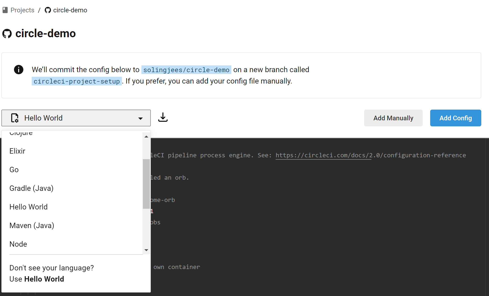

如果项目已经使用`.circleci/config.yml`文件配置好了`Circle CI`，就点选`Add Manually`进行人工配置，`Circle CI`会使用我们根目录下的`.circle/config.yml`文件进行配置：

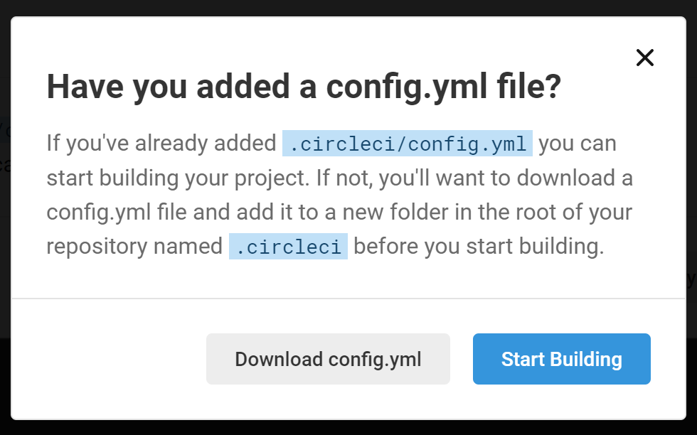

上图是`Add Manually`的提示，表示如果我们已经有了配置文件就可以直接`Start Building`，这样`Circle CI`就会开始使用`config.yml`自动化构建我们的项目；

当我们构建完成，`Circle CI`会监视每一次`git commit`的操作，然后会使用`config.yml`重新进行自动化构建；

### `Cricle CI`的检视

当`Circle CI`项目`Building`完成，会自动跳转到`WORKFLOW`下对应`project`的面板，该面板记录每一次`git push`的构建信息；

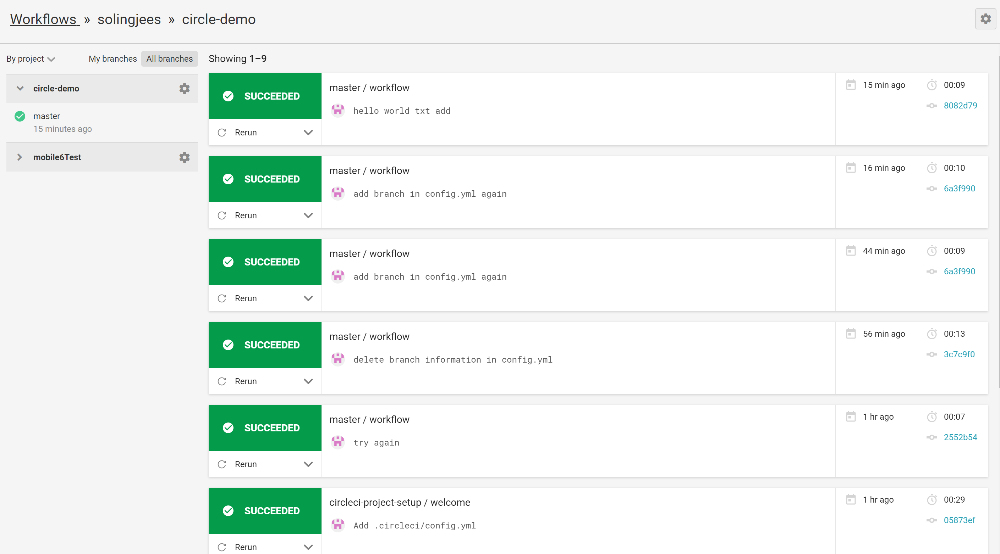

每一次构建不一定会只有一个`job`，我们可以点选记录来查看该次构建的信息；

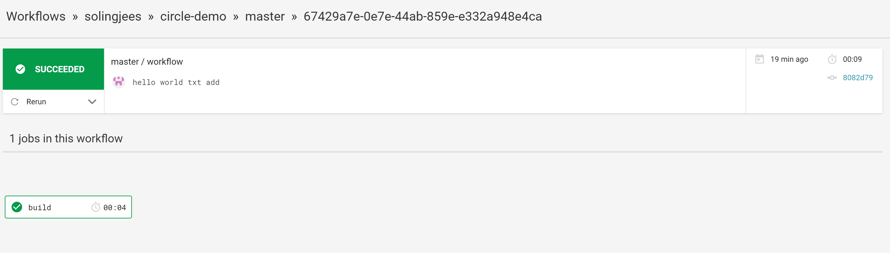

进一步地，我们可以点选记录末尾的蓝色`commit hash`值来跳转到`GitHub`来查看该次`commit`的修改：


我们还可以查看每一个`job`更加详细的信息，比如构建的过程：

+ 首先设置环境;
+ 然后准备环境变量;
+ 接着执行我们的命令：


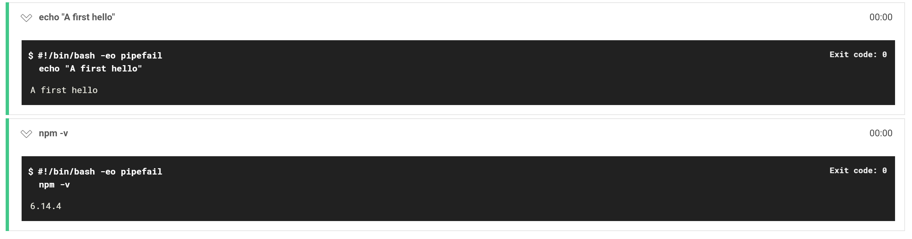

在`job`页面我们发现，`Circle CI`默认使用了一个`2CPU/4096MB`的机器来构建我们的项目，还有一些其他的信息，比如构建时间、构建的`commit hash`等等；

至此，我们就简单了解了一个项目的`Circle CI`创建流程；

## `Circle CI`配置`user key`密钥提升权限

在我们的实际开发中，当我们首次`set up`一个`GitHub`项目时，会生成一对只具有（部分）读权限的`employ key`使得`Circle CI`可以从`GitHub`上的该项目`check out`代码；但是有很多场景`Circle CI`需要去操作`repositories`，如读写操作、新建/删除仓库等，最典型的应用场景如`GitHub Pages`的新建，因此我们需要生成`user key`使得`Circle CI`可以和用户一样操作该用户下的所有的`repositories`；

我们跟随`Project Settings->Checkout SSH keys`;

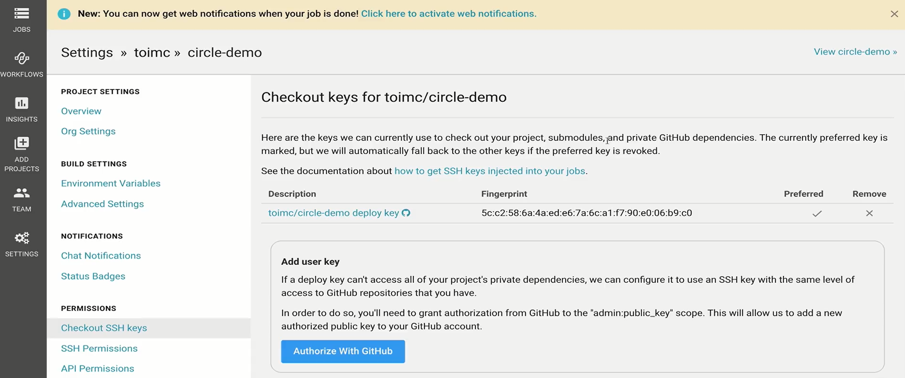

在该页面，我们可以看到适用于当前项目的`keys`，然后我们要`Add user key`来提升`GitHub repository`操作权限;

我们点击`Authorize with GitHub`来授权`Circle CI`向`GitHub ssh`的`admin:public_key scope`进行添加新的`public key`；

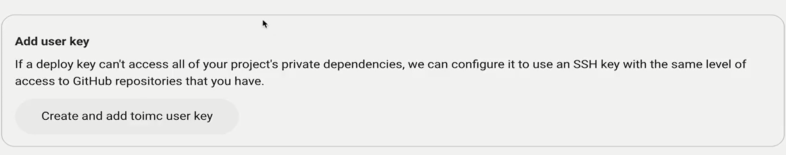

接着，我们`Create and add user key`来新建`user key`，这会在用户的`GitHub`端生成`ssh`公钥，然后在`Circle CI`端生成`ssh`私钥，下图显示的是`GitHub ssh`新生成的公钥；

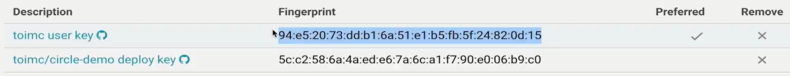

这样，`Circle CI`就能以用户权限来访问`GitHub repositories`了；

然后，我们需要在`config.yml`中指定当前`Job`所使用的`ssh`密钥为`user key`，否则默认情况下，`Circle CI`依然使用`deploy key`来与`GitHub`通信导致因权限受限而无法修改`GitHub`仓库：

```yaml
version: 2
 jobs:
   build:
     ...
     steps:
       - add_ssh_keys:
          fingerprints:
            - "07:75:9c:8d:d3:3e:68:92:23:db:3b:f0:70:bf:4a:6d"
       - checkout
       ...
```

## `config.yml`配置自动化任务

在这部分，我们对`config.yml`作更加深入的配置来适应我们实际的项目需要；

首先，我们需要配置一个`Job`，如果我们没有使用`workflow`属性进行工作流配置，那么默认情况下会先执行`build Job`，因此在没有配置`workflow`属性的情况下，我们要首先在`build`任务中进行配置；

更多地，在一个`Job`中，我们可以定义以下属性来适应我们的需要：

+ `docker`：配置所需要的`docker`镜像，如`node`环境，注意`node`环境的版本别写错；

+ `branches`：我们可以自选需要进行构建的分支；进一步地，我们可以给`branches`添加以下新属性：

  + `only`：只有该属性下的分支才会被构建；
  + `ignore`：该属性下的分支都不会被构建；

+ `steps`：该属性下记录构建的步骤，可以添加以下清单成员：
+ `add_ssh_keys`：指定使用的`ssh`密钥，默认是`deploy key`，没有修改`GitHub`仓库的权限，若有需要，请使用`user key`；`add_ssh_keys`接收以下参数：
    + `fingerprints`：指纹，即`GitHub`公钥，可以接收多个`keys`清单成员；
  + `checkout`：该步骤用于拉取分支代码到`Circle CI`的构建服务器上进行构建，`circle CI`默认安装`git`作为版本控制工具，默认情况下会`git clone`代码仓库到服务器的当前`Job’s working_directory`下，并且之后的操作都会在该代码仓库的目录下进行；
+ `save_cache`：缓存项目文件/文件夹，常用以下参数：
    + `paths`：指定要缓存的文件/文件夹列表；
    + `key`：`cache`缓存名；
  + `restore_cache`：从项目缓存中提取缓存好的文件/文件夹，常用以下参数：
    + `keys`：要使用的缓存列表；
  + `run`：设置要执行的操作，主要使用以下属性：
    + `name`：当前命令的简要命名；
    + `command`：所要执行的命令；

> `YAML`语言非常注重缩进，缩进不正确构建会失败；
>
> 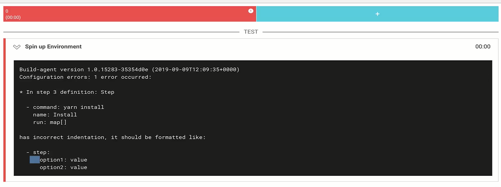

## `Vue.Js`项目配合`Circle CI`部署上线`GitHub Pages`与细节优化

### `cache`缓存`node_modules`依赖

`node`项目都存在`node_modules`文件夹，每当`Circle CI`构建时，我们不希望每一次都重新下载项目依赖，因为依赖的变更往往是比较少的，因此`Circle CI`提供了缓存的方式，使得`node_modules`文件夹在第一次构建时可以缓存下来备用，下一次可以直接从缓存中拉取，来提高构建效率，之后执行`npm install`类似的依赖安装过程会加快，因为大量的依赖都已经从缓存内拉取进来了；

```
 version: 2
 jobs: 
   build: 
     ...
     steps:
       ...
       - restore_cache:#使用缓存
          keys:#指定缓存名
            - dependencies_imooc
       ...
       - save_cache:#缓存
          paths:#指定要缓存的文件/文件夹列表
            - node_modules
          key: dependencies_imooc #指定缓存名
       ...
```

>  注意，如果存在多个符合要使用的缓存名，`restore_cache`只会使用最后/近的模糊匹配的`cache`，如：
>
> ```
> steps:
>   - save_cache:
>       key: v1-myapp-cache
>       paths:
>         - ~/d1
> 
>   - save_cache:
>       key: v1-myapp-cache-new
>       paths:
>         - ~/d2
> 
>   - run: rm -f ~/d1 ~/d2
> 
>   - restore_cache:
>       keys: 
>        - v1-myapp-cache
>        - v1-myapp-cache2
> ```
>
> 只会恢复`v1-myapp-cache`缓存；
>
> 若`v1-myapp-cache`缓存不存在，会跳过该缓存，接着往下寻找`v1-myapp-cache2`缓存进行恢复，找到后就停止查找；
>
> 若所有缓存都不存在，会提供一个`warning`，但不干扰执行；

### `shell`文件配置自动化部署

在我们完成`npm run build`后，我们要进行自动化部署，我们新建文件`scripts/deploy.sh`文件，书写`shell`命令进行自动化部署，该部分涉及大量`shell`命令知识，不进行详细分析：

```shell
#!/bin/sh
# 构想 https://gist.github.com/motemen/8595451

# 基于 https://github.com/eldarlabs/ghpages-deploy-script/blob/master/scripts/deploy-ghpages.sh
# MIT许可 https://github.com/eldarlabs/ghpages-deploy-script/blob/master/LICENSE

# abort the script if there is a non-zero error
set -e

# 打印当前的工作路径
pwd
remote=$(git config remote.origin.url)

echo 'remote is: '$remote

# 新建一个发布的目录
mkdir gh-pages-branch
cd gh-pages-branch
# 创建的一个新的仓库
# 设置发布的用户名与邮箱
git config --global user.email "$GH_EMAIL" >/dev/null 2>&1
git config --global user.name "$GH_NAME" >/dev/null 2>&1
git init
git remote add --fetch origin "$remote"

echo 'email is: '$GH_EMAIL
echo 'name is: '$GH_NAME
echo 'sitesource is: '$siteSource

# 切换gh-pages分支
if git rev-parse --verify origin/gh-pages >/dev/null 2>&1; then # 验证origin/gh-pages的存在性，>dev/null等价于1>dev/null 2&>1表示等价于1，也就是1和2都到dev/null中，表示标准输出1和错误输出2都重定向到dev/null，dev/null是一个黑洞，该目录在linux下比较特殊，这个文件接收到任何数据都会被丢弃
  git checkout gh-pages #切换分支到gh-pages
  # 删除掉旧的文件内容
  git rm -rf .
else
  git checkout --orphan gh-pages #将当前分支内容的最新commit copy到新建的分支的工作区内
fi

# 把构建好的文件目录给拷贝进来
cp -a "../${siteSource}/." .

ls -la

# 把所有的文件添加到git
git add -A
# 添加一条提交内容
git commit --allow-empty -m "Deploy to GitHub pages [ci skip]"
# 推送文件
git push --force --quiet origin gh-pages
# 资源回收，删除临时分支与目录
cd ..
rm -rf gh-pages-branch

echo "Finished Deployment!"
```

然后，我们修改`config.yml`文件，注意，在`config.yml`被调用时处于工程的根目录，而不是`.circleci`目录下：因此需要使用`./`而不是`../`；

```yaml
 version: 2
 jobs: 
   build: 
     ...
     steps:
       ...
       - run:
          name: Prepare shell commands
          # shell chmod +x 赋予执行权限，否则是无法执行的
          # 执行shell脚本
          command: chmod +x scripts/deploy.sh
       - run:
          name: Run Deploy to GitHub Pages
          command: ./scripts/deploy.sh
```

最后的`config.yml`文件如下：

```yaml
 version: 2
 jobs:
   build:
     docker:
       - image: circleci/node:10 
     branches:
         only:
            - master
     steps:
       - add_ssh_keys:
          fingerprints:
            - "07:75:9c:8d:d3:3e:68:92:23:db:3b:f0:70:bf:4a:6d"
       - checkout
       - restore_cache:
          keys:
            - dependencies_imooc
       - run:
          name: Install
          command: npm install
       - save_cache:
          paths:
            - node_modules
          key: dependencies_imooc
       - run:
          name: Build
          command: npm run build
       - run:
          name: Prepare shell commands
          # shell chmod +x 赋予执行权限
          # 执行shell脚本
          command: chmod +x scripts/deploy.sh
       - run:
          name: Run Deploy to GitHub Pages
          command: ./scripts/deploy.sh
```

我们的`shell`文件内存在一些环境变量需要配置，如`GH_EMAIL`、`GH_NAME`、`siteSource`，否则无法正常执行该文件，这些环境变量都来自于`Circle CI`的构建服务器；我们进入`Circle CI`当前项目的`Project Settings`，选择`Environment Viarables`，配置我们构建时的环境变量：

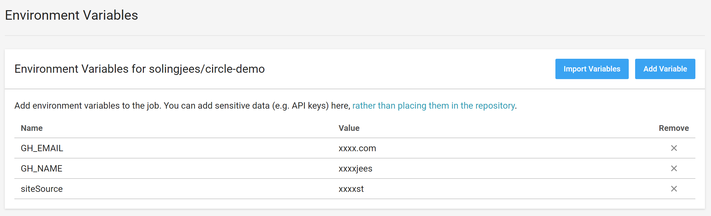

这样，我们就完成了自动化部署到`GitHub`的配置；`gh-pages`是`GitHub`默认的构建`GitHub Pages`的分支，`GitHub`会为该分支自动生成一个`GitHub Pages`；

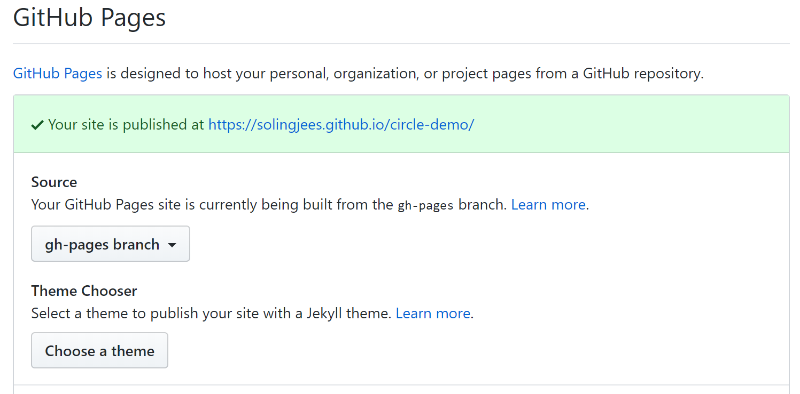

### `vue.config.js`设置`public path`修改上线路由

`Vue.Js`的代码构建在根目录上，但是`GitHub Pages`构建在`https://solingjees.github.io/circle-demo/`上，`URL base`不同，因为我们的`Vue.Js`项目中没有`/circle-demo`这个路由导致路由失败，而实际上我们要前往`/`路由，因此我们需要在`Vue.Js`项目中配置`URL base`，我们只需要在`vue.config.js`中这样书写即可完成`URL base`的配置；

```js
module.exports = {
  publicPath: //设置URL base
    process.env.NODE_ENV === 'production' ? '/circle-demo' : '/' //按照当前环境修改URL base
}
```

# `Travis CI`

`Travis CI`同样是一款非常重要的自动化`CI`工具，现在我们作进一步的了解；

## 用户面板基础了解

和`Circle CI`类似，我们要使用`GitHub`进行登陆授权，并且这是唯一的登陆方式，`Travis CI`暂不支持`bitbucket`；

在登陆完成后，我们就来到了`travis CI`的控制台；

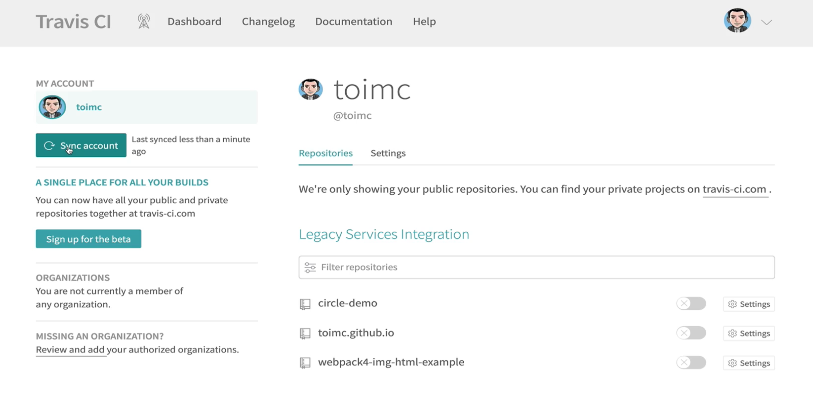

`Sync account`用于同步我们`GitHub`的个人/仓库信息；

`Repositories`显示我们`GitHub`上的公开仓库；

`Settings`可以操作我们的`API Token`、`Assets Token`，还可以开启/关闭一些新特性的支持，以及`email`通知；

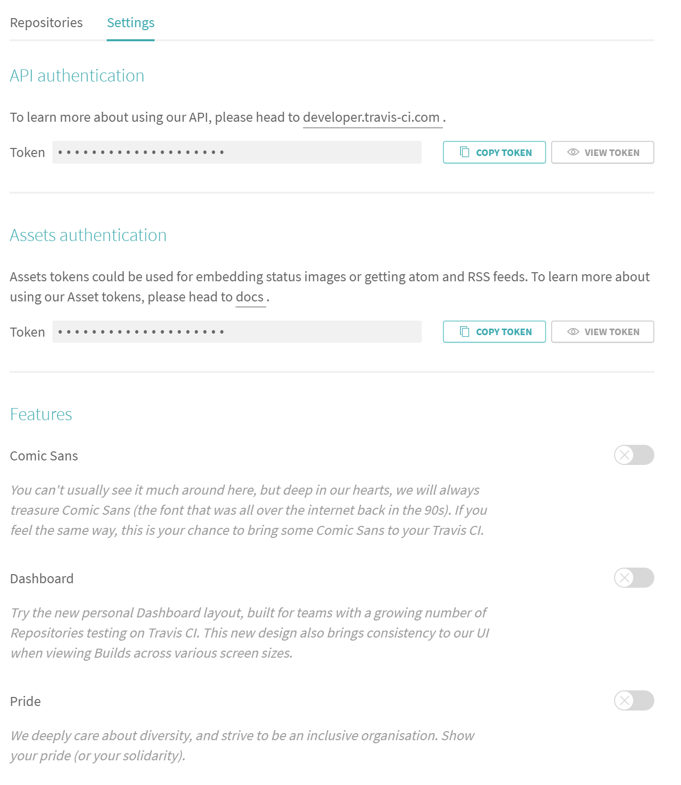

## `Travis CI`项目的创建和平台使用

在我们完成配置更新上传后，我们首先`Sync account`来同步我们的仓库信息，然后在右侧`repositories`选择指定的仓库并打开监视服务，这样，我们就完成了`Travis CI`和`GitHub`项目的对接；

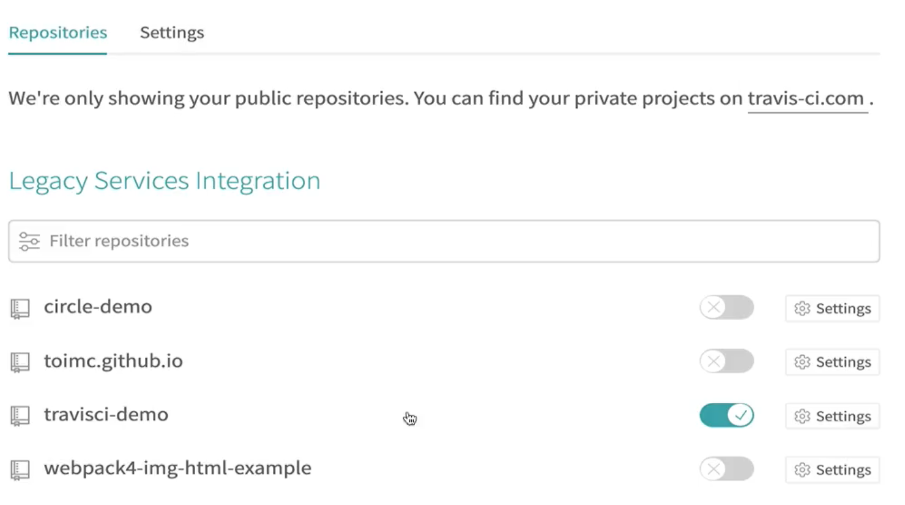

然后我们点击指定项目进入项目面板；

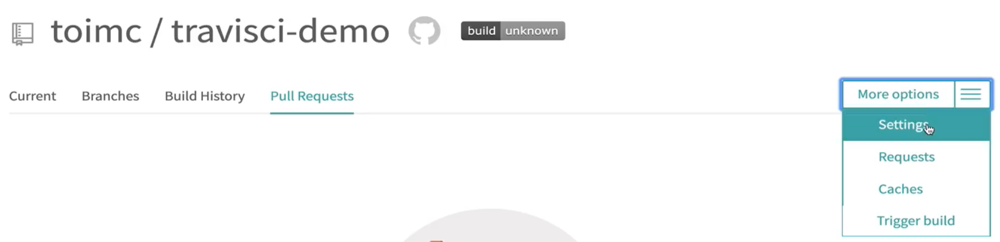


在项目面板中，我们简单了解一下不同菜单的功能：

+ `Current`：显示当前`Jobs`的构建情况；

  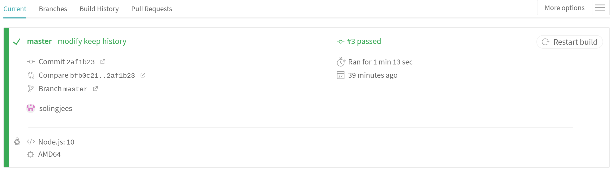

+ `Branches`：显示项目分支的情况；

  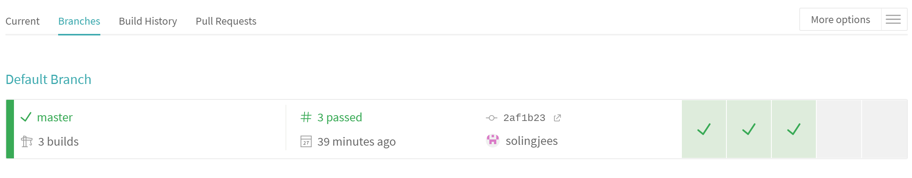

+ `Build History`：构建历史；

  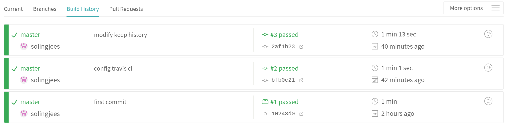

+ `Pull Request`：显示发起的代码合并请求；

+ `Trigger build`：手动触发构建，比如当我们首次`commit`时没有配置`Circle CI`服务，导致没有自动化构建，这时我们就可以手动触发第一次构建；

  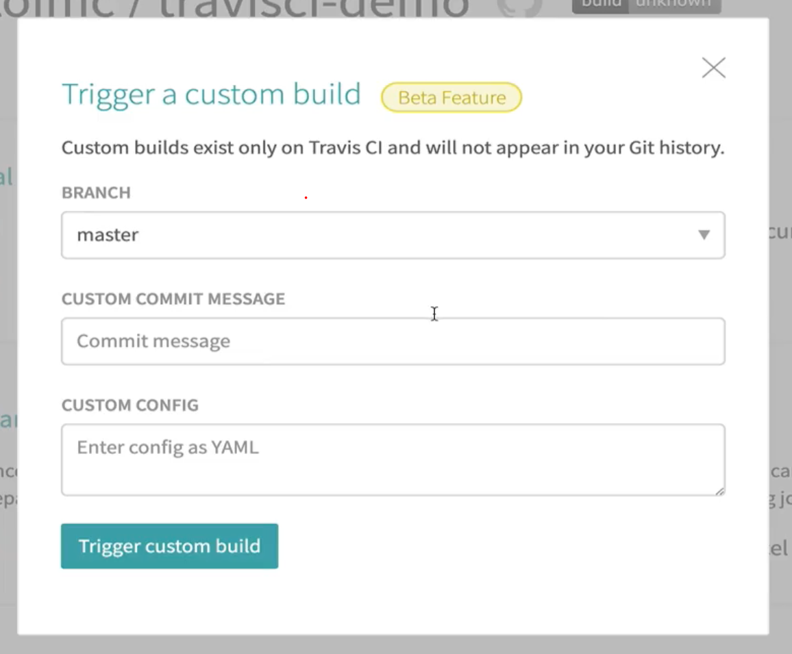

+ `Settings`：其中最重要的是`Environment Variable`，用于配置我们构建中的环境变量；

  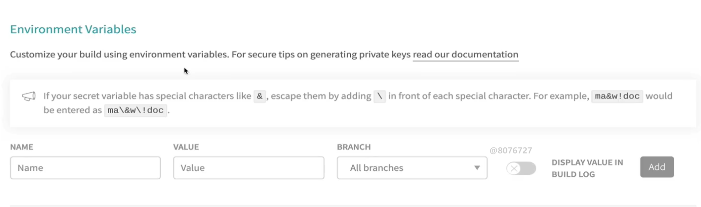


## 使用`Travis CI`搭建`Vue.Js`自动化流程并部署`GitHub Pages`

### 新建`GitHub`仓库

方法不再赘述，我们新建一个`public`的`GitHub`仓库；

然后我们使用`git remote add origin 远程仓库地址`将本地的`Vue.Js`项目和远程仓库连接，接着我们使用`code .`去打开`Vue.Js`项目；

### 配置`Travis CI`

我们需要在我们的项目根目录内新建`.travis.yml`文件，这是我们的配置文件；

首先我们需要配置环境，在`Travis CI`中`language`属性表示所配置的语言环境，进一步我们可以配置版本，对于`Vue.Js`项目，我们需要配置`Node.Js`环境，因此我们在`.travis.yml`中如下书写：

```
language: node_js
node_js:
    - "10" # 配置Node.Js版本
```

和`Circle CI`一样，我们使用`Job`来表示一个任务，但是`travis CI`拥有更加清晰优雅的`Job`流程，每个`Job`流程被分成多个清晰的阶段，每一个阶段按照规定的流程执行，如下所示是一个大致的流程：

```
OPTIONAL Install apt addons #安装apt插件，基本不配置
OPTIONAL Install cache components #安装cache组件，基本不配置
before_install #安装前
install #安装
before_script #脚本执行前，可以在这一步安装一些工具，比如gulp，然后在script阶段使用gulp
script #脚本执行
OPTIONAL before_cache (for cleaning up cache) #缓存前
after_success or after_failure #构建成功后/失败后
OPTIONAL before_deploy #部署前 
OPTIONAL deploy #部署
OPTIONAL after_deploy #部署后
after_script #脚本执行完后
```

我们并不需要在每一次`Job`时都和`Circle CI`一样`checkout`代码，这件事情`Travis CI`已经默认帮我们完成了，我们只需要对当前的项目进行操作即可，而不需要关心一些细枝末节；

我们主要对以下几个主要阶段进行配置：

+ `install`：这个阶段用于安装依赖，如安装`node_modules`下的所有依赖；
+ `script`：这个阶段用于运行构建脚本；

我们进行如下配置进行依赖安装和构建：

```
install: #install阶段进行依赖安装
    - npm install

script:#
    - npm run build
```

和`Circle Ci`类似，我们可以进行缓存，但是比`Circle CI`更加优雅；

`Travis CI`提供`cache`属性来配置缓存；`Travis CI`默认开启`npm`环境的缓存，但我们可以更加明确地书写出来：

```
cache:
    npm: true 
    # 现在明确开启了npm环境下的缓存，在npm install之前会首先提取缓存，构建结束后会新建/更新缓存，我们使用npm install会缓存node_modules文件夹
```

在我们完成依赖安装和构建后，我们需要配置`Job`的`deploy`阶段的内容，我们在`script`属性后添加以下内容：

```
deploy:
  provider: pages #表示GitHub
  local_dir: dist #设定需要被push的文件目录
  name: solingjjes #设定推送人
  email: 1600346867@qq.com #设定推送人邮箱
  skip_cleanup: true 
  # target_branch #设定要部署的分支，默认gh_pages
  github_token: $GITHUB_TOKEN  # Set in the settings page of your repository, as a secure variable
  keep_history: true #保持分支的commit历史，而不是git push --force覆盖gh_pages分支的更新的记录
  on:
    branch: master
```

> 具体的配置视字要部署的目标而定，比如`亚马逊AWS`的部署环境，具体配置参考官网即可，无需记忆；

当我们配置完毕后，我们`git add . + git commit -m xxx + git push`完成配置更新上传；

最后的`.travis.yml`文件内容如下，相比`Circle CI`繁复的配置，`Travis CI`过程清晰、配置简单：

```yaml
language: node_js
node_js:
    - "10"

cache: npm

install:
    - npm install

script:
    - npm run build

deploy:
  provider: pages
  local_dir: dist
  name: solingjjes
  email: 1600346867@qq.com
  skip_cleanup: true
  # target_branch
  github_token: $GITHUB_TOKEN  # Set in the settings page of your repository, as a secure variable
  keep_history: false #保持分支的commit历史，而不是git push --force覆盖gh_pages分支的更新的记录
  on:
    branch: master
```

### 修改`Vue.Js`路由

和`Circle CI`一样，我们的`Vue.Js`需要修改`publicPath`，此处不再赘述；

### 配置`GitHub Token`

我们必须要配置`GitHub Token`使得`Travis CI`能够访问、使用、修改我们的代码仓库，因此我们在`GitHub`上跟随`user-settings->Developer settings->Personal access tokens`创建一个`GitHub Token`，我们只需要配置第一个`repo`项目即可，使得使用该`Token`连接我的`GitHub`仓库的用户具有完全控制公私有仓库的权限；

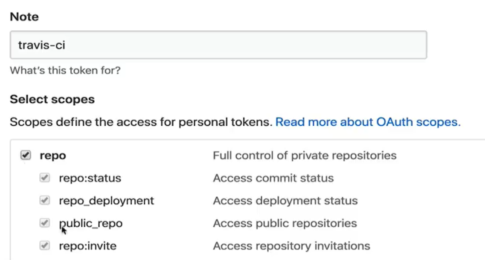

然后回到`Travis CI`中，跟随`project settings->Environment Variables`，新建一个环境变量`GITHUB_TOKEN`，输入在`GitHub`上生成的`GitHub Token`作为`value`，点击`Add`完成环境变量的创建，这样在项目部署时就可以读取到我们的`GitHub Token`以部署`GitHu Pages`了；

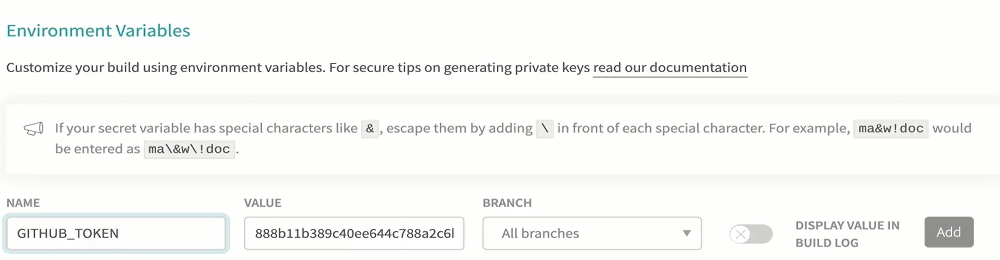

> 将`GitHub Token`以环境变量的方式传入目的是保护我们的项目，否则如果`GitHub Token`直接写死在`.travis.yml`中，会造成`GitHub Token`泄露，进而影响项目安全；

这样，我们就完成了所有的配置，只要再次`git push`即可触发自动化构建、部署的流程；


