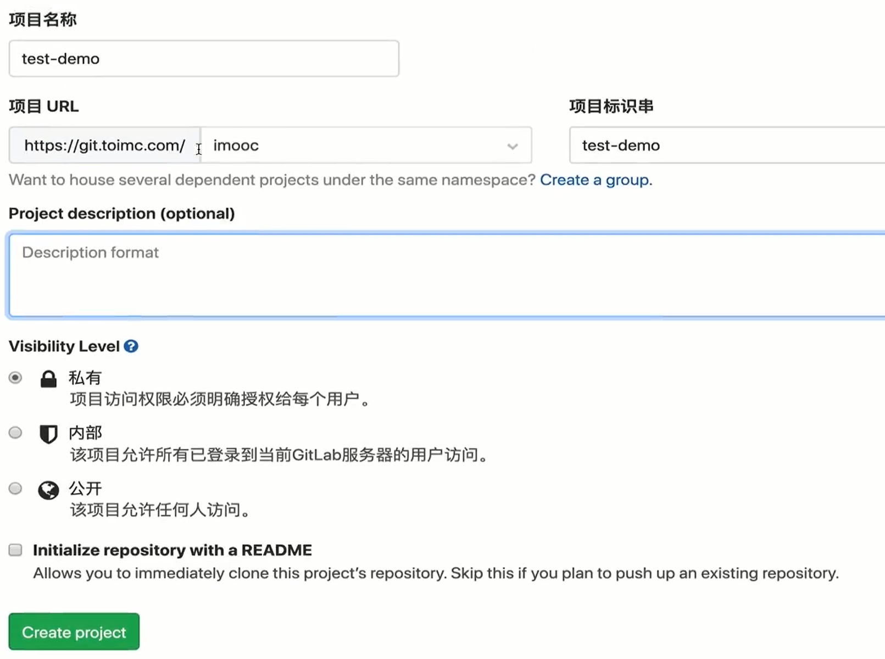

# `Jenkins`的优点

相较于`Circle CI`和`Travis CI`，`Jenkins`有以下的优点：

+ 支持本地化部署，我们可以部署一个自己的`CI/CD`平台供公司内部使用；
+ 最老牌的`CI/CD`工具，稳定性出众；
+ 高度可配置，不一定要使用`YAML`来书写配置文件；
+ 跨平台，使用`Java`编写，具有非常好的跨平台特性；
+ 支持分布式架构来来快速、异步地构建、测试、部署项目；
+ 配置选项多，但配置简单；
+ 提供丰富周边插件，具有强大的插件市场，可以使用插件来扩展`Jenkins`；
+ 免费，代码开源，部署免费；
+ `持续交付基金会`会员，开源`CI/CD`工具领导者；
+ 全球使用用户量巨大，达到`25万`之多；
+ 开源项目驱使内部结构不断发展完善，提升构建速度和稳定性；

# `Jenkins`平台搭建的要求

`Jenkins`环境的基本系统要求是`RAM>256M`，`DISK>1G(作为一个Docker容器运行jenkins的话推荐10GB)`；

但是这个配置只适用于个人用户，对于一个`10~100人`的团队来讲，这是远远不够的，团队使用的系统要求最低为`RAM>1G`，`DISK>50G`；

`Jenkins`支持两种部署方式：

+ `Docker`；
+ `war`包，得益于`Java`的底层实现和强大的跨平台特性，`Jenkins`官方推出`Jenkins war`包，该`war`包内含`Tomcat`容器，只需要使用`java`环境的命令`java -jar jenkins.war`即可完成配置；

# `DevOps`从开发到部署的链条实现


这三个服务一般不会运行在同一台服务器上，而是分布式地运行在不同的服务器上，这些服务器之间在配置上略有区别：

+ `GitLab`：`2`核心，`4GB`内存的服务器->`20`人团队；

+ `Jenkins` ：`2`核心，`4GB`内存的服务器-> `20`人团队，支持日构建`50`次左右；

+ `docker` ：视测试环境数量而定，比如如果需要4个环境：测试环境、验证环境、`Alpha`环境、`Production`环境，那么就需要启动多个docker容器，每个环境所需要的内存不等，比如`Java`环境的`Docker`镜像需要`300MB`内存；

由于`Jenkins`和`Docker`不在一台服务器上，我们就要将`Jenkins`构建完成的代码远程推送到`Docker`所在的服务器上，然后使用`Docker`进行部署发布，主流的有这三种方式来完成这种开发需求：

+ 运维人员在部署服务器上配置`shell`脚本，该脚本执行`Docker`镜像的打包构建的命令或者使用`rsync`传递文件树到已经存在的`Docker`镜像中——比如`Nginx`镜像的一系列命令，来完成我们的项目部署上线；
+ `Jenkins`将构建后的项目打包成`Docker`镜像推送到远程服务器集群的私有`Docker`镜像仓库中，然后使用`Kubernetes`容器管理平台来管理所有的`Docker`镜像，也就是管理一个`Docker`镜像集群；更进一步的，在企业中，会使用`Rancher`来管理所有的`Kubernetes`集群，因为它进一步封装了`Kubernetes`，并且提供了增强的功能；

+ 使用`Jenkins`插件进行发布，`Jenkins`提供的插件市场中存在大量的插件可以进行发布部署，而不需要在部署服务器上增加复杂的操作；

# `Jenkins`的`Docker`安装

使用以下命令安装`Jenkin`的`Docker`镜像；

```
docker run  --name jenkins_imooc -itd -p 11005:8080 -p 50000:50000 jenkins/jenkins:lts
```

其中`-i`表示打开标准输入，`-d`表示后台运行，`-t`表示分配一个伪终端并绑定到容器的标准输入上；

> `Docker run`命令会默认执行系统镜像的 `/bin/bash`文件，当文件运行结束，镜像便会停止；对于一些镜像，我们需要添加`-ti`来为容器分配一个伪终端，并接管其`stdin/stdout`标准输入/输出，这时候bash命令会因标准输入流的打开而不会自动退出；

或者配置`docker-compose.yml`文件以使用`docker-compose up`进行安装（推荐），文件内容如下：

```yaml
version: '3'
services:
   jenkins:
      container_name: 'jenkins'
      image: jenkins/jenkins:lts
      restart: always
      user: jenkins:994 //user格式为用户名：组名，这里必须要和docker用户在同一个组里，否则jenkins无法使用docker命令，进而无法配置自动化流程，使用cta /etc/group查看组
      ports:                                                        
        - "10050:8080"
        - "50000:50000"
        - "10051:10051"                                                                 
      volumes:         
        - /home/jenkins/data:/var/jenkins_home                                           
        - /usr/bin/docker:/usr/bin/docker                                                
        - /var/run/docker.sock:/var/run/docker.sock
```

在我们安装启动了我们的镜像后，我们使用以下命令来查看是否成功启动：

```
docker ps | grep jenkins_imooc
```

`Jenkins`在初始安装时会生成`Admin`密码，会记录在`logs`中，我们使用以下命令来查看日志：

```
docker logs -f jenkins_imooc
```

然后我们可以看到`Admin`密码，没有该密码我们无法解锁`Jenkins`；


和以前的任何私有化部署一样，我们使用以下命令来修改防火墙规则；

```
firewall-cmd --add-port=11005/tcp --permanent
firewall-cmd --reload
```

接着我们就可以打开我们的网址进入我们的`jenkins`，第一次进入会要求解锁，我们输入之前获取的管理员密码进行解锁；


接着用户可以选择`安装推荐的插件`或`选择插件来安装`两个选项来扩展`Jenkins`，比如版本控制、项目构建、消息提示，中文语言包等插件；

部分的插件可能需要使用谷歌服务进行下载，因此会`出现Jenkins实例已离线`的错误，这时用户可以选择配置代理以进行下载或离线安装的方式进行安装，或者跳过该插件的安装；


插件安装完成后，我们就可以创建管理员用户或者继续以`Admin`身份进入`Jenkins`平台；


然后我们可以配置我们所有资源的根地址；


这样，我们就完成了`Jenkins`的`Docker`安装；

# `Jenkins`的插件配置

## 插件源的加速

`Jenkins`相比于`Circle CI`和`Travis CI`最大的优势是可以使用插件来扩展我们的`Jenkins`，在我们进入`Jenkins`工作台后，我们跟随`Manage Jenkins->Manage Plugins`可以进入管理插件的面板；


但是在国内连接国外的插件源服务器会很慢，我们可以使用国内的清华加速源来安装我们的插件；

`Jenkins`默认使用`https://updates.jenkins.io/update-center.json`作为插件的源配置文件，我们进入清华镜像站搜索`Jenkins`，进入该目录，然后复制`update-center.json`地址；


在`Jenkins`的`Manage Plugins`页面进入`Advanced`页面，粘贴到`Update Site`的`URL`中，点击`Submit`提交我们的修改；


这样，我们就完成了插件源的切换；

## 手动安装插件

如果我们是内网环境，我们无法联网安装插件，那么我们可以手动将本地的插件安装到`Jenkins`上；

我们可以从`jenkins`的官网下载插件，选择`Header`的`Plugins`搜索需要的插件；


搜索完成后进入搜索结果页面；


然后进入插件详情页面；


在该页面，我们可以点击`Archives`，我们就能查看历史版本，我们可以选择需要的版本进行下载，会得到一个`.hpi`结尾的文件；


然后，在`Manage Plugins`页面的`Advanced`页面中选择`Upload Plugin`上传我们下载的插件；


然后会跳转到`Plugin`下载安装的页面；如下图所示，部分内容需要连接`google`服务，因此出现错误，但是不影响插件的安装，安装完成后点击`Restart Jenkins when installation is complete and no jobs are running`，会在无任务时重启`Jenkins`以完成插件的安装；


## 插件市场安装插件

在`Jenkins`平台上`Manage Plugin`页面的`可选插件`菜单下我们可以从插件市场中搜索需要的插件进行安装；

如下所示，我们可以搜索`gitlab`来安装`GitLab`和`Git Client`插件；

最后点击`下载待重启后安装`即可安装，同样地，安装时点击`Restart Jenkins when installation is complete and no jobs are running`，会在无任务时重启`Jenkins`以完成插件的安装；


# `Jenkins`的数据备份

在实际开发中，我们往往需要备份我们的`Jenkins`数据，其他的`image`也是一样；如果我们在创建容器时未使用`volume`属性来设置宿主机和`container`的目录映射，我们可以使用以下方法来获取我们的`Jenkins`数据并进行备份；

## 新建容器备份数据

我们可以将我们原先的`container`打包成一个新的镜像，这个镜像会包含我们原先的`container`的所有数据，我们使用以下命令进行打包`container`：

```
docker ps //先获取我们需要打包的container的hash值
docker commit <container hash值> <新镜像名>
```

然后我们使用以下命令来运行新镜像，并将新镜像的`/tmp`目录映射到实体机上：

```
docker run -itd -v /tmp:/tmp --name <容器名> <新镜像名>
```

容器内的所有数据都保存在容器内的`/var/jenkins_home`目录下，我们可以将所有的数据`copy`到`/tmp`目录下，这样我们可以直接在实体机上查看所有数据：

```
docker exec -it <容器名> cp -r /var/jenkins_home /tmp
```

然后我们可以在实体机的`/tmp`目录下发现多了一个`jenkins_home`目录，该目录存储我们的`Jenkins`的所有数据：


> 实体机上的`/tmp`会在`linux`关机时自动销毁，要注意数据持久化到其他目录下；

## 不生成新容器备份数据

上面的方法我们需要新建一个僵尸容器来进行备份，实际上这个容器没有任何用处；我们可以转而使用下述的方法来直接将`container`中的数据备份出来而不广义（狭义的讲，在执行命令期间是有新镜像生成的，但是自动销毁了）生成新的`container`；

我们使用以下命令来`backup`：

```
docker run  \
--rm  \ //命令完成后自动销毁container 
--volumes-from jenkins_imooc \ //从jenkins_imooc container生成相同的container
-v /tmp/backup:/backup \ //将container的/backup映射到实体机的/tmp/backup目录
ubuntu \ //使用ubuntu镜像
tar cvf /backup/backup.tar /var/jenkins_home 
//将container的/var下的jenkins_home文件夹压缩成/backup/backup.tar文件
```

由于我们将`/backup`目录映射到`/tmp/backup`目录，因此我们可以在`/tmp/backup`目录下看到`backup.tar`压缩文件；


然后我们使用以下命令将其解压：

```
tar xvf backup.tar
```

这样会在当前目录下生成`var`目录，内含`jenkins_home`，该目录包含所有的`data`数据；

## `docker cp`命令直接复制

`Docker`给我们提供了最简单命令来将我们的数据提取出来；

```
docker ps //先获取我们需要打包的container的hash值
docker cp <container hash值>:/var/jenkins_home /tmp/ 
//直接将内部的保存数据的/var/jenkins_home文件夹复制到实体机的/tmp目录下
```

# `Jenkins`权限管理

`Jenkins`最重要的特性是插件的扩展，而权限管理的功能便是由插件实现的，我们需要安装以下插件来配置我们的权限管理；

+ `PAM Authentication`：添加`Unix`插件化权限模块`PAM`支持；
+ `Matrix Authorization Strategy`：基于矩阵的安全权限策略；
+ `Role-based Authorization Strategy`：基于角色的安全权限策略；
+ `LDAP`：添加`LDAP`权限；

然后我们`直接安装`即可；

> 现在举一些比较重要的插件：
>
> + 若`Jenkins`需要对接`GitHab`和`GitLub`，要下载`GitHub`和`GitLab Authentication`两款插件；
>
> + 若`Jenkins`需要连接远程的`Linux`，使用`SSH Slaves`插件；
> + 若`Jenkins`需要连接远程的`Windows`，使用`WMI Windows Agents`插件；
> + 若`Jenkins`需要构建在指定时间内完成，使用`Build Timeout`插件；
> + 若`Jenkins`需要更加丰富的`Jobs`构建信息，可以使用`Dashboard View`插件；
> + 若`Jenkins`需要使用文件夹的形式来管理`jobs`，可以使用`Folders`插件；
> + 若`Jenkins`需要备份比较重要的配置文件，可以使用`ThinBackup`插件；
> + 若`Jenkins`需要彩色的`Console Output`显示，可以使用`AnsiColor`插件；
> + 若`Jenkins`需要在构建时添加一些参数，可以使用`Build With Parameters`插件；

## 基于角色的权限控制

在我们安装好后，我们跟随`系统管理->全局安全配置->授权策略`，选择`Role-Based Strategy`并点击`保存`来启用角色权限控制；


然后我们跟随`系统管理->Manage and Assign Roles->Manage Roles`进入管理角色界面；

我们可以在`Global roles`管理我们的角色，比如添加新角色、删除角色，分配角色权限；

> 注意`delete`权限的配置；


更多地，我们可以新建基于`Job`的角色，来管理某个角色对一个`Job`的权限；

`Pattern`处可以进一步配置该角色所能管理的`Job`的正则表达式；


然后跟随`系统管理->Manage and Assign Roles->Assign Roles`来为项目成员分配角色：


## 基于安全矩阵的权限控制

我们跟随`系统管理->全局安全配置->授权策略`，选择`安全矩阵`；

然后添加用户到矩阵中来，否则该用户不被授予任何权限，然后选择需要给该用户赋予的权限即可；


比如上图的`imooc`用户拥有全部权限；

最后点击`保存`来应用更改；

由于`imooc`拥有全部权限，我们可以使用该账户去新建用户，跟随`系统管理->管理用户->新建用户`来创建一个新的`Jenkins`用户；


当我们新建了`testuser`用户后，我们可以到`安全矩阵`中添加用户、配置该用户的权限，如下图，最后保存一下；


如上图，因为`testuser`用户没有`Configure Jenkins`的权限，因此在该用户的面板上就没有`系统管理`的选项了；


## 基于私有化部署的`GitLab`的权限控制

在实际的开发中，我们的`GitLab`的成员权限应当和`Jenkins`的权限相同；

我们跟随`系统管理->全局安全配置->授权策略`，选择`GitHub Committer Authorization Strategy`；

然后我们可以在`GitLab Authorization Settings`中配置一些权限，其中经常使用的权限是：

+  `Admin User Names`：输入要赋予管理员权限的`GitLab Username`列表；（容易踩坑）
+ `Use GitLab repository permissions`：使用`GitLab`仓库的用户权限作为`Jenkins`的用户权限；
+ ` Grant READ permissions to all Authenticated Users`：为每一个验证的用户提供`READ`权限；
+ ` Grant READ permissions for Anonymous Users`：为匿名用户提供`READ`权限；
+ `Grant ViewStatus permissions for Anonymous Users`：为匿名用户提供查看状态权限；


然后，我们必须要配置`Jenkins`去拉取我们的私有化部署的`GitLab`的成员权限，我们跟随`系统管理->全局安全配置->安全域`，选择`Gitlab Authentication Plugin`；


为了授权`Jenkins`使用`GitLab`的成员权限，我们需要在`GitLab`上生成一个`System OAuth application`，类似`ssh` 密钥，将该`application`配置到`Git Authentication Plugin`即可完成权限授予；我们在`GitLab`上，跟随`管理中心->应用->New Application`来创建一个新的`application`：

我们首先设置`application`的名称，然后配置`Redirect URI`，这个`URI`就是`GitLab`验证完`application`后的数据回送地址；`GitLab Authentication`要求我们在`GitLab`上的回送地址必须是以下格式，只有使用这个格式`GitLab Authentication Plugin`才能正确地接收到回送数据；

```
http://<根路径>/securityRealm/finishLogin
```

接着配置`Scopes`来设定该`application`的`GitLab`权限，直接选择第一个`api`，授予项目、群组的完整读写权限；

最后，点击`submit`完成`application`的生成；如下图，会生成一个`application ID`和`applicaiton password`，就是密钥的账户和密码；


接着，我们在`Jenkins`的安全域中将生成的`application`配置进来：

+ `Client ID`：`application`的`ID`；
+ `Client Secret`：`application`的密码；
+ `GitLab Web URI`和`GitLab API URI`：私有化部署的`GitLab`的网址；


这样，我们就完成了`Jenkins`从`GitLab`拉取数据的权限授予；

但是，如果`Jenkins`和`GitLab`在同一台服务器上，可能会出现`Jenkins`无法从`GitLab`获得授权的情况，可以查看`GitLab`上的`管理中心->设置->网络->外发请求`的`Allow requests to the local network from hooks and services`是否打开，该选项会允许`GitLab`向本机网络发送请求，关闭后，`GitLab`将不可以往本机的其他服务器发送数据；


最后，当我们接下来首次从`Jenkins`登陆时，会自动重定向到私有化部署的`GitLab`上，询问是否授权`Jenkins`权限；


到此为止，我们就完成了`Jenkins`拉取`GitLab`的权限配置；

### `Jenkins`删除`Gitlab`的`安全域`和`权限策略`配置

由于将`Jenkins`上的`Admin User Names`被错误地配置成了`GitLab`的用户的`name`而不是用户的`Username`，`Jenkins`找不到管理员，导致`Jenkins`只能接到非管理员账户上，使得丢失了`系统管理`权限，因为管理员账户的丢失，因此也无法使用`UI界面`重新配置；最好的方法是直接到`container`内部修改配置文件，将我们的`安全域`配置和`权限策略`配置删除即可；

首先，我们使用以下命令以`root`用户身份进入`Jenkins container`的`shell`环境：

```
docker exec --user root  -it jenkins_imooc /bin/bash 
```

然后我们使用以下命令进入`/var/jenkins_home`目录，该目录保存了所有的数据；

```
cd /var/jenkins_home
```

`/var/jenkins_home`目录下放置了`config.xml`文件，该文件保存着我们的`安全域`和`权限策略`配置，我们只要修改`config.xml`文件即可完成我们的重置；

但是`docker`环境没有`vim`指令，我们无法打开`config.xml`文件进行编辑，因此我们使用以下命令来安装`vim`命令：

```
apt-get update   
apt-get install vim
```

`vim`指令安装完成后，我们使用以下命令打开`config.xml`文件进行编辑；

```
vi config.xml
```

我们只要删除该文件下的下述部分代码，就能删除之前的`安全域`和`权限策略`配置；

```xml
<useSecurity>true</useSecurity>
<authorizationStrategy class="hudson.security.FullControlOnceLoggedInAuthorizationStrategy"> //权限策略
   ...
</authorizationStrategy>
<securityRealm class="hudson.security.HudsonPrivateSecurityRealm"> //安全域
   ...
</securityRealm>
```

然后我们保存退出，输入以下命令退出`docker container`的`shell`环境；

```
exit
```

最后，我们只要输入以下命令重启`docker container`即可；

```
docker restart <容器名>
```

# `Jenkins`和`GitLab`的对接

> 在进行对接前，要注意，`Jenkins`必须在`container`创建时设置了`user`，否则`ssh`仓库无法连接；

首先我们在`GitLab`上新建一个项目，新建步骤参照以前`GitLab`的操作方式；

如果我们新建一个`private`的项目，我们需要配置`ssh`密钥来使得`Jenkins`可以访问我们的项目；



然后，我们到`Jenkins`，跟随`凭据->系统->全局凭据->添加凭据`，然后我们选择类型为`SSH Username width private key`去配置一个`ssh`密钥连接；


接着，我们在本地机上生成一个对`ssh`密钥，尽量使用新的`ssh`密钥，因为一般为了厘清不同密钥的使用场合，不会一对密钥用到底，比如，不要将用于项目部署的密钥对配置在最高管理员权限的场景；

创建`ssh`密钥对的方式不再细讲，参照下图即可生成一对包含`passphrase`的密钥对；


然后我们将生成的`ssh`密钥的`private key`粘贴到`添加凭据`页面上的`Private Key`内，并输入`Passphrase`，外加`Username`等边缘信息，然后点击`确定`完成`Jenkins`凭据的生成；


然后我们到`GitLab`中配置`ssh`密钥的`Public Key`；我们跟随`管理中心->部署密钥->新建部署密钥`来新建一个部署密钥，将`Public Key`粘贴进来，然后点击`Create`新建即可；


但是，我们现在只是新建了`凭据`和`deploy key`，我们需要将该凭据和`deploy key`配置到`Jenkins`和`GitLab`的项目中才能开始使用；

在`GitLab`中，我们跟随`<项目>->设置->CI/CD->deploy key`，点击`Expand`展开，选择`公开访问的部署密钥`，我们就能看见之前创建的`deploy key`，然后点击`启用`即可将该`deploy key`应用于当前项目；


然后在`Jenkins`中，我们新建一个`Task/Project`，在`Configure`页面上，我们点选`源码管理`的`Git`，然后在`Gitlab Repository URL`位置处输入我们`GitLab Project`的`ssh`地址，并选择之前配置的凭据作为`Credentials`，然后选择要构建的分支；


接着，我们需要配置`构建触发器`，用于监听`GitLab`的行为，进而触发自动化构建，比如`GitLab repository push event`，我们点选`构建触发器`下的`Build when a change is pushed to GitLab.GitLab webhook URL:xxx`；

通过勾选下方的`events`来启用`GitLab`哪些事件可以触发构建，如果`GitLab`端配置了`Jenkins`未启用的事件，也不会被触发，在这里，我们选择`Push Events`；

`webhook URL`是生命周期钩子，`GitLab`经过配置可以在`push events`发生后通过该钩子发送事件消息到`Jenkins`，进而触发构建；


进一步的，我们选择`高级`，选择下方的`Secret Token`的`Generate`来生成一个`Secret Token`，生成后，在`GitLab`端上只有配置了`Secret Token`的`webHook`才会触发构建；


接着，我们到`GitLab`上去创建一个`webHook`，我们进入`Project`，点选`设置`下的`Webhooks`去创建一个`webhook`，粘贴`Jenkins`的`webhook URL`和`Secret Token`，然后选择需要触发的事件，最后点击`Add Webhook`即可创建一个新的`webhook`，这样`GitLab`就能在事件触发后发送消息到`Jenkins`了；另外，由于我们的`webhook`使用`http`协议进行通信，因此需要取消掉`SSL verification`；


最后，我们在`Jenkins`的`构建`中可以配置我们需要构建执行的内容，我们可以试验一下，选择`执行shell`，然后输入：

```
echo 'hello world'
```


如果我们需要测试一下自动化构建的流程是否走通，我们可以在`GitLab`的`webhooks`处选择对应`webhook`后的`测试`选项，然后选择需要测试的事件；

> 该操作要求仓库至少有一次`commit`；当然，也可以自己在本地创建仓库手动触发`push event`；


然后，在`Jenkins`端就会接收到`Push Event`开始自动化构建，并且在项目界面的左端的`Build History`面板显示构建情况：


我们可以点选`build job`来查看该`Job`的具体情况；


