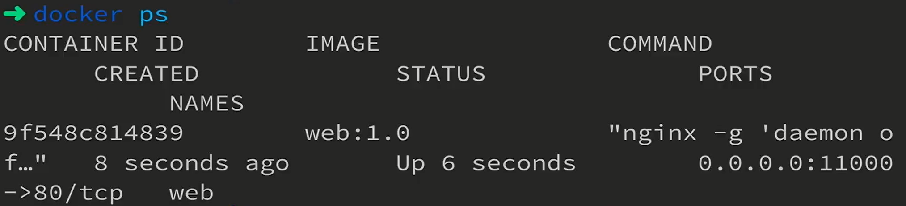

# `Docker`文件系统和`Dockerfile`

 `Docker`文件系统是我们进行自动化实践中必须要经历的一步，我们构建好的代码必须要经过`Docker`的处理成为`镜像`，然后运行起来成为`容器`上线部署；

`Docker`镜像是一个分层的系统，使用`Dockerfile`的配置将一组文件打包成镜像；

`Dockerfile`的每一条顺序的可执行的命令都会成为一个抽象的层；

而`容器`就是在`镜像`的基础上形成的，`Docker Deamon`守护进程将镜像复制出来，并且将其变成`Read-Only`的层，在此基础上，再添加一个新的层，称为`Read-Write Layer`，所有的文件修改都在这个层执行；


如上图所示，`4`条命令构成镜像的`4`个层，而`VOLUME`和`CMD`两个层次只修改了镜像的`json`文件，本身不产生内容；创建容器后，生成`Read-write Layer`层，宿主机上的文件`/var/lib/docker/containers/<id>/.`和`/var/lib/docker/volumes/<id>/_data/.`经过`Read-write Layer`层被挂载到内部`/data`目录，因此我们发现，容器进程只要修改`Read-write Layer`即可修改我们的容器表现；

这是一个比较粗略的解释，更加深入的解释参见官方文档；

在此，我们也发现了`Dockerfile`的作用：

+ 用于产生`Docker`的镜像（★）；
+ `Dockerfile`按照步骤构建，产生文件系统；
+ `Dockerfile`是镜像的配置文件，高度可配置；

# 前后端项目自动化构建部署上线

##  前后端项目配置`Dockerfile`

###   `Vue.Js`前端项目配置

若我们希望将我们的项目的`build`代码打包成一个`Docker`镜像，就要在我们项目的根目录下新建`Dockerfile`文件进行配置，如下所示，是`Vue.Js`官网推荐的`Dockerfile`配置；

```dockerfile
# 注意node版本要相同，否则肯定出问题
FROM node:11.14.0 as build-stage
# author
LABEL maintainer=1600346867@qq.com

# 设定所有操作的工作目录：build-stage:/app
WORKDIR /app
# 工作区的文件拷贝到工作目录，如build-stage:/app/src
COPY . .
# 在build-stage:/app下运行命令
RUN npm install
RUN npm run build

# production stage
FROM nginx:stable-alpine as production-stage
# 将build-stage:/app/dist->production-stage:/usr/share/nginx/html
COPY --from=build-stage /app/dist /usr/share/nginx/html
# 暴露80端口，方便镜像映射
EXPOSE 80
# container运行时执行命令，保证nginx container不挂
CMD ["nginx", "-g", "daemon off;"]
```

同时，我们不希望将工作区的所有文件/文件夹都添加到镜像中，比如`.circleci`，我们可以在项目的根目录新建`.dockerignore`文件来将部分文件/文件夹排除出去，这样当执行`COPY`指令时便会排除这些文件/文件夹，下面的配置是`Vue.Js`项目的`.dockerignore`推荐配置：

```dockerfile
# Dependency directory
# https://www.npmjs.org/doc/misc/npm-faq.html#should-i-check-my-node_modules-folder-into-git
node_modules
.DS_Store
dist

# node-waf configuration
.lock-wscript

# Compiled binary addons (http://nodejs.org/api/addons.html)
build/Release
.dockerignore
Dockerfile
*docker-compose*

# Logs
logs
*.log

# Runtime data
.idea
.vscode
*.suo
*.ntvs*
*.njsproj
*.sln
*.sw*
pids
*.pid
*.seed
.git
.hg
.svn
```

### `Koa`后端项目配置

一样地，我们配置`Dockerfile`和`.dockerignore`；

`Dockerfile`文件如下：

```dockerfile
# build stage
FROM node:10
# author
LABEL maintainer=1600346867@qq.com

# 设定所有操作的工作目录：build-stage:/app
WORKDIR /app
# 工作区的文件拷贝到工作目录，如build-stage:/app/src
COPY . .
# 在build-stage:/app下运行命令
RUN npm install --registry=https://registry.npm.tabao.org
RUN npm run build

EXPOSE 12005

VOLUME [ "/app/public" ]

CMD ["node","dist/server.bundle.js"]
```

`.dockerignore`文件如下：

```dockerfile
# Dependency directory
# https://www.npmjs.org/doc/misc/npm-faq.html#should-i-check-my-node_modules-folder-into-git
node_modules
.DS_Store
dist

# node-waf configuration
.lock-wscript

# Compiled binary addons (http://nodejs.org/api/addons.html)
build/Release
.dockerignore
Dockerfile
*docker-compose*

# Logs
logs
*.log

# Runtime data
.idea
.vscode
*.suo
*.ntvs*
*.njsproj
*.sln
*.sw*
pids
*.pid
*.seed
.git
.hg
.svn
```

并且，一般我们的开发环境端口和上线环境端口不同，因此要修改我们的上线端口：

```js
const isDevNode = process.env.NODE_ENV === 'production' ? false : true
let port = !isDevNode ? 12005:3000
app.listen(port, () => {
  console.log(`server is running at:${port}`)
})
```

### 其他前后端适配

在`Vue.Js`前端项目中要修改`Axios`的`URL base`为后端项目的`URL`，否则请求无法被后端接收到：

```js
Axios.defaults.baseURL = (process.env.NODE_ENV !== 'production') ?
  'http://localhost:3000' : 'http://www.solingjees.site:12005'
```

## 本地镜像打包和测试

在我们将我们的代码真正打包构建到服务器的环境中前，我们希望代码在本地环境内尝试运行一下来查看`Docker`的配置是否正确，运行效果是否符合预期；

> + 若我们的本地环境为`Windows`，是不支持本地生成`docker`镜像的，因此建议使用`Mac`或`Linux`来进行开发，或者使用`linux`虚拟机进行打包测试，；
> + 若`docker`的镜像下载速度慢，则可以设置镜像源为中国官方加速源、阿里源等稳定‘的镜像源；

进入我们的项目中，在根目录下输入以下命令来进行镜像打包：

```
docker build -t \ # 给镜像添加标签
web:1.0 . \ # .表示将当前文件夹内容进行打包
```

> 在构建过程中我们可以发现任何的镜像都是分层的结构，然后可以单独拉取，可以分层地进行缓存；
>
> 

镜像构建完成后，我们使用`docker images`命令来查看镜像；


接着我们使用以下命令来运行我们的镜像：

```
docker run -itd --name web -p 11000:80 web:1.0
```

若打出一串`hash`值，说明容器正常生成；

然后可以使用`docker ps`命令来查看生成的容器；



接着，我们就可以到浏览器下访问`localhost:11000`页面进行验证了；

## 前后端项目上线

> 以下三个步骤在项目的开始就应当已经完成；为了保证流程的完整性，添加这部分；

### `GitLab`新建项目

这部分按照以前的`GitLab`配置流程走下来即可，然后我们`clone ssh`地址；

### 推送本地代码到远程仓库

```
git init //初始化仓库
git remote -v //查看远程仓库的信息
git remote add origin <ssh address>
git add .
git commit -m xxx
git push origin master 
```

### 配置`GitLab`和`Jenkins`对接

过程参考`jenkins.md`的对接流程，不再赘述；

### `shell`脚本配置自动化构建流程

在我们`Jenkins`项目的`配置->构建`中，我们选择`执行shell`，然后我们就可以开始书写`shell`命令来配置自动化构建流程了；

在我们书写`shell`命令时，我们会需要传入一些外部参数来提高我们`shell`命令的灵活性；

在此之前，我们安装了`Build with Paramters`插件，这个插件使得我们能传递参数到`shell`脚本中；

在我们的配置中，在`general`下有一个`参数化构建过程`，在这里我们就能配置要传入`shell`命令的参数；


当我们完成`shell`脚本书写后，我们回到项目面板，点击`Build With Parameters`，然后配置要传入的参数，即可开始验证书写的`shell`脚本了；


这样我们就完成了自动化构建的整个流程，之后我们项目的上线不再依赖于人工输入了；

#### `Vue.Js`的`shell`脚本

我们使用下面的`shell`脚本配置自动化构建，相应的，我们需要设置`container_name`、`port`、`image_name`、`tag`这四个参数：

```shell
#!/bin/bash

CONTAINER=${container_name}
PORT=${port}

# echo $CONTAINER
# echo $PORT

# 镜像构建，不缓存以保证docker始终使用最新的文件
docker build --no-cache -t ${image_name}:${tag} .

# docker...$CONTAINER会查看该容器是否在运行，当然也可能不存在这个容器，2>/dev/null将错误消息吃掉不输出
RUNNING=$(docker inspect --format="{{ .State.Running }}" $CONTAINER 2 > /dev/null)
# 注意：docker inspect --format=...的返回值是一个结构化的数据，不是字符串，要手动转
# 检查该容器是否存在，如果不存在进入
if [ ! -n "${RUNNING}" ]; then
   echo "${CONTAINER} does not exit"
   return 1
fi

# 检查该容器是否为false
if [ "${RUNNING}" == "false" ]; then
   echo "$CONTAINER is not running."
   return 2
else
   echo "$CONTAINER is running."
   # 将该容器的id保存在matchingStarted
   matchingStarted=$(docker ps --filter="name=$CONTAINER" -q | xargs) # 返回类型为字符串
   if [ -n $matchingStarted ]; then
      docker stop $matchingStarted
   fi
   
    matching=$(docker ps -a --filter="name=$CONTAINER" -q | xargs)
   if [ -n $matching ]; then
      docker rm $matching
   fi
fi

# 输出容器是否运行
echo "RUNNING is ${RUNNING}"

# 跑容器
docker run -itd --name $CONTAINER -p $PORT:80 ${image_name}:${tag}
```

#### `Koa`的`shell`脚本

相较于`Vue.Js`的配置，这部分只修改了映射的端口，因此我们可以很快得出这样一个结论，`Node.Js`项目的`Jenkins shell`脚本非常容易去重用；

```shell
#!/bin/bash

CONTAINER=${container_name}
PORT=${port}

# echo $CONTAINER
# echo $PORT

# 镜像构建，不缓存以保证docker始终使用最新的文件
docker build --no-cache -t ${image_name}:${tag} .

# docker...$CONTAINER会查看该容器是否在运行，当然也可能不存在这个容器，2>/dev/null将错误消息吃掉不输出
RUNNING=$(docker inspect --format="{{ .State.Running }}" $CONTAINER  2> /dev/null)
# 注意：docker inspect --format=...的返回值是一个结构化的数据，不是字符串，要手动转
# 检查该容器是否存在，如果不存在进入
if [ ! -n "$RUNNING" ]; then
   echo "${CONTAINER} does not exit"
   return 1
fi

# 检查该容器是否为false
if [ "$RUNNING" == "false" ]; then
   echo "$CONTAINER is not running."
   return 2
else
   echo "$CONTAINER is running."
   # 将该容器的id保存在matchingStarted
   matchingStarted=$(docker ps --filter="name=$CONTAINER" -q | xargs)
   if [ -n $matchingStarted ]; then
      docker stop $matchingStarted
   fi
   
    matching=$(docker ps -a --filter="name=$CONTAINER" -q | xargs)
   if [ -n $matching ]; then
      docker rm $matching
   fi
fi

# 输出容器是否运行
echo "RUNNING is ${RUNNING}"

# 跑容器
docker run -itd --name $CONTAINER -p $PORT:12005 ${image_name}:${tag}
```

#### `Shell`命令注释

+ 以`#!/bin/bash`开头来声明文件内的命令是`shell`命令；

+ 变量直接声明，无需修饰符，并且，如：

  ```
  dollar=100 ✔
  let dollar = 100 ×
  ```

  当我们使用变量时，在变量前添加`$`即可，或者使用`${}`包裹，这两者没有区别：

  ```
  echo $dollar ✔
  echo ${dollar} ✔
  ```

+ 命令的执行必须包含在`$()`中，和变量的使用不同，使用的是`()`；

  ```
  $(docker ps --filter="name=web" -q | xargs)
  ```

+ 变量赋值语句不得有空格，否则是错误的；

  ```
  dollar = 100 ×
  dollar=100 ✔
  ```

+ `shell`脚本的传入参数可以通过`${xxx}`进行访问，相当于文件内部使用的变量；

+ `echo`命令用于输出内容；

  ```
  echo 'hello world'
  ```

+ `shell`脚本可以直接使用外部宿主机上的命令，如`docker build`命令；

+ 注释类似`Python`，使用`#`开头为注释；

  ```
  # 这是一条注释
  ```

+ 条件判断语句：

  ```
  if [ 条件判断 ]; then
      echo 'hello world'
  fi #结束标志
  ```
  
+ 基础运算符：

  ```
  -n：一元运算符，比较是否为非空，非空返回true，否则返回false；
  ！：一元运算符，非；
  ```

  使用如下：

  ```
  ! -n “0”
  ```
  

### 放行防火墙端口

在之前的文档中有详细说明，方法不再赘述；

这样，我们就完成了项目自动化构建、打包、上线部署的流程，之后我们只需要关注业务逻辑本身即可；


