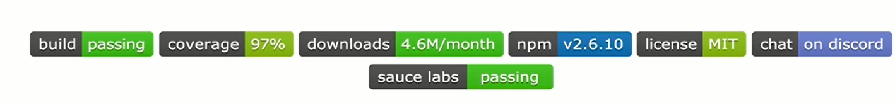
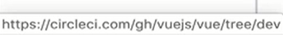

# 前端自动化

`前端自动化`是指前端代码的自动化构建、打包、测试及部署等流程；

持续集成（`Continuous Integration`）通俗地讲是指编写的代码不断地合并集成到代码仓库中，并且不同开发者不停更新本地代码来验证代码正确性，如果系统运行异常则回退版本，然后修改`bug`；

持续部署（`Continuous Deployment`）通俗地讲是指不断的将版本仓库中的代码发布到测试/生产环境，持续部署非常依赖测试用例来进行自动化校验、测试，以保证系统的健壮性；

前端自动化通常和`CI/CD`相结合，并且具有非常重要的意义：

+ 减少人为失误，提高软件质量；
+ 效率迭代，便捷部署；
+ 快速交付，便于管理；

# 前端项目的分类

| 级别          | 描述                                                         | 特点                   | 缺点                             |
| ------------- | ------------------------------------------------------------ | ---------------------- | -------------------------------- |
| `hello world` | 代码体量很小，页面单一； 管理扁平，部署简单； 维护简单       | 开发/测试/发布集一身   | 成也萧何败也萧何（难以延续）     |
| 工程化        | 多页面，功能复杂；资源文件较多，有性能需求；有协同需求，代码模块化，形成工程目录 | 需要快速开发，快速迭代 | 路遥知马力，日久见人心（难协同） |
| 自动化        | 企业级应用，多场景，多团队；开发/测试/部署流程化，自动化；简单部署，快速迭代；版本控制，专注功能 | 专注代码编写及开发流程 | 明知山有虎，偏向虎山行（难推动） |

# 最佳实践

在我们的前端开发中，经常出现以下问题：

+ 常因为版本/环境问题加班、返工；
+ 开发效率无法提升，测试部署工作常有推诿；
+ 公司运维工作很“闲”；

因此，我们提出了最佳实践：

+ 基本的版本控制，培养协同效率；
+ 创建工程化项目，参与开源项目实践；
+ 按需取用，推动团队自动化流程；

以`Vue.js`项目为例，在它的`code`中有一个`.circleci`文件，是`circle CI`的配置文件，再者，在`README.md`的头部也说明了自动化平台（在我们鼠标悬停`build`标签时，浏览器左下角表明了该`link`的网址是`Circle CI`的项目地址），甚至还有代码测试覆盖率：

# `CI/CD`工具

为了使我们项目能够自动化构建/部署，现在我们行业内主流使用以下三种`CI/CD`平台，使得我们更多聚焦于业务逻辑的实现；

| 分类     | Jenkins                | Travis CI   | Circle CI   |
| -------- | ---------------------- | ----------- | ----------- |
| 本地部署 | 支持                   | 云平台      | 云平台      |
| 配置     | 高度可配置             | `YAML`文件  | `YAML`文件  |
| 跨平台   | 是（基于`Java`）       | `Linux+Mac` | `Linux+Mac` |
| 多服务器 | 是（支持伺服机`Task`） | 否          | 否          |
| 费用     | 免费                   | 69$/c/m     | 50$/c/m     |

