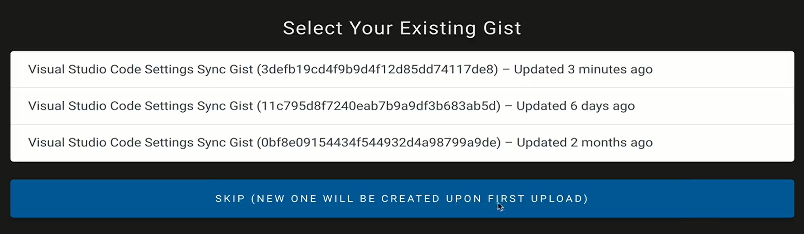

# `ESLint`的安装

`ESLint`只支持`Node.js>=6.14`，`npm>3`的开发环境；

`ESLint`的安装很简单，我们使用如下命令进行安装：

```
npm install eslint --save-dev
```

`ESLint`会安装二进制执行文件到`./node_modules/.bin`下，因此我们可以使用如下命令调用`ESLint`命令：

```
./node_modules/.bin/eslint --version //查看版本
// or
npx eslint --version //使用npx更加方便，可以直接使用eslint命令
```

然后我们使用以下命令来初始化我们的`ESLint`配置：

```
npx eslint --init
```

接下来，会进行交互式配置：

+ 设置`eslint`的功能：检查语法、指出错误、自动修改；
+ 项目所使用的规范：`es6:js modules`、`commonJs`；
+ 项目所使用的框架：`react`、`Vue.js`、`None`；
+ 项目是否使用`TypeScript`；
+ 项目的运行端：`Node`、`Broswer`;
+ `ESLint`的配置文件的格式：`JavaScript`、`YAML`、`JSON`；

当这些都配置完毕后，便会生成一个在工程目录下生成一个配置文件；

`ESLint`接收多种格式的配置文件，但是当有多个配置文件时，会按照以下优先级只使用一个配置文件；

```
.eslintrc.js
.eslintrc.yaml or .eslintrc.yml
.eslintrc.json
.eslintrc
package.json中的eslintconfig属性
```

初始的配置文件中主要有以下内容：

```js
module.exports = {
    "env": { //项目代码将会运行在什么环境下
        "browser": true,
        "commonjs": true,
        "es6": true,
        "node": true
    },
    "extends": "eslint:recommended",//继承了哪个配置文件
    "globals": { //全局配置
        "Atomics": "readonly",
        "SharedArrayBuffer": "readonly"
    },
    "parserOptions": {//解析器配置
        "ecmaVersion": 2018 //描述项目使用的es语法版本
    },
    "rules": {//规则
    },
    "plugins":{//扩展设置，添加规则集
    
    }
};
```

# `ESLint`的`Rules`配置

使用`ESLint`配置我们的项目，最主要的是配置`Rules`规则；

在`ESLint`中，使用以下三种字符串/数字来表示某条规则的报错等级：

+ `off/0`：关闭规则；
+ `warn/1`：开启规则，使用警告级别的错误；
+ `error/2`：开启规则，使用错误级别的错误；

即，如果某一条规则为`error`级别，那么当该规则不符合时，程序会直接退出；

我们有两种方式配置`Rules`；

第一种，在`eslint`的配置文件的`Rules`下配置，如下所示，所有`quotes`都应当在合法情况下尽量使用`""`：

```
module.exports = {
    ...
    "rules": {
        quotes: ["error", "double"] //第一个参数表示报错等级，之后的参数是传递给规则的属性/选项
    }
};
```

第二种，直接在`js`文件书写魔法注释，效果等价第一种，这种应用主要用于临时的调试：

```
/* eslint quotes:["error","double"]*/       # 禁用该规则应用到全部文件
// /* eslint-disable quotes */  # 和上面一样
// eslint-disable-next-line quotes  # 禁用该规则应用于下一行 
var single = 'abc'
```

## `Rules`举例

`quotes`：默认`double`，在合法情况下，引号应当尽量使用`""`；

`no-unused-vars`：未使用过的`var`变量，一般设为`warn`；

 `semi`：句尾是否有`;`，一般设为`never`；

# `ESLint`和`vscode`、`webStrom`的组合

在上面的说明中，我们能够使用`ESLint`的命令来检视、修正我们的代码，但是这是比较麻烦的，我们必须要使用命令才会触发这一系列的操作。现在的`IDE`都增强了`ESLint`的能力，可以实时地检查代码是否符合我们配置的`ESLint`规则；

## 代码实时检查

首先，在`vs code`中，我们需要在插件市场中下载`ESLint`插件，然后开启它；

`ESLint`插件增强了`ESLint`的能力，使得`vs code`可以使用`ESLint`的规则进行实时检查，因此这要求我们本地必须安装有`ESLint`库，可以全局安装，也可以项目内安装，可能还需要`eslint-plugin-html`插件，具体观察`ESLint`的输出窗口的提示：

```
npm install --global eslint //全局安装
//or 
npm install --save-dev eslint  //项目内安装
```

`ESLint`库安装后再使用`eslint --init`初始化一个配置文件，否则还是无法使用的；

一切就绪后建议重启一下`vs code`，这样我们的配置才会生效；

这样之后，我们就完成了`ESLint`的配置，我们可以在配置文件中书写规则然后测试一下：


红色下划线表示这部分代码不符合我们的`ESLint`规则，我们可以快捷地修复该问题；

我们可以选择`Disable quotes for this line`禁用提示的代码的某条报错规则，这个选项可以用于这种场景：我们在一个文件内定义了项目内的全局变量，在其他文件内使用这个全局变量时`ESLint`会因为无法检视到导致报错变量未定义，这时便可以采用禁用这段代码的某条报错规则的方式；或者使用`Disable quotes for the entrie file`将禁用这条规则应用到全部文件；

`webStrom`和`vs code`不同，默认就集成了`ESLint`插件；

我们打开`setting->Languages & Frameworks->JavaScript->Code Quality Tools->ESLint`，可以看到：


其中，默认选中了`Automatic ESLint configuration`，默认使用工程目录下的`ESLint`配置文件作为配置；

对于报错的代码段，我们可以快捷地`fix`：


更多的，如果问题很多，我们可以点选`More actions`：


选择`ESLint:Fix current file`来快速修复当前文件的所有问题；

## 代码保存时修复问题

`vs code`提供了一个非常好用的功能，在我们保存时自动修复代码问题；

配置也很简单，跟随`查看->命令面板->搜索“首选项：打开用户设置”->扩展->ESLint`，找到下述选项，选择`on`即可；


我们现在只是打开了保存时自动修正地功能，但是我们还可以更加深入地在`settings.json`中更细粒度地配置`ESLint`，比如下图，可以设置对于`html`语言编写的代码进行保存时`autofix`，还有使用`vetur`插件配置`vue`项目的格式等等：


## 配合`Github Gist`下载、同步`vs code`配置

在实际的开发中，为了能够在多个平台上共享我们的`vs code`配置，我们可以将我们的`vs code`配置打包成一个`gist`投送到自己的`GitHub`上，`gist`是公开的`code`、`notes`、`snippets`；

### 配置登陆`GitHub Gist`的`IP`地址

目前`GitHub Gist`处于无法访问的状态，会报出`IP`没有找到的错误，因此我们需要在本地指明`GitHub Gist`的`IP`地址以进行访问；

我们在`git bash`中使用管理员身份打开控制台，进入`C:\Windows\System32\drivers\etc\`目录，然后`vi hosts`进行编辑，在适当位置添加以下内容，最后退出保存，这样我们就可以登上`GitHub Gist`网站了；

```
192.30.253.118 gist.github.com
192.30.253.119 gist.github.com
```

### `Settings Sync`配置下载非本人的`gist`配置

`vs code`插件市场提供了`Settings Sync`插件来将本地的`vs code`配置和自己的`GitHub Gist`进行同步；

首先，我们要安装`Settings Sync`，安装完后会自动打开`welcome`面板，在`welcome`面板中，我们可以使用自己的`GitHub`账号下的`Gist`作为云端存储，或者自定义配置云端存储的位置；


如果我们需要使用非本人的已经配置好的`gist`配置，需要在自定义配置中输入`Gist ID`，并且勾选`下载公开gist`，否则是无法下载的；

当我们完成了配置，跟随`查看->命令面板->Sync:下载配置`即可将`Gist`的配置从云端下载到本地，并启用；

### `Settings Sync`配置自己的`GitHub Gist`

我们不会一直使用别人的`gist`配置，我们需要有自己的`gist`仓库；

首先我们跟随`查看->命令面板->Sync:重置扩展设置`将我们的`gist`设置去除掉；

然后我们跟随`查看->命令面板->Sync:更新/上传配置`，由于我们已经将配置删除掉，这会打开我们的`welcome`面板，然后我们点选使用`LOGIN WITH GITHUB`来登陆我们的`gitHub`账号；

登陆完成后会打开如下面板，我们可以选择自己的远程`gist`进行连接，或者选择`SKIP`会在生成一个新的`gist`；



之后我们再次选择`Sync:更新/上传配置`，`Settings Sync`便会将`vs code`配置同步到`GitHub Gist`上，并在控制台打印消息，比如`Gist ID`等等；


对于一个新建的`Gist`，默认是`Secret`的，即私人的，如果我们需要将我们的`Gist`分享给其他人，我们就要生成一个公开的`Gist`仓库来存储我们的`vs code`配置；

我们跟随`查看->命令面板->Sync:高级选项->Sync:在公开Gist上分享配置`，这个操作会移除本地的`Gist`并将`vs code`配置发布到自己的`GitHub`上新的公开`Gist`上；然后`Settings Sync`就会开始上传`vs code`配置到一个公开的`Gist`上，并打印消息，如新的公开`Gist ID`，其他人就能使用该`Gist ID`来下载我们的`vs code`配置了；

# `ESLint`在`Vue.js`项目中的使用

首先，我们需要安装`Vetur`插件，这是`Vue.js`的插件，用于高亮代码、格式化、检错等；

其次，由于`vs code`本身就存在代码格式化的功能，会和`ESLint`发生冲突，我们需要在设置中关闭`Editor:Format On Save`，如果不关闭，可能你会发现每一次`ctrl+S`都会产生两次格式化，导致最后仍然会报错；

我们在`.eslintrc.js`文件的`rules`中书写规则，如：

```js
module.exports = {
  ...
  rules: {
    'no-console': process.env.NODE_ENV === 'production' ? 'warn' : 'off',
    'no-debugger': process.env.NODE_ENV === 'production' ? 'warn' : 'off',
    "quotes":['error','single'],
    "semi":['error','never']
  }
}
```

但是，如果我们一条一条规则去自己配置会花费很多时间，因此我们可以将规则打包成一个集合进行使用；

使用`Vue-Cli`进行`Vue.js`项目创建时，会安装`eslint-plugin-vue`这个组件，这个组件已经封装好了多个用于`Vue.js`的规则集，`Vue.js`在创建时便是使用了`plugin:vue/essential`、`@vue/standard`这两个规则集；

```js
module.exports = {
  ...
  extends: [
    'plugin:vue/essential',//报错error
    '@vue/standard'
  ],
  ...
}
```

和`Vue.js`类似，在`react`项目中，我们可以安装`eslint-plugin-react`插件来引入`react`的相关规则集；


