# 缺陷控制的重要性和概念

在我们的软件开发过程中，我们可能出现以下的缺陷问题：

+ 需求不明确，导致返工：
  + 需求经常变化；
  + 需求文档不清晰；
  + 客户未确定需求；
  + 内部反推动的工作风气；
  + 功能模块未讨论清楚，分工不具体，人员未指定；

+ 进度有超期，导致加班：
  + 经常项目上线加班；
  + 经常前期推不动、重度依赖`UI`设计、产品经理；
  + 无人`Push`放风式管理；
  + 自驱力不足；

+ 工程有`bug`，导致难以维护：
  + 无代码风格指南；
  + 无代码质量检测；
  + 测试流程紊乱；
  + 没有自动化测试闭环；
  + 发布环境/测试环境没有同步；
+ 协同有问题，导致效率低下：
  + 项目经理太忙；
  + 项目经理经验不足；
  + 有想法的人太多；
  + 没有具体的分工；
  + 缺少协同工具，人员协同能力不同；

进而的，我们看到了缺陷控制的重要性；我们给缺陷控制下个定义；

`缺陷控制`就是在项目全生命周期中，保障项目质量的一系列行为；

`缺陷跟踪系统/软件`是被设计用来帮助质量保证和程序员在工作中维护软件缺陷的跟踪报告，或者称为`问题跟踪管理系统`，主要用于`集中概览`、`开发状态`、`提供报告`；

进而的，我们提出一些缺陷控制的方法；

+ 需求不明确：沟通/督办；
+ 进度有超期：缺陷跟踪；
+ 工程有`bug`：代码`Lint`/规范；
+ 协同有问题：清单/待办；

在日常的开发工作中，为了充分地推进项目的进度，我们一定要：

+ 分工明确，责任到人；
+ 借助工具，提升效率；
+ 量体裁衣，按需取用；

# 最佳实践

对于不同层次的公司团队，往往在项目上具有一些区别：

+ 小公司团队：扁平管理，项目外包，业务多样简单；
+ 传统团队：二级公司，流程冗长，业务多样复杂；
+ 中大型公司：`KPI`驱动，技术单一，业务复杂度高，技术深入；

同时，也会存在缺陷的问题，有以下的表现：

+ 无章办事，代码欠优化，代码质量低下；
+ 督办意识差，工具看板基本不用，轻重缓急分不清；
+ 意识薄弱，形同虚设的质量管理工具，领导意识差，团队意识差；

在项目的全流程上，在不同的层次上我们部署不同的行为来进行缺陷的控制：

+ 代码层次：自检代码，质量监控，版本控制，代码风格，`Snippets`；
+ 团队层次：互相监督，意识形态，定期培训/自检，分工明确，协同待办，代码`Review`；
+ 项目层次：制定计划，项目经理`Push`，版本控制，协商沟通，定期检验，纠正措施，备选方案；
+ 公司层次：缺陷管理软件，公司流程，奖惩有度，抽样检查，质量改进，总结推演；

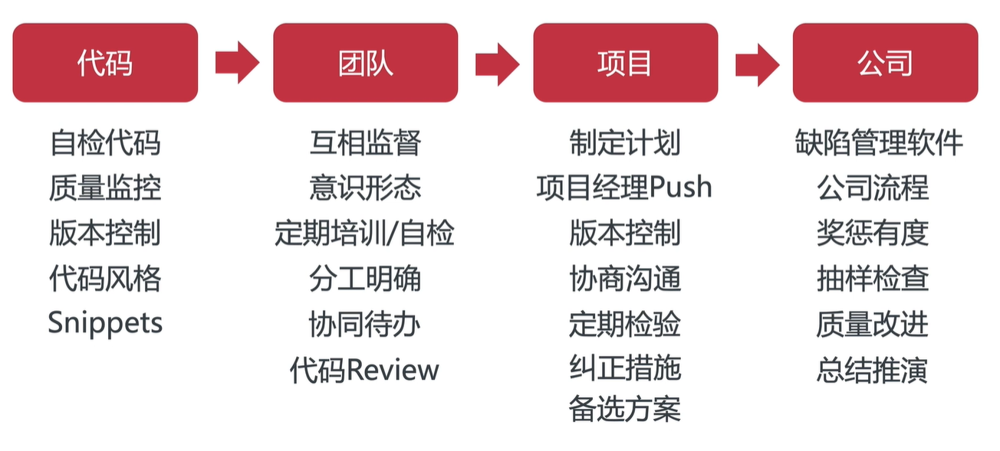

# 缺陷控制工具

代码类：`ESLint`、`JSLint`、`StyleLint`；

流程类：`Jira`、禅道、`Redmine`；

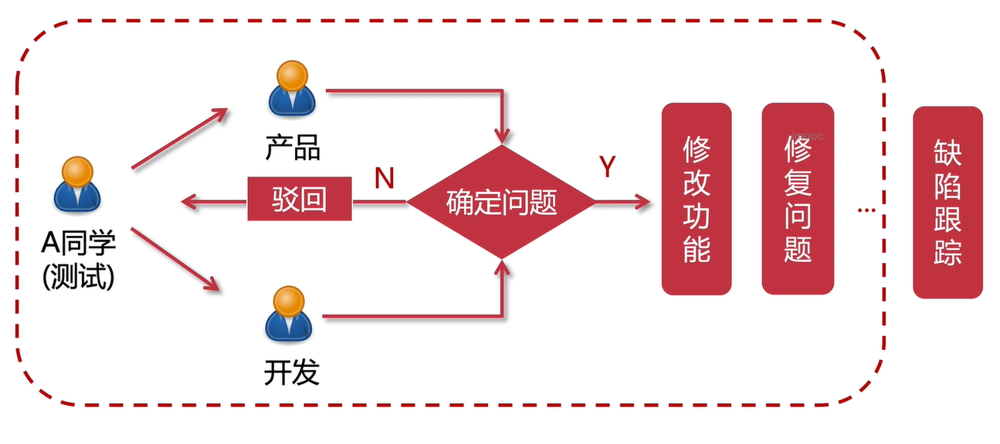

（协同）工具类：`Trello`、`Teambition`、钉钉、石墨；

使用以上的工具，我们进一步提出简单的软件开发思路：

+ 分析：功能模块$\to$开源解决方案$\to$业务闭环；
+ 资源配备：初步需求$\to$产品经理+`UI`设计+程序员$\to$开发系统；
+ 运营维护：公司级的运营$\to$专门团队$\to$运维；

# `Trello`和`Teambition`

首先我们讲解`Trello`；

最开始，我们要新建账号登陆等等，这些就不赘述了；

然后进入我们的看板首页，我们新建一个看板；

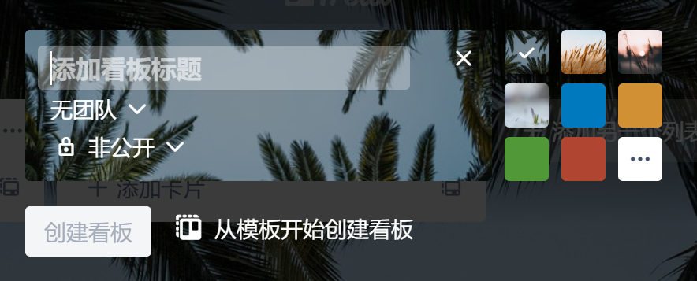

输入看板的标题我们即可新建一个看板，然后我们就可以进入看板内部；

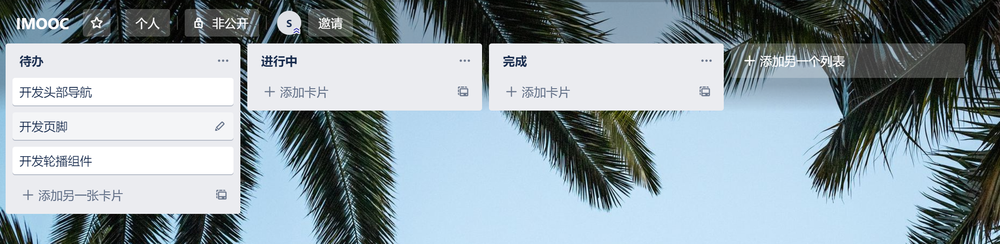

在这个页面我们可以修改每一个列表的标题，为每一个列表添加卡片，增加列表等等，来表述一组卡片所处的状态；并且支持拖拽，可以将卡片从一个列表拖拽到另一个列表来更改卡片所处于的状态；

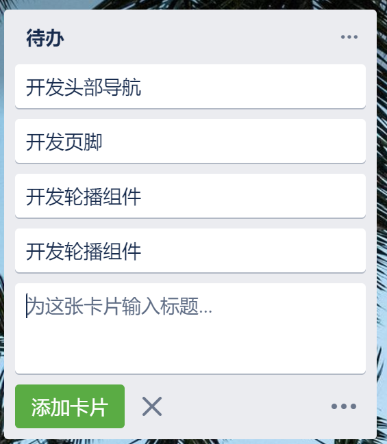

更进一步的，我们可以定制每一张卡片，来对该卡片进行详细化；如下图，我们可以添加描述、管理与该卡片相关的成员、要做的清单等等；

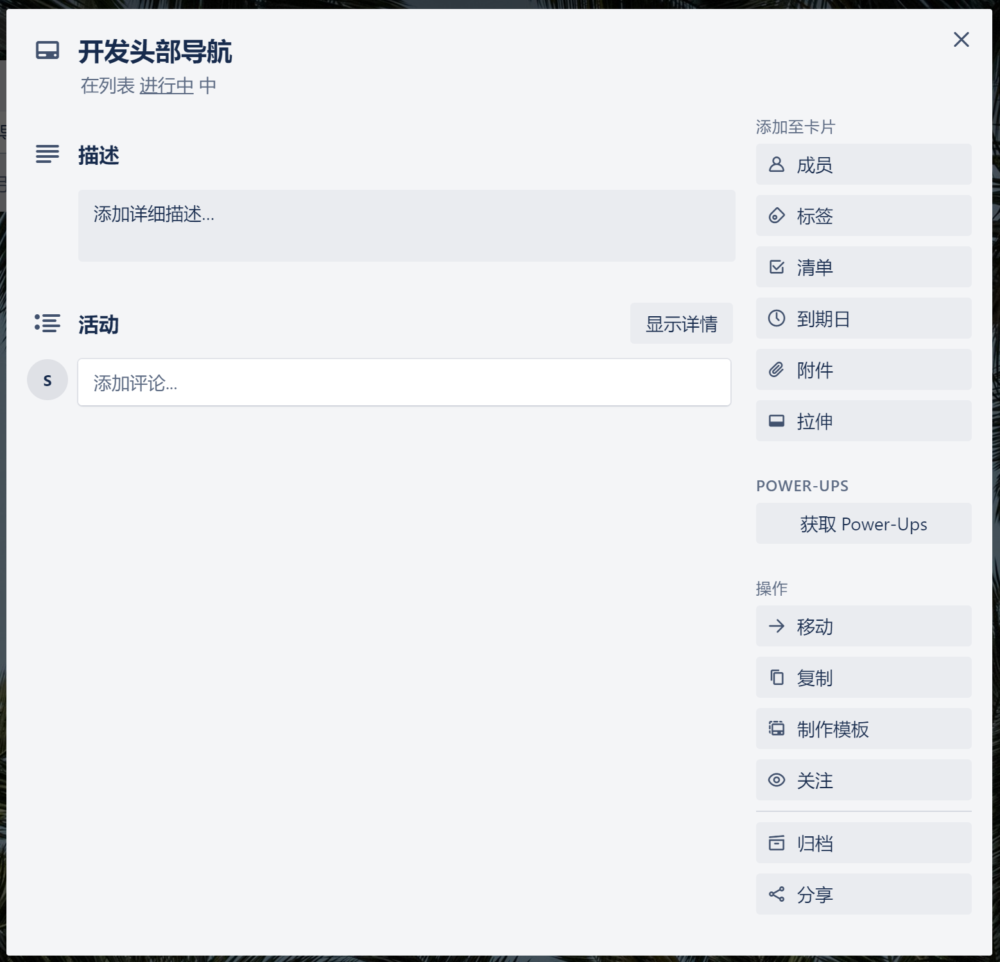

`Trello`可以邀请新的成员以加入看板；

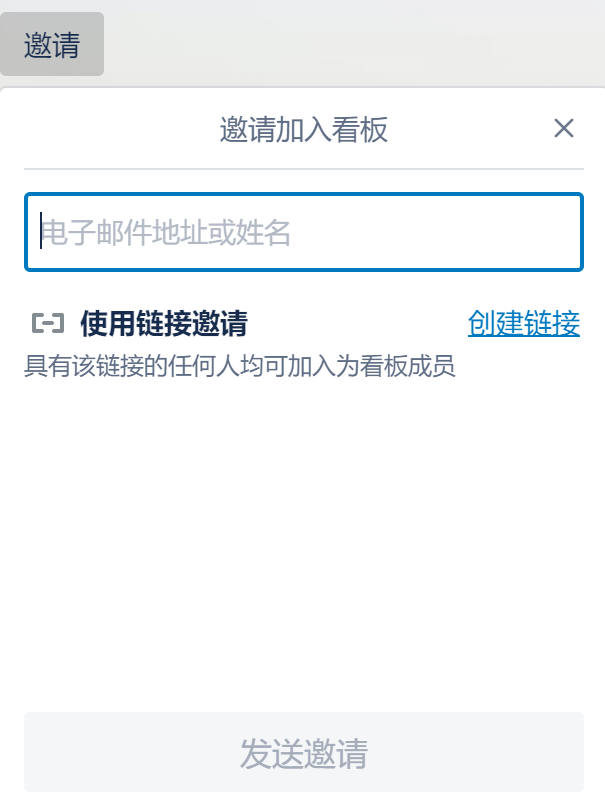

而且还支持对看板内成员的权限管理，可以设置若干管理员赋予卡片操作的权限，比如拖拽卡片、修改卡片清单等等，然后其他成员有观看的权限，并且支持查看成员的看板动态，这样我们就完成了一个小型的带有权限管理的缺陷控制的工具的配置；

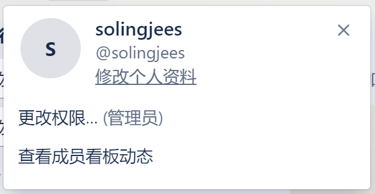

和`gitLab`一样，我们可以创建一个团队，每一个团队可以创建多个看板以表示多个项目，每一个团队成员在团队中的权限和在每一个团队下的看板的权限一致；

`Trello`还提供一些个性化需求，比如跟随`显示菜单->更改背景`我们可以修改看板的背景；

然后介绍`teambition`；

首先在我们注册完毕后，和`Trello`不同的是，我们需要先创建企业；

然后我们进入企业管理的界面；

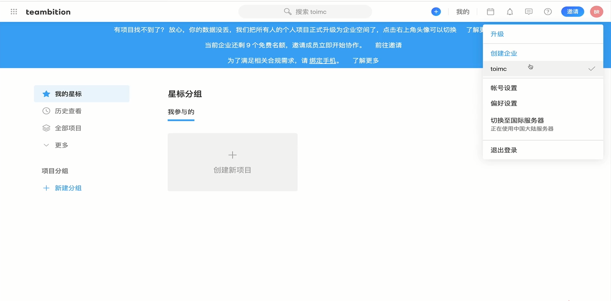

在企业管理的界面，我们可以`创建新项目`；`teambition`为我们提供了若干种工作流模板选择，或者我们可以自己新建模板；

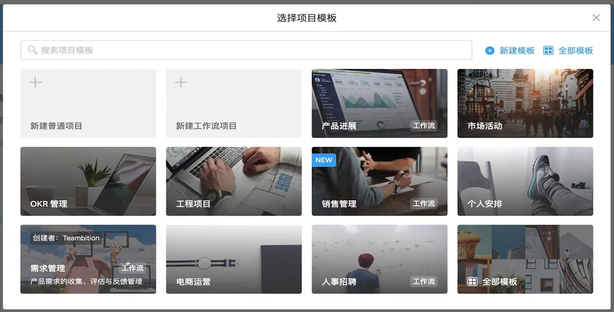

在选择了模板后，我们要完善该项目的标题和项目分组信息，项目分组是该项目的成员组，可以选择多个项目分组加入该项目中，比如开发组、测试组等等：

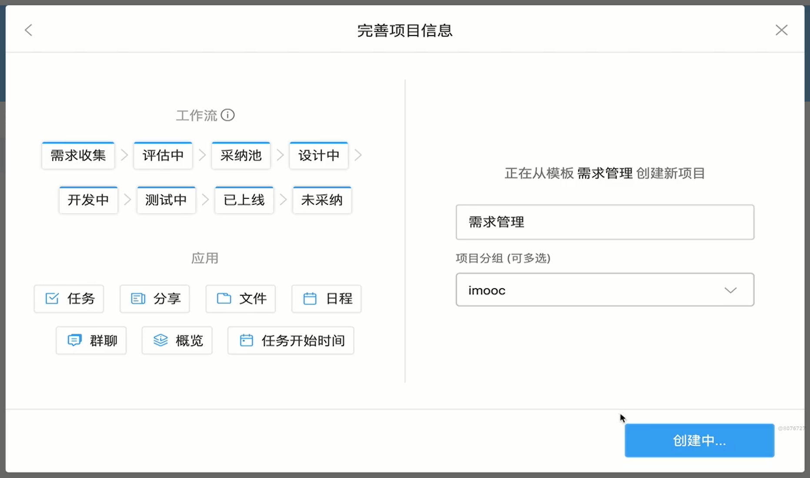

在我们创建好项目后，我们就进入了该项目的看板页面，展示方式和`trello`类似：

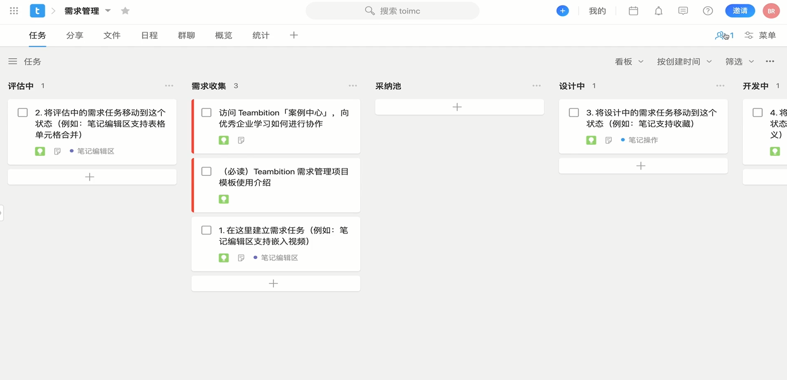我们可以点击右上角的`成员`来管理我们的项目成员，可以邀请新成员和查看项目分组成员：

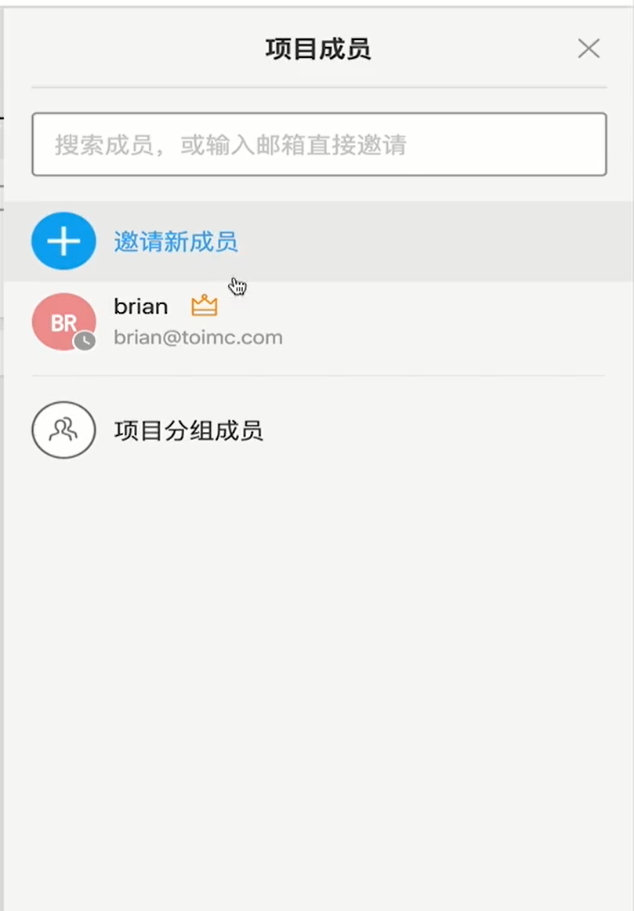

同样地，我们可以点击卡片来查看、操作我们的卡片，使用方式和`Trello`相似，但是比`trello`要复杂一些：

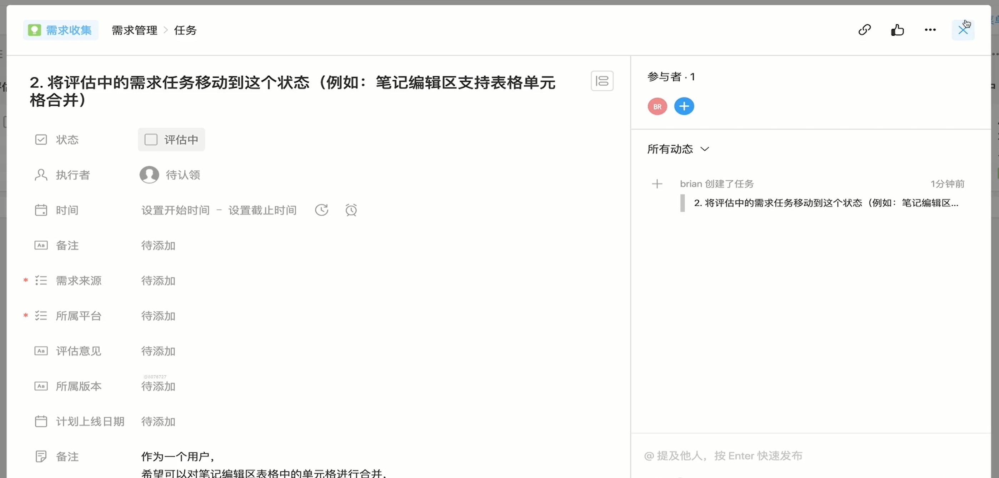

我们可以进入左上角的`分享`板块，该板块主要是分享一些`markdown`文档，方便项目成员的查看，比如需求文档：

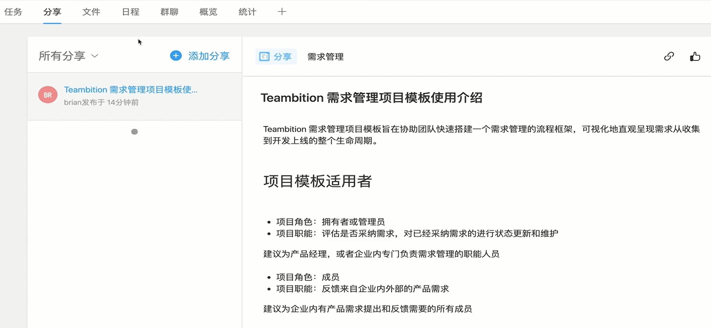`文件`板块主要是管理项目中的上传的文件，其中免费版的`teambition`提供单文件上限`1G`，空间上限`200G`的服务：

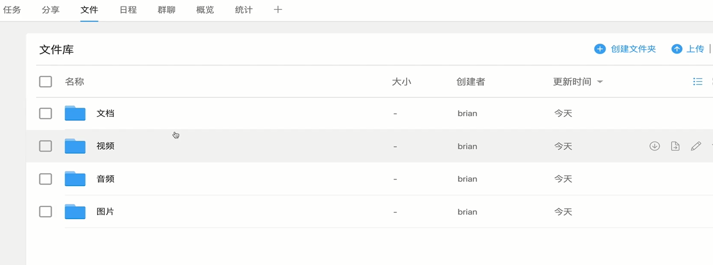

`日程`主要用于行程规划、会议等，还具有通知的功能；

`群聊`提供项目成员的交流服务；

`概览`提供项目的信息；

`统计`提供整个项目的图表信息，比如任务燃尽图、项目进展走势图等等：

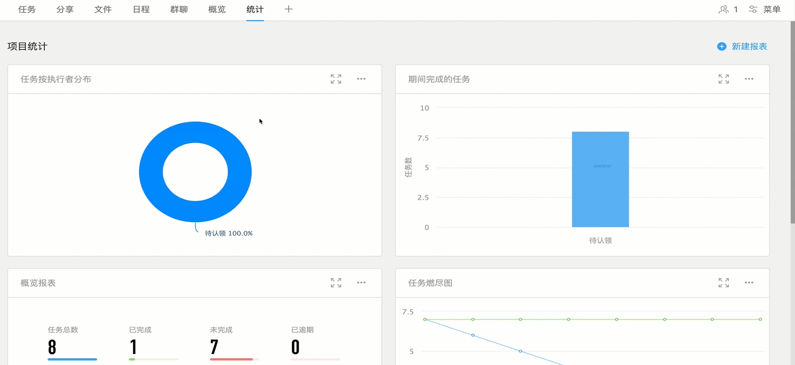

要着重注意项目分组，在`teambition`中，一个大的项目分组可以细分为多个小分组，比如一个`100人`的企业，可以按照部分细分为更小的分组：市场部、开发部等等，分组可以无限细分；

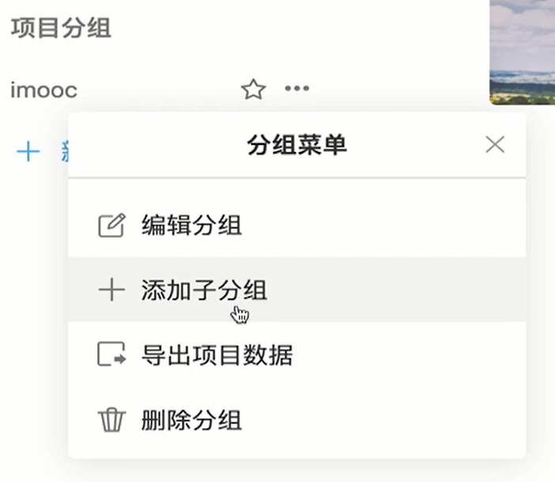

# 禅道

禅道是用于公司级别，用于系统管理整个公司的所有项目的项目管理软件；

在禅道开源版的首页上，我们可以查看自己今天的工作任务和工作流、项目动态、待办事务等等：

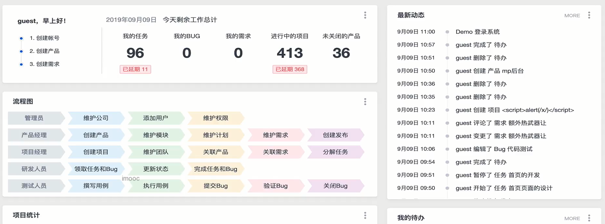

我们可以在`项目`板块下查看所有的项目的信息、进度、状态等等：

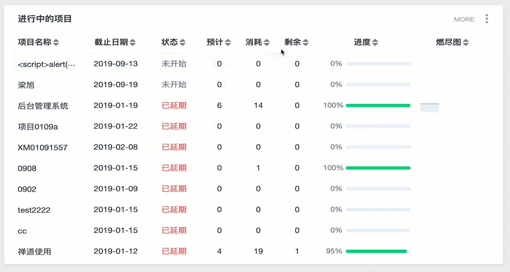

我们可以进入自己具有权限的项目中查看项目内容，我们可以看到项目的所有任务、状态等等重要信息：

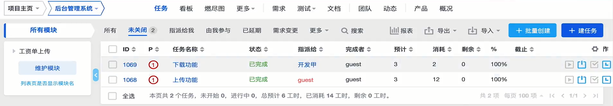

然后具有权限的人员可以新建一个任务，派发给指定的人员在截止时间前完成，实现了任务跟踪，将整个流程电子化地流动起来，如测试人员新建修改`bug`的任务派发给指定程序员在截止时间前修改；

除了这个功能外，还有看板、燃尽图、文档等功能，集成了`teambition`、`trello`的功能，是一个高度专业的项目管理工具；