# [`Vue-Validate`]`Vue-Validate3.x`配置表单验证和国际化

在我们的`Vue.js`项目中，我们往往将`Vue-Validate`写在`src/utils/veevalidate.js`文件中，然后将该文件`import`到`src/main.js`中生效即可；

`veevalidate.js`的内容如下：

```js
import { extend, localize } from "vee-validate";
import {
  required,
  email,
  min,
  length,
  confirmed
} from "vee-validate/dist/rules";//引用规则，限于规则文件过大，因此需要用户自行引入以降低文件体积
import zh from "vee-validate/dist/locale/zh_CN.json";//引用中文国际化配置
//对一个规则进行修改然后组成新的规则，可以在我们的项目使用该修改后的规则，方法相同
extend("email", email);
extend("min", min);
extend("length", length);
extend("required", required);
extend("confirmed", confirmed);

//配置中文规则，parameter1表示当前使用中文，parameter2表示要合并的新规则
localize("zh_CN", {
  //宽泛的为每一个规则制定消息
  messages: {
    ...zh.messages,
    required: "请输入{_field_}"
  },
  //表示元素在当前语言下的表示，name是该元素的name
  names: {
    password: "密码",
    username: "账号",
    code: "验证码",
    nickname: "昵称",
    email: "邮箱"
  },
  //对一个元素的进行定制消息，粒度比messages要细一些
  fields: {
    username: {
      email: "请输入正确的邮箱",
      required: "请输入账号"
    }
  }
});
```

在`xx.vue`文件中使用以下格式进行配置表单验证：

```html
...
 <validation-provider
     name="password" //name很重要，veevalidatee使用元素的name来应用规则
     rules="required|min:6"//规则对应veevalidate.js中的扩展规则名
     v-slot="{ errors }">
         <div class="layui-input-inline">
             <input
                 type="password"
                 name="password"
                 autocomplete="off"
                 v-model="password"
                 placeholder="请输入密码"
                 class="layui-input"
             />
         </div>
         <div class="layui-form-mid error">
             <div style="color: #c00;">
                {{ errors[0] }}
             </div>
         </div>
  </validation-provider>
...
```

这个过程不难理解，当在`vue`触发表单修改，`validation-provider`内部就会到我们的`localize`的配置下寻找当前的`name`所匹配的规则所对应的错误提示，然后将提示输出到`errors`这个数组中，这样我们就能获取到错误提示了；

为了实现我们的国际化配置，除了以上的使用`localize()`的国际化实现方法外，我们还可以使用`vue-i18n`这个库来实现；

首先我们新建一个文件`/src/utils/i18n.js`，我们在该文件下书写国际化配置：

```js
import Vue from "vue";
import VueI18n from "vue-i18n";
import zh from "vee-validate/dist/locale/zh_CN.json";

//将VueI18n挂载到Vue实例上
Vue.use(VueI18n);
//创建一个新的vueI18n的配置
const i18n = new VueI18n({
  locale: "zh_CN", //指定当前所使用的语言
  messages: {
    zh_CN: {
      fields: {
        password: "密码",
        username: "账号",
        code: "验证码",
        nickname: "昵称",
        email: "邮箱"
      },
      //写规则和对应的错误提示
      validation: {
        ...zh.messages,
        required: "请输入{_field_}",
        email: "请输入正确的邮箱"
      }
    }
  }
});

//导出我们的VueI18n配置
export default i18n;
```

接着我们要使用`i18n`这个我们生成的配置，我们新建`/src/utils/veevalidate-i18n.js`文件：

```js
import { extend, configure } from "vee-validate";
import {
  required,
  email,
  min,
  length,
  confirmed
} from "vee-validate/dist/rules";
import i18n from "./i18n";

configure({
  defaultMessage: (field, values) => {
    // 使用i8n下配置的当前语言的值替换当前field的名字
    //{allowFalse: true, _field_: "password", //当前field的名字，_value_: "", //代表当前input内的值，_rule_: "required"//代表当前所不成立的规则}
    values._field_ = i18n.t(`fields.${field}`);
    //将当前的values放入validation.required这条规则所指定的模板字符串中构造然后返回
    return i18n.t(`validation.${values._rule_}`, values);
  }
});

//扩展规则
extend("email", email);
extend("min", min);
extend("length", length);
extend("required", required);
extend("confirmed", confirmed);
```

在`vue`文件中，我们不需要进行更改；

`vue-i18n`使用更专业的`API`来实现国际化配置，其实逻辑是一样的，在`vue`文件中触发受到规则约束的元素的内容修改，导致`validation-provider`发送`fleild`和`values`到`defaultMessage`函数中，`field`代表`validation-provider`的`name`，`values`包含当前该元素验证的一些数据，包括：

```js
{
   allowFalse: true, 
   _field_: "password",//当前field的名字
   _value_: "", //代表当前input内的值
   _rule_: "required"//代表当前所匹配的规则
}
```

然后会使用当前的国际化语言来修改`_field_`参数，接着使用我们编写的`i18n`配置中的对应当前匹配的规则的字符串模板进行错误提示的生成，最后返回到`errors`数组中即可，这样我们同样也可以取到错误提示了；

目前为止，这两种实现方法没有本质区别，效果是一样的；

# [`Vue-Validate`]`login`的全验证校验

在我们登录之前，我们要进行一次对表单的全校验，之前对每一个`input`的校验只能起到提示作用，而在登录之前要求我们的所有表单都是正确的，我们编写以下代码来实现我们的需求：

```html
<validation-observer v-slot="{ validate }" ref="observer">
 ...
 <button
     class="layui-btn"
     type="button"
     @click="validate().then(submit)">立即登录
 </button>
</validation-observer>
```

`validation-observer`可以对包含的表单进行全校验，并且会触发校验未通过的表单提供错误提示消息，我们可以将`validate`方法从`validation-observer`内部传递出来，执行该方法就会对所包含的表单进行一次校验，然后我们可以在`button`按钮上添加`click`事件：在使用`validate().then()`方法后执行`submit()`；

> `validate()`函数并不是`Promise`，`then()`函数只是`validate()`返回的对象的一个函数而已，`submit()`函数不管`validate()`函数校验是否通过都会执行；

因为不管校验是否通过都会执行，因此我们需要在`submit()`函数中添加以下内容来提取验证后的结果

```js
 async submit() {
      const isValid = await this.$refs.observer.validate();//如果校验未通过，返回false
      if (!isValid) return;//如果校验失败，截止
      ...
    }
```


# [`Axios`]`axios`拦截器与`axios`封装进阶

在我们的实际应用过程中，对于`axios`请求，我们需要配置`baseUrl`、拦截器、`get/post`等方法，这些细细碎碎的配置在不同地方散落，不易于管理，比如很多人会将`Axios.defaults.baseURL`配置在`/src/main.js`中，而实际上，这样分散的配置不易于我们的查看和修改，因此我们可以将它们集成在一个`class`中，使得这一切变得非常简洁；

一般来讲，我们对`baseURL`的配置会按照我们的环境进行修改，因此我们会在`/src/config/index.js`中配置`dev`和`pro`环境下的`baseURL`，这种将配置单独独立在`config`文件夹下的思想非常重要，在很多框架中都遵从这样的设计方式：

```js
export default {
  //axios配置
  baseUrl: {
    dev: "http://localhost:3000",
    pro: "http://www.solingjees.site:11006"
  }
};
```

由于类似`Axios`、`dataBase`这样的操作大部分都是工具类的，在大部分的`vue`文件中都需要调用，比如`Vee-validate`这样的验证工具，因此我们都会将它们集成在`/src/utils`文件夹下，将来的一些非页面的公共模块都可以集成进来；

我们创建`/src/utils/axios.js`文件用于集成我们的`axios class`：

```js
// 封装axios的请求，返回重新封装的数据格式
// 对错误统一处理
import axios from "axios";
import errorHandle from "./errorHandle";//这是我们的异常处理的函数，将其单独剥离开来目的是作深入的配置，因为我们需要配置日志等非常重要的监控操作

class HttpRequest {
   //外部传入baseUrl
  constructor(baseUrl) {
    this.baseUrl = baseUrl;
  }

  //设定基础配置（不暴露），这个方法包藏所有的request请求都必须要使用的配置，其实也可以写到contrustor内，但是这样写可以更加清晰地查看基础配置
  getInsideConfig() {
    const config = {
      baseURL: this.baseUrl,
      headers: {
        "Content-Type": "application/json;charset=utf-8"
      },
      timeout: 10000
      //withCredentials:true //是否跨域请求带上凭证
    };
    return config;
  }

  //设定拦截器（不暴露），对于传入的axios实例配置拦截器，当然我们也可以在request()方法中设定，但是这样单独划分出来职责更加明确而且易于修改
  interceptors(instance) {
    // 请求拦截器
    instance.interceptors.request.use(
      config => {
        // Do something before request is sent
        console.log("config ", config);
        return config;
      },
      err => {
        errorHandle(err);
        return Promise.reject(err);
      }
    );
    // 响应请求的拦截器
    instance.interceptors.response.use(
      res => {
        console.log("res: ", res);
        if (res.status === 200) {
          return Promise.resolve(res.data);
        } else {
          return Promise, reject(res);
        }
      },
      err => {
        debugger;
        errorHandle(err);
        return Promise.reject(err);
      }
    );
  }

  //创建实例(不暴露)，这个方法包藏所有request请求都必须要经过的阶段，因为get、post请求很多的基础配置相同，我们将函数传入的options和我们的基础配置合并组成完整的配置，最后将这个形成的axios request请求传递回去
  request(options) {
    const instance = axios.create();
    const newOptions = Object.assign(this.getInsideConfig, options);
    this.interceptors(instance);//添加拦截器
    return instance(newOptions);
  }
  
  //暴露，所有的get()、post()方法都是axios的糖，底层都是axios({method:'xxx'})的变体，因此我们可以单独配置特殊的一部分，然后使用this.request()方法将额外配置合并到总配置中形成最后的axios request
  get(url, config) {
    const options = Object.assign(
      {
        method: "get",
        url
      },
      config
    );
    return this.request(options);
  }

  //暴露
  post(url, data) {
    return this.request({
      method: "post",
      url,
      data
    });
  }
    
  //这样的操作使得我们的扩展非常容易，我们可以轻而易举地生成delete等axios方法，而不使用过大的篇幅
}

export default HttpRequest;
```

```js
//最简单的异常处理函数
const errorHandle = err => {
  console.log(err);
};

export default errorHandle;
```

上图的代码集成难度较高，需要我们非常细心地分析了`axios`的相互关系才能确定如何设计`axios class`；

这样一个`class`实际上依然不太方便，我们不会每一次`axios`请求都创建一遍`class`，而是将这个`class`作为唯一一个入口来调用我们的`get()`、`post()`方法；因此我们在`/src/utils`下创建`request.js`文件将我们的入口暴露出来：

```js
import HttpRequest from "./axios";
import config from "@/config";//引入config配置文件
const baseUrl =
  process.env.NODE_ENV === "development"
    ? config.baseUrl.dev
    : config.baseUrl.pro;
//按照环境的不同使用不同的baseUrl
const axios = new HttpRequest(baseUrl);//生成入口

export default axios;//导出入口
```

这样我们就深度地集成了我们的`request`，而且这样的集成可以到处移植，而不需要去修改`HTTPRequest class`的内容；

我们在我们的`API`中就可以这样去使用`axios`了：

```js
import Axios from "@/utils/request";

const getCode = () => {
  return Axios.get("/getCaptcha");
};

const forget = async option => {
  return Axios.post("/forget", {
    ...option
  });
};

export { getCode, forget };
```

我们发现，`API`的结构非常之简单，只做到了隔离的作用；

上面的配置比较困难，我们需要不断去研究业务逻辑的隔离才能更好地写出高聚合的代码；

# [验证码设计]验证码的请求认证

`JWT`最核心的是`Token`（令牌），因此我们需要创建出这样一个`Token`；

我们以`login`页面的验证码的认证为例来进一步理解`JWT`认证；

按照`JWT`的思想，我们可以这样来实现图形验证码的认证：

+ 当页面第一次挂载时，我们在浏览器端创建一个`id`，将其保存下来，以备后用；
+ 然后我们的浏览器端去请求图形验证码时会带上`id`，在服务器端接收该`id`，生成验证码把相关信息（验证码`value`、时效性）保存在`redis`数据库的该`id`下，然后返回验证码`svg`到浏览器；
+ 接着浏览器在`login`等其他场景下上传自己的验证码值并带上`id`，到服务器端和保存在`redis`下的该`id`下的`value`进行确认，然后返回认证结果；

我们的`id`理应非常复杂，复杂到在我们的系统中是唯一的，因此我们使用`uuid`这个库来随机生成一个`uuid`，这个`uuid`是全世界唯一的，不可能出现`uuid`重复的情况；

我们使用以下命令来安装它：

```
npm install -S uuid
```

在我们的`login`页面挂载的部分，我们编写以下代码：

```js
import { getCode } from "../api/login";
import { v4 as uuid } from "uuid";
 ...
 mounted() {
    let sid = "";
    //首先尝试到localstorage中获取sid
    if (localStorage.getItem("sid")) {
      sid = localStorage.getItem("sid");
    } else {
      sid = uuid();
      localStorage.setItem("sid", sid);
    }
    //将其存储在store中
    this.$store.commit("setSid", sid);
    console.log(sid);
    this._getCode();
  },
  ...
```

如果`localstorage`中有`sid`，我们就直接取出，如果没有，我们就创建出来并保存到`localstorage`，`localstorage`是有域的，不同域不共享`localstorage`内的数据；但是如果每一次要使用`sid`都从`localstorage`中获取比较浪费性能，我们可以将其保存在运行在内存中的`store`中，`store`如下所示，我们使用`this.$store.commit('setSid',id)`来提交`setSid`事务来修改`sid`：

```js
export default new Vuex.Store({
  state: {
    sid: ""
  },
  mutations: {
    setSid(state, value) {
      state.sid = value;
    }
  },
  actions: {},
  modules: {}
});
```

`_getCode()`函数如下，就是会去带上`store`中的`sid`去发送`/getCaptcha`请求，

```js
//login.vue
...
methods: {
    _getCode() { //当我们点击图形验证码也会触发图形验证码的更新，会更新Redis内的sid对应的图形验证码
      let sid = this.$store.state.sid;
      getCode(sid).then(res => {
        // console.log(res);
        if (res.code === 200) {
          this.svg = res.data;
        }
      });
    }
}
...
//login.js
const getCode = sid => {
  return Axios.get("/getCaptcha", { params: { sid } });
};
```

`get`请求会将`sid`以`params`的形式传输出去：

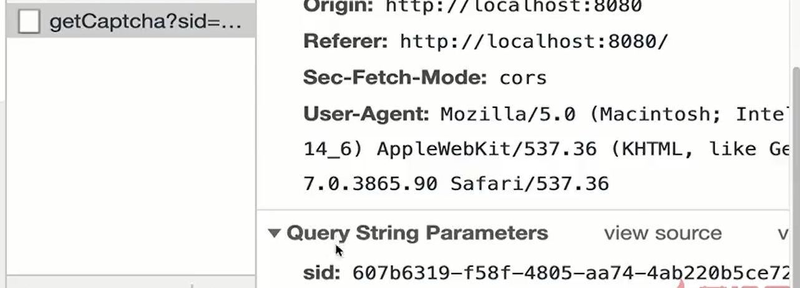


而在服务器端，我们可以在`/getCaptcha`这样编写，来使得我们可以将`sid`和图形验证码进行一一对应地保存到`redis`中：

```js
/**
 * 表示公共可以访问的服务
 */
import svgCaptcha from 'svg-captcha'
import { getValue, setValue } from '../config/RedisConfig'

class PublicController {
  constructor() {}

  async getCaptcha(ctx) {
    const query = ctx.request.query //获取sid
    // console.log(query)
    const newCaptcha = svgCaptcha.create({
      size: 4,
      ignoreChars: '0olil',
      color: true,
      noise: Math.floor(Math.random() * 5),
      width: 150,
      height: 38,
    })
    //保存图形验证码数据，设置图形验证码超时时间，单位：s
    setValue(query.sid, newCaptcha.text, 10 * 60)//将sid和图形验证码的值一一对应，10*60表示时效，一般验证码时效10分钟
    // console.log(newCaptcha)
    ctx.body = {
      code: 200,
      data: newCaptcha.data,
    }
  }
}

export default new PublicController()

//setValue实现
const setValue = (key, value, time) => {
  if (typeof value === 'undefined' || value === null || value === '') return
  if (typeof value === 'string') {
    if (typeof time !== 'undefined') { //如果包含时效
      client.set(key, value, 'EX', time) //EX是Redis保留字，表示时效，时效过后该key-value会自动删除
    } else client.set(key, value)
  } else if (typeof value === 'object') {
    Reflect.ownKeys(value).forEach((item) => {
      client.hset(key, item, value[item], redis.print)
    })
  }
}
```

## 开发中可能出现的问题--- `@ alias`服务器无法识别

如果我们在`Koa`的`import`路径中使用了`@`之类的`alias`，我们需要首先使用`webpack`进行打包，否则`server`是不知道`@`指向什么的，当然，我们可以使用相对路径来替代`alias`；更一般的，我们会使用如下的方式配置`@`等一系列路径转换字符；

```js
// /config/utils.js
const path = require('path')

//exports的快捷方式写法
exports.resolve = function resolve(dir) {
  return path.join(__dirname, '..', dir)
}

exports.APP_PATH = exports.resolve('src')
exports.DIST_PATH = exports.resolve('dist')

exports.getWeboackResolveConfig = function (customAlias = {}) {
  const appPath = exports.APP_PATH
  return {
    modules: [appPath, 'node_modules'],//指定需要解析的文件/文件夹
    extensions: ['.js', '.json'],//指定需要解析的文件后缀
    alias: {
      '@': appPath,//将路径中的@字符替换成`/src`
      ...customAlias,//将传入的其他alias配置进来
    },
  }
}
// /config/webpack.config.base.js
const webpackconfig = {
     resolve: {
        ...utils.getWeboackResolveConfig() //将该函数配置进来，目的是部分配置是默认的，我们可以专注于新alias的配置
    }
}
```

但是者没有解决`@`的问题，在`Koa`的开发环境中，我们一般使用`nodemon`来启动服务器，而不经过`webpack`打包操作，其实我们完全可以使用`webpack`的命令来开启服务器，我们可以在使用以下两条命令来实现我们的目的：

```json
//package.json
{
  "scripts": {
    "watch": "cross-env NODE_ENV=dev webpack --watch --progress --hide-modules --config config/webpack.config.dev.js",//开启webpack打包监视
    "debug": "nodemon --inspect ./dist/server.bundle.js"//运行webpack打包后的文件
  },
}
```

我们可以两个命令一起执行，服务双开，即在两个终端下运行这两个命令，但是必须`npm run watch`在`npm run debug`之前；

我们还有一个更好的方法来合并两个脚本命令，我们可以使用`npm-run-all`这个库来合并两个脚本命令，我们使用以下方法来安装它：

```
npm install -D npm-run-all
```

然后在我们的`package.json`中这样写：

```
 "watch": "cross-env NODE_ENV=dev webpack --watch --progress --hide-modules --config config/webpack.config.dev.js",
 "debug": "nodemon --inspect ./dist/server.bundle.js",
 "start:dist": "npm-run-all -p watch debug"//这样我们就能并行（-p表示并行，-s表示串行，一个执行完执行另一个）运行这两个命令
```

之后我们就能使用以下命令来运行我们的服务了：

```
npm run start:dist
```

## `Token`的存储和安全性

`Token`可以使用几种方式存储在本地：

+ `localStorage`：不手动删除不会消失；
+ `sessionStorage`：会话中断会删除`sessionstorage`内的数据；
+ `cookie`：浏览器侧表现好，移动端表现较差；

由于我们的`Token`目前是明文放在`axios`请求中，因此非常不安全，我们可以采用以下方式来提高安全性：

+ 使用`HTTPS`；
+ 服务端存储`Secret`，动态`Secret`；
+ 设置短期的`Token`时效，设置刷新`Token`；

# [`Vue`]`Vue.js`插件实现鉴权失败错误提示地弹窗逻辑和交互（难点）

当我们登录失败时我们获取到了从服务器端发回来的错误消息，然后我们需要使用友好的形式来提示用户鉴权失败，而不是简单使用`alert()`函数提示用户；

但是对于错误提示这样的组件，往往所有的页面或组件都需要使用它，而如果我们在每一个页面上都要引入这个错误提示的组件，是非常繁琐和麻烦的，我们需要不停地`import`和挂载；

因此，`Vue.js`提供了插件这一个非常重要的特性来实现将我们的组件类似`vuex`挂载到`Vue`这个对象下，使得我们可以通过类似`Vue.$store.commit()`方法来全局调用它而不需要在每一个`Vue`组件内都引入`vuex`；这部分内容非常高级，具体的构成如下；

我们首先新建一个错误提示的`Vue`组件，由于这样的组件是全局挂载的，和普通组件不同，因此我们将该组件保存在`/src/components/modules/Alert.vue`文件中：

```vue
<template>
  <div v-show="isShow">
    <div class="alert">
      <div class="flex">{{ msg }}</div>
      <div class="btnCommon success" @click="close()">确定</div>
    </div>
    <div class="mask" @click="closeMask()"></div>
  </div>
</template>

<script>
export default {
  name: "alert",
  props: {
    msg: {
      type: String,
      default: "一条提示"
    },
    isShow: {
      type: Boolean,
      default: false
    }
  },
  methods: {
    close() {
      this.isShow = false;
    },
    closeMask() {
      this.close();
    }
  }
};
</script>

<style lang="scss" scoped>
//scss的darken函数可以很方便地修改颜色深度，借鉴一下
$btn-main: #009688;
$btn-dark: darken($btn-main, 5%);
.btnCommon {
  width: 105px;
  height: 32px;
  text-align: center;
  line-height: 32px;
  border-radius: 6px;
  cursor: pointer;

  &.success {
    background: $btn-main;
    color: #fff;
    &:hover {
      background: $btn-dark;
    }
  }
}

.flex {
  flex: 1;
  justify-content: center;
  align-items: center;
  display: flex;
}

//这里的布局使用了flex的百分比便宜布局写法、flex填充等知识，需要细读借鉴
.alert {
  width: 300px;
  height: 150px;
  position: fixed; //基于浏览器窗口定位
  background: #fff;
  border-radius: 6px;
  left: 50%;
  top: 50%;
  margin-left: -150px;
  margin-top: -75px;
  padding: 20px 10px;
  box-shadow: 0px 5px 8px rgba(0, 0, 0, 0.05);
  z-index: 3000;
  display: flex;
  flex-flow: column nowrap; //组合flex-direction和flex-wrap
  justify-content: center;
  align-items: center;
}

.mask {
  position: fixed;
  width: 100%;
  height: 100%;
  background: rgba(0, 0, 0, 0.4);
  left: 0px;
  top: 0px;
  overflow: hidden;
  z-index: 2000;
}
</style>
```

该组件和普通的组件并没有什么区别，重要的是接下来的内容；

我们在`/src/components/modules`目录下新建`index.js`文件，该文件是所有`modules`的出口，我们不暴露错误提示的组件到外部，使得我们可以更好地隔离不同的区块内的文件；

`index.js`文件内容如下：

```js
import AlertComponent from "./Alert.vue";
//导入的是下面的部分，并不能直接作为组件
//export default {
//   name: "alert",
//   props: {
//     msg: {
//       type: String,
//       default: "一条提示"
//     },
//     isShow: {
//       type: Boolean,
//       default: false
//     }
//   },
//   methods: {
//     close() {
//       this.isShow = false;
//     },
//     closeMask() {
//       this.close();
//     }
//   }
// };
const Alert = {};

Alert.install = Vue => {
  const AlertConstructor = Vue.extend(AlertComponent); //使用导入的vue object生成一个vue组件
  const instance = new AlertConstructor(); //实例化一个vue组件
  instance.$mount(document.createElement("div")); //由于import的vue object没有配置el，因此处于无挂载状态，手动挂载到一个新建立的div上，真正挂载时会替换掉该div为vue template内的元素，如果直接写instance.$mount('#app')，会将#app元素给替换掉，导致页面出错
  document.body.appendChild(instance.$el); //将该组件添加为body元素的子元素

  //挂载到body实体元素属于实体元素层，我们依然可以在vue逻辑层对该组件进行操作
  // 在Vue实例对象下添加一个全局的方法，这样我们就能使用Vue.$alert()方法来修改instance这个错误提示组件了
  Vue.prototype.$alert = function(msg) {
    instance.msg = msg;
    instance.isShow = true;
  };
};

export default Alert;
```

这样我们就完成了一个插件，为什么称为插件？因为我们不需要实际地在`vue`文件中引入，只提供接口，而不需要进行配置；

然后在`/src/main.js`文件中我们使用以下方法来使用插件：

```js
...
import Alert from "./components/modules/alert";
Vue.use(Alert);//使用该插件
new Vue({
  router,
  store,
  render: h => h(App)
}).$mount("#app");
```

这样我们就将我们的`Alert`全局插入我们的程序了；

我们可以进行这样的测试，在`vue`文件中的`mounted()`生命周期函数中，我们添加以下代码：

```
window.Vue = this
```

这样我们就可以在`Chrome`控制台调用`Vue`对象了；然后我们在`Chrome`控制台执行`window.Vue.$alert()`，你会发现`Alert`组件正常显示了：

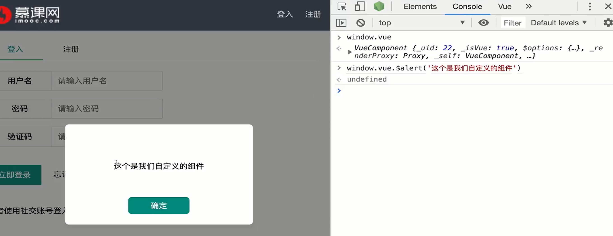

进一步地，我们可以修改我们的组件使得其可以接收`Confirm`的场景下的确认和取消；

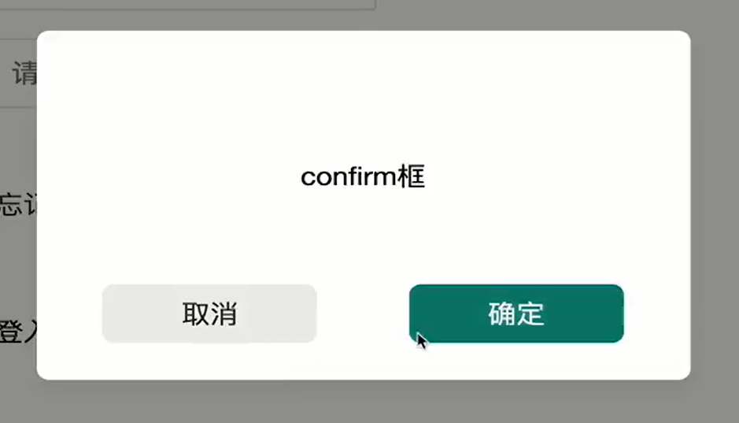

我们修改我们的组件如下，具体选择`alert`还是`Confirm`场景下的提示组件样式从`props`中的`type`中得出，而且我们提供了回调函数来触发回调，这样我们为开发者显示提示框提供了充足的灵活性：

```vue
<template>
  <div v-show="isShow">
    <div class="alert">
      <div class="flex">{{ msg }}</div>
      <div v-if="type === 'alert'">//如果是alert场景
        <div class="btnCommon success" @click="close()">确定</div>
      </div>
      <div v-else class="space-round">//如果是confirm场景
        <btnCommon class="btnCommon cancel" @click="cancelEvent()"//取消
          >取消
        </btnCommon>
        <btnCommon class="btnCommon success" @click="successEvent()"//确定
          >确定
        </btnCommon>
      </div>
    </div>
    <div class="mask" @click="closeMask()"></div>
  </div>
</template>

<script>
export default {
  name: "alert",
  props: {
    type: {
      type: String,
      default: "alert"
    },
    msg: {
      type: String,
      default: "一条提示"
    },
    isShow: {
      type: Boolean,
      default: false
    },
    success: {//外部传入一个函数，successbutton按下触发
      type: Function,
      default: () => {
        console.log("点击了success按钮");
      }
    },
    cancel: {//外部传入一个函数，cancelbutton按下触发
      type: Function,
      default: () => {
        console.log("点击了cancel按钮");
      }
    }
  },
  methods: {
    close() {
      this.isShow = false;
    },
    closeMask() {
      if (this.type === "alert") this.close();
    },
    cancelEvent() {//按下cancelbutton触发
      this.cancel();//回调外部传入的cancel函数
      this.close();//关闭提示框
    },
    successEvent() {//按下successbutton触发
      this.success();//回调外部传入的success函数
      this.close();//关闭提示框
    }
  }
};
</script>

<style lang="scss" scoped>
$btn-main: #009688;
$btn-dark: darken($btn-main, 5%);
.btnCommon {
  width: 105px;
  height: 32px;
  text-align: center;
  line-height: 32px;
  border-radius: 6px;
  cursor: pointer;

  &.success {
    background: $btn-main;
    color: #fff;
    &:hover {
      background: $btn-dark;
    }
  }
  &.cancel {
    background: #ededed;
    color: #333;
  }
}

.space-round {
  display: flex;
  flex-flow: row nowrap;
  justify-content: space-around;
  align-items: center;
  width: 100%;
  padding: 0 10px;
}

...
</style>
```

然后我们修改`/src/components/modules/index.js`文件为`Vue`对象添加一个新的全局方法：

```js
import AlertComponent from "./Alert.vue";
const Alert = {};
...
Alert.install = Vue => {
  ...
  //调用Vue.$confirm()函数触发，需要三个参数，msg，success是点击确定后的回调函数，cancel是点击取消后的回调函数
  Vue.prototype.$confirm = function(msg, success, cancel) {
    instance.type = "confirm";//设定场景是alert韩式confirm
    instance.msg = msg;//设定消息
    instance.isShow = true;//设定show
    if (typeof success !== "undefined") instance.success = success;//如果提供了success回调函数，success回调就使用该函数，否则使用default函数，下同
    if (typeof cancel !== "undefined") instance.cancel = cancel;
  };
};

export default Alert;
```

我们现在只需要通过`Vue.$confirm()`函数即可显示`confirm`场景的提示框，而不需要在`vue`文件里`import`进来实例化；

然后我们需要在我们`Vue.js`端的业务代码中去将我们的登录的函数补全完整：

```js
 login({
        username: this.username,
        password: this.password,
        code: this.code,
        sid: this.$store.state.sid
      })
        .then(res => {
          if (res.code === 200) {//如果校验通过，就删除掉输入框的内容
            this.username = "";
            this.password = "";
            this.code = "";
            requestAnimationFrame(() => {
              this.$refs.observer.reset();//在一帧动画帧中完成重置validation-observer的所有错误提示信息
            });
          } else if (res.code === 404) {//如果账号密码没有配对
            this.$alert("用户名密码校验失败，请检查");//提示信息即可，不清空表单数据也不修改错误提示信息
          } else if (res.code === 401) {//如果验证码错误
            this.$refs.codefield.setErrors([res.msg]);//修改验证码外的validation-provider的错误提示信息为传递过来的msg，注意，要以数组形式传入
          }
        })
        .catch(err => {
          const data = err.response.data;
          if (data.code === 500) {//如果没有这个账号或密码
            this.$alert("用户名密码校验失败，请检查");//提示框提示
          } else {
            this.$alert("服务器错误");//其他错误说明服务器有错误
          }
        });
```

# [`Vue`]路由守卫验证请求

在我们的开发中，我们部分的路由是有先决条件的，比如我们会要求我们只能通过登录页面跳转到注册页面，`Vue-router`提供了路由守卫来拦截路由的跳转：

```js
import Vue from "vue";
import VueRouter from "vue-router";
Vue.use(VueRouter);
const Reg = () => import(/*webpackChunkName: 'reg'*/ "../views/Reg.vue");
const routes = [
  {
    path: "/login",
    name: "login",
    component: Login
  },
  {
    path: "/reg",
    name: "reg",
    component: Reg,
    beforeEnter: (to, from, next) => { //beforeEnter即为路由守卫
      console.log("from", from);//打印from的值
      if (from.name === "login") next();//from存储上一个路由，name是上一个路由的路由名字，如果是从login路由进来的，我们就进入/reg路由
      else {
        next("/login");//其他情况下，比如没有上一个路由或者上一个路由不是login，就前往login路由
      }
    }
  },
  {
    path: "/forget",
    name: "forget",
    component: Forget
  }
];
```

> 如果大家需要使用`console.log`来查看和监视某一个变量的值，我们可以从`vs code`的插件市场安装`Turbo Console Log`插件，这个插件允许我们使用`ctrl+Alt+L`来为一个变量快速生成`console.log`；

# [`Vue-Router`]为路由添加名字？有什么用？

我们在配置路由时，往往只配置两样东西，一个是路由的路径，另一个是路由的组件/页面，但实际上，我们还可以为每一个路由添加名字，添加名字有什么用，实际上，是更加直观的方式；

```js
import Vue from "vue";
import VueRouter from "vue-router";
Vue.use(VueRouter);
const Reg = () => import(/*webpackChunkName: 'reg'*/ "../views/Reg.vue");
const routes = [
  {
    path: "/login",
    name: "login",
    component: Login
  },
  ...
];
```

+ 我们不再需要在每一次路由时记忆路由路径，而只需要使用路由名字即可；
+ 当我们修改路由路径时，其他的所有的路由行为都不需要修改路由路径，因为都是使用路由名字进行路由的；

> 一开始，我也认为路由添加名字是没有说明用处的，后来慢慢开发下来发现这有解耦的效果，需要重视起来；

# [`DOCLever`]注册的前端逻辑和`Mock`模拟返回数据

注册的前端逻辑和登录大体相仿，单表单校验和全校验基本思路相同：

```js
//vue register 
async submit() {
      let Observer = this.$refs.observer;
      let isValid = await this.$refs.observer.validate();
      if (!isValid) return;
      const registerInfo = {
        username: this.username,
        nickname: this.nickname,
        password: this.password,
        code: this.code,
        sid: this.$store.state.sid
      };
      register(registerInfo).then(res => {
        if (res.code === 200) {//如果注册成功
          this.username = "";
          this.password = "";
          this.code = "";
          requestAnimationFrame(() => {
            Observer.reset();//将所有的error清空
          });
          //跳转到登陆界面让用户登陆
          this.$alert("注册成功");
          setTimeout(() => { //延迟跳转要注意，目的是提供友好的交互
            this.$router.push("/login");
          }, 1000);
        }  else {
          // res.msg = { username: [] , name:[], code: []}返回的数据结构，表示各个field的错误信息
          this.$refs.regobserver.setErrors(res.msg);
          //该方法接收这样一个object，每一个field都是表单中validation-provider的name，然后指定每一个field的error，将最终的错误显示由后端决定：
          //{field1:["errorString1",...],
          // field2:["erroString2",...],
          // ...,
          //}
          //
        }
      });
    }
```

由于现在是前后端分离的开发方式，因此在后端没有完成`API`接口实现以前，我们需要使用`DOClever`来`mock`我们的数据；

我们在`DOClever`上新建一个`Mock`接口如下所示：

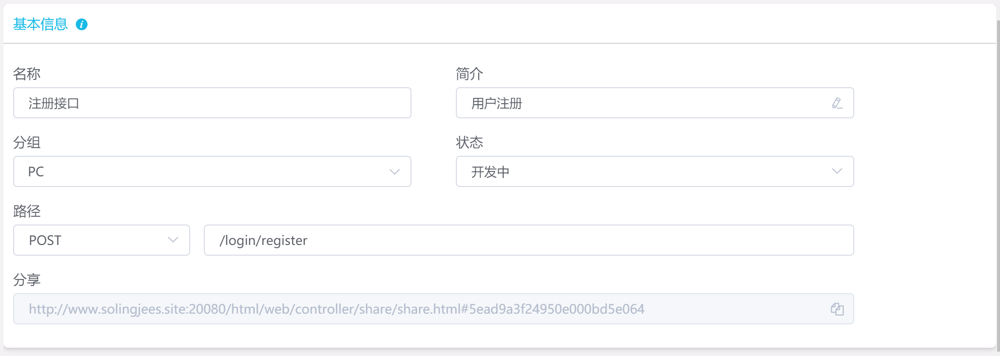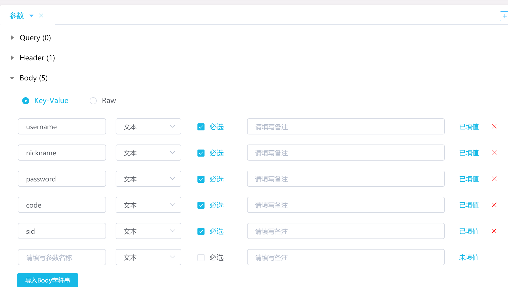


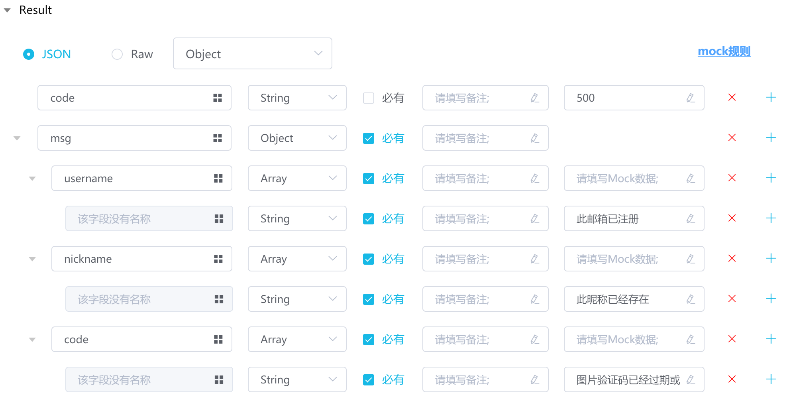

我们可以点选`运行`进行接口测试：

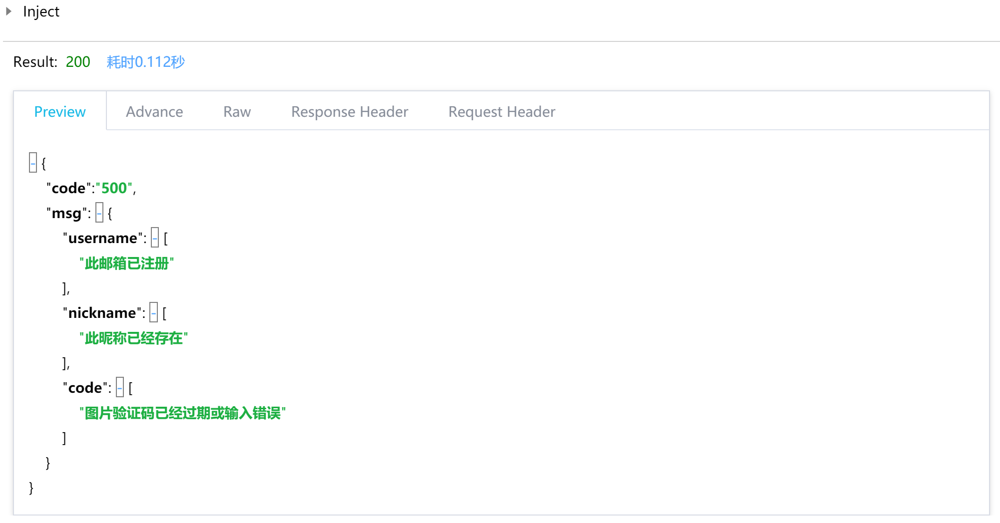

然后我们使用`net.js`启动我们的转接服务器（需要先下载`net.js`，具体过程参见以前的文档），一般都是在`36742`端口：

```
node net.js http://www.solingjees.site:20080/mock/5ead8bae24950e000bd5e05c \ # doclever地址 
http://localhost:3000 \ # 真实koa地址
```

接着我们需要修改`Vue.js`项目中的两个地方：

+ 修改`webpack`的`devserver`为`net.js`服务器地址：`localhost:36742`，否则会因为跨域问题而导致请求发送失败；

  ```js
  module.exports = {
    devServer: {
      proxy: "http://localhost:36742"
    }
  };
  ```

+ 修改`Axios`的`baseUrl`为`net.js`服务器地址，否则会因为根地址不正确而没有发到`DOClever`；

  ```js
  export default {
    //axios配置
    baseUrl: {
      dev: "http://localhost:36742",
      pro: "http://www.solingjees.site:11006"
    }
  };
  ```


这样，前端就能快乐地进行脱离后端的开发了；

在我们的实际开发中，我们应当对我们用户的`password`进行加密，这样尽管有人攻入了数据库，也无法使用用户的账号密码登录，在`koa`中我们使用`bcrypt`库来实现加密，我们使用以下命令安装这个库：

```
npm install -S bcrypt
```

使用方法很简单，直接在后端代码里修改一下`password`部分的逻辑就行了；

> 但是要注意，这个库如果版本高于`v3.0.5`那么要求`node`版本为`v12`；

在后端`Koa`中我们这么处理`register`请求：

```js
 async register(ctx) {
    //接收客户端的数据
    let { body } = ctx.request
    const sid = body.sid
    const code = body.code
    let msg = {}
    //校验验证码的内容
    let check = true
    let checkResult = await checkCode(sid, code)
    if (checkResult) {
      //查库，看username是否被注册
      let user1 = await User.findOne({ username: body.username })
      if (user1 !== null) {
        msg.username = ['此邮箱已注册']
        check = false
      }
      //查库，看nickname是否被注册
      let user2 = await User.findOne({ nickname: body.nickname })
      if (user2 !== null) {
        msg.nickname = ['此昵称已经存在']
        check = false
      }
      if (check) {
        //写入数据到数据库
        body.password = await bcrypt.hash(body.password, 5)//指定盐值生成新盐来加密密码
        let user = new User({
          username: body.username,
          nickname: body.nickname,
          password: body.password,
          created: moment().format('YYYY-MM-DD HH:mm:ss'),
        })//schema模板
        const result = await user.save()
        ctx.body = {
          code: 200,
          data: result,
          msg: '注册成功',
        }
        return
      }
    } else {
      msg.code = ['图片验证码输入错误']
    }
    ctx.body = {
      code: 500,
      msg,
    }
  }
```

那么相应的，我们需要修改登录逻辑中的`password`的校验，否则登录时密码是通不过验证的：

```js
 async login(ctx) {
      ...
      if (await bcrypt.compare(body.password, user.password)) {
        checkUserPassword = true
      }
      ...
  }
```

> 我们在前端并没有做密码加密然后传输，原因是在前端加密没有任何意义，因为我们前端的代码攻击者都是看得到的，怎么加密的他都知道，而且如果在一个不安全的信道上，攻击者可以截取用户发出去的加密后的密码而不需要知道这个密码是什么，因为没有真正的密码照样可以请求后端；

# [登录业务逻辑]登录操作的副作用-`header`的信息改变

在我们登录成功后，我们会接受到我们的用户信息，同时我们还要告知整个系统我们已经登录了，因为这些数据在我们整个系统中都需要使用，因此大可以将这些数据都保存到`Vuex`中，这样在一个单页面应用中，我们可以非常方便地读取到用户的信息和登录状态信息；

```js
 async submit() {
      const isValid = await this.$refs.observer.validate();
      if (!isValid) return;
      login({
        username: this.username,
        password: this.password,
        code: this.code,
        sid: this.$store.state.sid
      }).then(res => {
          if (res.code === 200) {
            this.username = "";
            this.password = "";
            this.code = "";
            this.$store.commit("setUserInfo",res.data) //使用store的commit操作提交用户信息数据到store
            this.$store.commit('setIsLogin',true) //修改用户登录状态为true
            requestAnimationFrame(() => {
              this.$refs.observer.reset();
            });
            this.$router.push({name:'index'})
          } else if (res.code === 404) {
            this.$alert("用户名密码校验失败，请检查");
            this._getCode()
          } else if (res.code === 401) {
            this.$refs.codefield.setErrors([res.msg]);
          }
        })
        .catch(err => {
          const data = err.response.data;
          if (data.code === 500) {
            this.$alert("用户名密码校验失败，请检查");
            this._getCode()
          } else {
            this.$alert("服务器错误");
          }
        });
    }
```

而我们的`store`里面需要这样写：

```js
import Vue from "vue";
import Vuex from "vuex";

Vue.use(Vuex);

export default new Vuex.Store({
  state: {
    sid: "",
    isLogin:false, //是否登录
    token:'',
    userInfo:{} //用户信息
  },
  mutations: {
    setSid(state, value) {
      state.sid = value;
    },
    //设置用户信息
    setUserInfo(state,value){ //修改用户信息的操作
      state.userInfo = value
    },
    //设置登录状态
    setIsLogin(state,value){ //修改用户登录状态的操作
      state.isLogin = value
    }
  },
  actions: {},
  modules: {}
});
```

接着，我们就常见到的应用就是`header`部分用户信息的显示，因此，大可以从`stroe`中读取来进行修改的操作， 这部分内容非常简单，因此就简单查看代码就可以明白了；

```vue
<template>
  <div class="fly-header layui-bg-black">
    <div class="layui-container">
      <a class="fly-logo" href="/">
        
      </a>
      <ul class="layui-nav fly-nav layui-hide-xs">
        <li class="layui-nav-item layui-this">
          <a href="/"><i class="iconfont icon-jiaoliu"></i>交流</a>
        </li>
        <li class="layui-nav-item">
          <a href="case/case.html">
             <i class="iconfont icon-iconmingxinganli"></i>案例
          </a>
        </li>
        <li class="layui-nav-item">
          <a href="/" target="_blank">
             <i class="iconfont icon-ui"></i>框架
          </a>
        </li>
      </ul>
      <ul class="layui-nav fly-nav-user">
        <!-- 未登入的状态 -->
        <template v-if="!isShow"> //使用条件渲染来按照状态使用不同的功能
          <li class="layui-nav-item">
            <a
              class="iconfont icon-touxiang layui-hide-xs"
              href="../user/login.html">
            </a>
          </li>
          <li class="layui-nav-item">
            <router-link :to="{name:'login'}">登录</router-link>
          </li>
          <li class="layui-nav-item">
            <router-link :to="{name:'reg'}">注册</router-link>
          </li>
          <li class="layui-nav-item layui-hide-xs">
            <a
              href=""
              onclick="layer.msg('正在通过QQ登入', {icon:16, shade: 0.1, time:0})"
              title="QQ登入"
              class="iconfont icon-qq">
            </a>
          </li>
          <li class="layui-nav-item layui-hide-xs">
            <a
              href=""
              onclick="layer.msg('正在通过微博登入', {icon:16, shade: 0.1, time:0})"
              title="微博登入"
              class="iconfont icon-weibo">
            </a>
          </li>
        </template>
        <!-- 登录后的状态 -->
        <template v-else>
           <li class="layui-nav-item">
            <a class="fly-nav-avatar" href="javascript:;">
              <cite class="layui-hide-xs">{{userInfo.nickname}}</cite>
              <i class="layui-badge fly-badge-vip layui-hide-xs" v-show="userInfo.isVip !== '0'">VIP{{userInfo.isVip}}</i>
              
            </a>
            <dl class="layui-nav-child">
              <dd><a href="user/set.html"><i class="layui-icon">&#xe620;</i>基本设置</a></dd>
              <dd><a href="user/message.html"><i class="iconfont icon-tongzhi" style="top: 4px;"></i>我的消息</a></dd>
              <dd><a href="user/home.html"><i class="layui-icon" style="margin-left: 2px; font-size: 22px;">&#xe68e;</i>我的主页</a></dd>
              <hr style="margin: 5px 0;">
              <dd><a href="/user/logout/" style="text-align: center;">退出</a></dd>
            </dl>
          </li>
        </template>
    </ul>
    </div>
  </div>
</template>

<script>
export default {
  name: "Header",
  computed:{
    isShow(){ //使用计算属性来使用store里的状态数据
      return this.$store.state.isLogin
    },
    userInfo(){ //因为userInfo是一个object，最好提供一个默认的obejct，因为可能isLogin修改了但是userInfo还没有更新，因此页面的部分数据比如userInfo.nickname会报错undefined
      return this.$store.state.userInfo || {
        nickname:'',
        pic:'',
        isVip:'0'
      }
    }
  }
};
</script>

<style lang="scss" scoped>
.fly-logo {
  left: -15px;
  top: -10px;
  margin-left: 15px;
}
</style>
```

# [`LayUI`]`header`悬浮功能栏的实现

`LayUI`为我们提供了动画的选项使得我们可以操控我们的组件进入和退出的动画，我们只需要在我们要应用动画的组件上添加两个类即可，一个类是`layui-anim`，该类必须添加，否则所有的`layui`动画均无效，另一个类是详细的`layui`动画类，按需要添加，可以添加多个，详细的信息参考https://www.layui.com/doc/element/anim.html;

我们将动画类添加在悬浮功能栏的组件上；

然后，我们需要为添加动画的组件添加`layui-show`类控制其显示和隐藏，我们大部分的动画都是应用于组件的显示和隐藏的，这是一个需要注意的点；

只要控制`layui-show`类的添加即可，我们可以声明一个状态来控制它，使用`object`的方式来控制类的添加；

```html
   <dl class="layui-nav-child 
   layui-anim  //必须携带该类，否则所有动画都无效
   layui-anim-upbit //指定所使用的动画
   " 
   :class="{'layui-show':isHover}">
   </dl>                    
```

然后我们要通过`mouseover`和`monseleave`事件来控制`isHover`即可实现悬浮功能栏的显示和隐藏；

我们将这两个事件放在包含悬浮功能栏组件的外层组件上，因为只要鼠标在该外层组件下的任何组件上悬浮，就会触发`mouseover`和`mouseleave`事件，即使悬浮栏是一个脱离文档流的组件，也能够触发事件；

```vue
 <li class="layui-nav-item"
               @mouseover="show()"
               @mouseleave="hide()">
            <a class="fly-nav-avatar"
             href="javascript:;">
              <cite class="layui-hide-xs">{{userInfo.nickname}}</cite>
              <i class="layui-badge fly-badge-vip layui-hide-xs" v-show="userInfo.isVip !== '0'">VIP{{userInfo.isVip}}</i>
              
            </a>
            <dl class="layui-nav-child 
                       layui-anim  //必须携带该类，否则所有动画都无效
                       layui-anim-upbit //指定所使用的动画
                       " :class="{'layui-show':isHover}">
              <dd><a href="user/set.html"><i class="layui-icon">&#xe620;</i>基本设置</a></dd>
              <dd><a href="user/message.html"><i class="iconfont icon-tongzhi" style="top: 4px;"></i>我的消息</a></dd>
              <dd><a href="user/home.html"><i class="layui-icon" style="margin-left: 2px; font-size: 22px;">&#xe68e;</i>我的主页</a></dd>
              <hr style="margin: 5px 0;">
              <dd><a href="/user/logout/" style="text-align: center;">退出</a></dd>
            </dl>
</li>
```

然后我们就要去编写这两个事件的执行函数；

```js
 methods:{
    //展示用户浮动功能栏
    show(){
      this.isHover = true
    },
    //隐藏用户浮动功能栏
    hide(){
      this.isHover = false
    }
  },
```

我们强调这是一个悬浮栏，因此外层组件的包含区域很可能并不是一个矩形的，而是文档流内子组件加上脱离文档流的子组件的两个矩形，而且非常有可能这两个矩形没有重叠和相邻，彼此之间留有空隙，也就是说，当我们从文档流内子组件鼠标移动到悬浮栏子组件时，会触发一次鼠标移出包含区域的行为，即`hide()`函数被执行，导致`isHover`被设置为`false`，进一步导致悬浮栏被隐藏，也就是说这种实现方式是不可靠的，我们的鼠标永远无法悬浮在悬浮栏上；

那么如何来解决这个问题？其实只要让`isHover`被设置为`false`的时间迟一点即可，原来我们是当鼠标移出时立刻更新`isHover`为`false`，现在我们给它`200`毫秒的延时，只要`200`毫秒内我们鼠标再次移入悬浮栏时即可再次触发悬浮事件导致`isHover`被设置为`true`，这样我们就可以完美地进入悬浮栏里了；

实现方法也很简单，设置一个延时器，然后在这两个事件函数内都去延时更新原来的延时器即可，实际上只要`hide()`函数延时更新就行了；

```js
data(){
  return {
    hoverCtrl:{},
    isHover:false
  }
},
methods:{
    //展示用户浮动功能栏
    show(){
      clearTimeout(this.hoverCtrl)
      this.hoverCtrl = setTimeout(()=>{
        this.isHover = true
      },200)
    },
    //隐藏用户浮动功能栏
    hide(){
      clearTimeout(this.hoverCtrl)
      this.hoverCtrl = setTimeout(()=>{
        this.isHover  =false
      },200)
    }
  },
```

# [登录概要]登录注册的核心要义（重点）

登录正向要点：

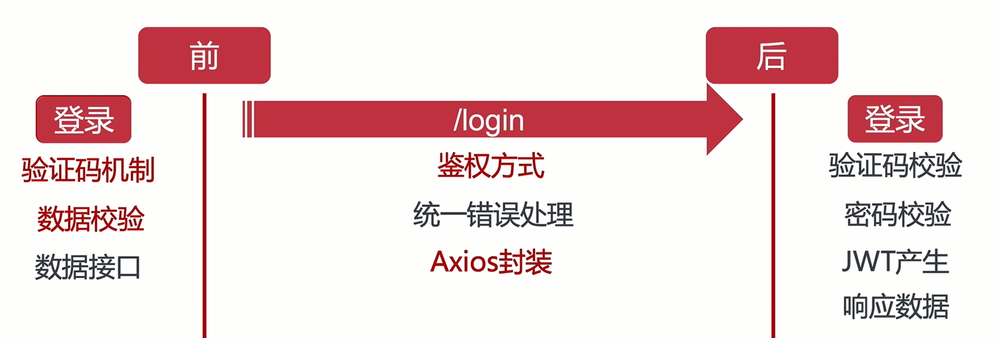

登录反向要点：

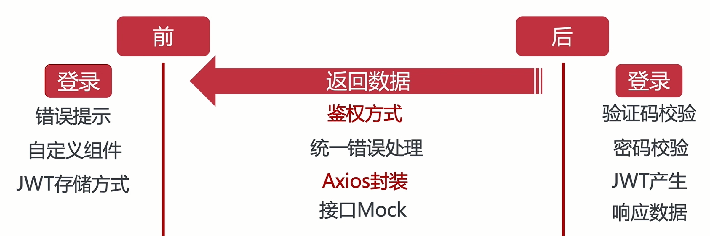

注册正向要点：

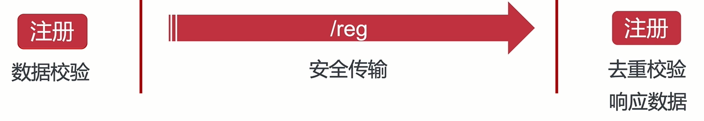

注册反向要点：

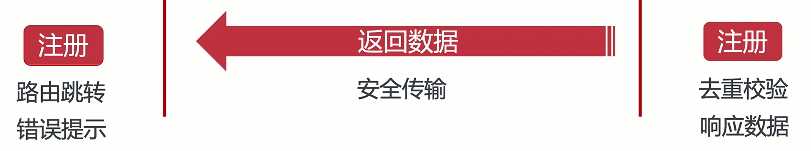

# [业务逻辑设计]登录业务的一些小贴士😊

我们在进行登录时，我们会发送用户的账号、密码、验证码等信息，其中账号、密码都是敏感信息，当我们登录成功验证成功回传数据，账号、密码（一般就账号）就不应该回传回来了，应该直接使用本地这组验证成功的账号密码，因为这比再传一次账号、密码回来要安全一点；