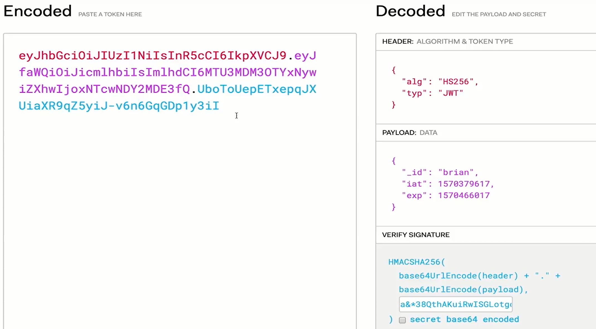
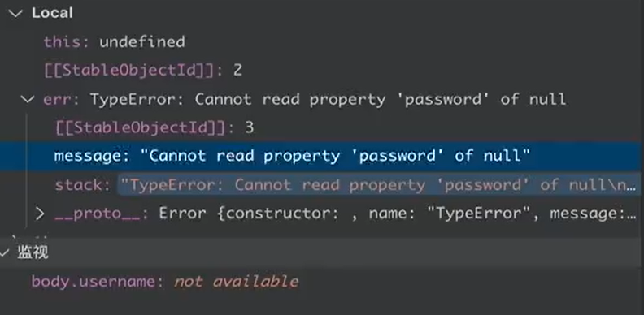
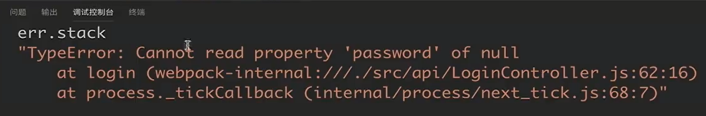
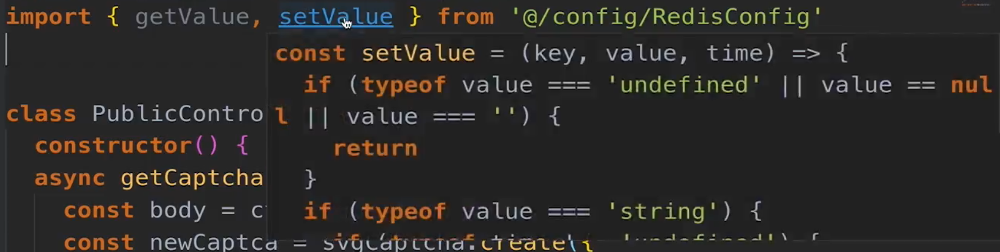
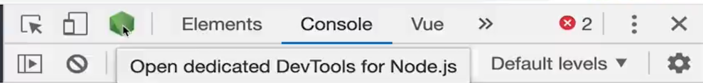
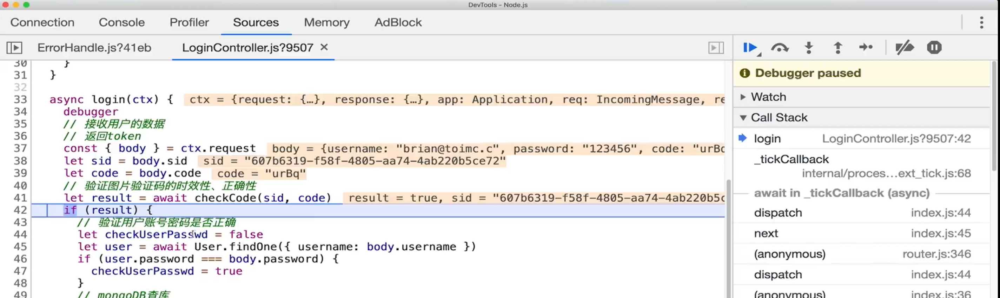

# `Koa`端`JWT`生成和验证

现在我们开始真正的`JWT`鉴权配置，在`Vue.js`端的鉴权行为并没有触及`JWT`的真正内容，这些都是在`koa`服务器端配置的；

为了使用`JWT`进行鉴权，我们需要使用`koa-jwt`这个库，该库是`koa`上用于验证`JWT`的库，这个库只有验证功能，没有生成`JWT`的功能；

首先我们照例使用以下命令安装`koa-jwt`：

```
npm install -S koa-jwt
```

在使用`koa-jwt`之前，我们首先需要配置`secret`，照例我们将该配置写入`/src/config/index.js`文件：

```js
...
const JWT_SECRET = 'HAiOjE1NjE4Njk2MjMsInVzZXIiOiIxMjM0NSIsInN1YiI6InhsIn'
export default {
  ...,
  JWT_SECRET
}
```

`secret`是`signature`的一部分，我们使用该`secret`来验证浏览器端上传的`JWT`的`signature`的有效性进而达到鉴权的目的；

然后我们在`src/index.js`如下使用`koa-jwt`：

```js
import JWT from 'koa-jwt'
import config from './config'
import errorHandle from './common/errorHandle'//处理jwt鉴权失败的error中间件
const jwt = JWT({ secret: config.JWT_SECRET })//使用我们配置的secret进行鉴权
.unless({
  path: [/^\/public/, /\/login/],//将/public和/login路由带头的请求放行不鉴权
})

//koa会顺序执行这些中间件，正是使用这种特性我们在jwt前放置errorHandle才能获取到jwt的鉴权失败的消息，不光能获取到jwt的错误信息，如果jwt鉴权成功会继续执行下一个中间件，如路由的业务逻辑，因此同样会获取到路由中的错误消息，将errorhandle放置在这里是非常重要的业内常用的操作
const middleware = compose([
  ...
  errorHandle,//该中间件必须写在jwt前面，否则失效
  jwt,//在这里鉴权
])
//所有的router都必须放在jwt之后
```

> 我们需要将我们的请求按照不同的类别进行；

这里我们添加了`errorHandle`中间件，我们一般将错误处理单独独立到一个文件内，不管在任何项目中开发，都理应如此操作；在此，我们放在`src/common/errorHandle.js`文件中；

```js
export default (ctx, next) => {
  return next().catch((err) => {//该中间件会直接调用next()执行接下来的中间件，使用catch()来抓取包含鉴权失败在内的所有消息
    if (err.status === 401) {//status为401表示鉴权失败
      ctx.status = 401//修改ctx状态码
      ctx.body = {
        code: 401,
        msg: 'Protected resource,use Authorization header to get access\n',//返回以告消息
      }
    } else {
      throw err//如果不是401，说明是其他错误，比如500服务器内部错误
    }
  })
}
```

这样我们就可以对我们浏览器上传的`JWT`进行验证了，但是首先我们必须要给浏览器端一个`JWT`，否则我们都没有`JWT`上传上来无法验证，而`koa-jwt`并没有生成`JWT`的能力，因此我们需要使用`jsonwebtoken`库来生成`Token`；我们首先来安装它：

```
npm install jsonwebtoken
```

一般来讲，我们将部分权限的分配放置在`login`的请求流程中，在服务器端为该用户分配`Token`：

```js
import jsonwebtoken from 'jsonwebtoken'
import config from '../config'
class LoginController {
  constructor() {}

  async login(ctx) {
    ...
    //返回Token
    let token = jsonwebtoken.sign(
      {
        _id: 'solingjees',//payLoad中存储数据
        // exp: Math.floor(Date.now() / 1000 + 60 * 60 * 24),//设定时效方法1
      },
      config.JWT_SECRET,
      {
        expiresIn: '1d',//设定时效方法2，该方法更加优雅，使用d、h等代替复杂的时间算式
      }
    )
    //将token返回
    ctx.body = {
      code: 200,
      token,
    }
  }
}
```

但是要注意这样一点，`PayLoad`不能存储任何重要信息，比如身份证等，如果一个中间人拿到了你的`Token`，他可以直接逆向算出你的`PayLoad`内的值，比如在`jwt.io`上我们粘贴进我们的`Token`，会直接得到该`Token`的`Header`和`PayLoad`内的数据：



`iat`代表`Token`的生成时间，`exp`代表有效时间；

因此要非常注意`payLoad`内保存的数据；

这样我们就完成了`JWT`在服务器端的生成和校验；

# `Koa`端基础登录逻辑的实现

我们梳理一下登录逻辑的整个过程：

+ 当用户打开登录页面，会生成/获取到一个`sid`，该`sid`全球唯一，由于我们的登录需要验证码，因此会将该`sid`随验证码请求一起发到`Koa`后端，接着`Koa`生成一个验证码并将`sid`和验证码以`key-value`的形式保存到`Redis`中，最后返回验证码的`svg`代码，`vue.js`接收到后端发来的`svg`图形显示出来；

+ 当用户完成并确认表单提交的时候，会将以下内容提交上来：

  ```
  {
     username:String.
     password:String,
     code:String,
     sid:String
  }
  ```

  为什么会有`sid`？当用户为游客模式时我们依然需要唯一确定一个客户端，比如验证码需要和一个客户端绑定在一起否则无法验证；

  当服务器接收到请求，会首先经过`JWT`鉴权门，鉴权成功（准确来说是绕过）后会将请求发到对应路由的业务逻辑函数中；

+ 当接收到表单数据后，首先先校验验证码，因为不少的接口都需要验证码的校验，比如注册、忘记密码等，我们将验证码的校验剥离到一个单独的文件`/src/common/utils.js`中：

  ```js
  import { getValue } from '@/config/RedisConfig'
  const checkCode = async (key, value) => {
    const redisData = await getValue(key)//从Redis中读取指定sid的验证码值
    if (redisData != null) {//如果验证码值存在
      if (redisData.toLowerCase() === value.toLowerCase()) return true//如果浏览器端所确定的验证码值和真实验证码值进行校验，相等则校验成功返回
      else false
    } else false
  }
  export { checkCode }
  ```

  如果验证码校验失败则直接返回：

  ```jz
  ctx.body = {
      code: 401,
      msg: '图片验证码不正确，请检查',
  }
  ```

  如果验证码校验成功，则我们继续校验`mongoDB`中存储的`username`和`password`；

  首先我们需要编写`/src/model/user.js`生成`User`模板来连接`users collection`：

  ```js
  import mongoose from '../config/DBHelper'
  var Scheme = mongoose.Schema
  var UserSchema = new Scheme({
    username: { type: String },
    password: { type: String },
  })
  export default mongoose.model('users', UserSchema)
  ```

  接着我们去获取`MongoDB`内的指定`username`的那条数据，如果`username`这条数据存在，然后对比`password`，这就是账号密码校验；

  账号密码校验失败直接返回：

  ```js
  ctx.body = {
     code: 404,
     msg: '用户名或密码错误',
  }
  ```

  账号密码校验成功然后就生成`JWT`还给前端，表示浏览器用户现在拥有了`login`后的调用`API`的所有权限；

  完整代码如下：

  ```js
  ...
  import { checkCode } from '../common/utils'
  import User from '../model/user'
  
  class LoginController {
    constructor() {}
  
    async login (ctx) {
      // 接收用户的数据
      const { body } = ctx.request
      const sid = body.sid
      const code = body.code
      // 验证图片验证码的时效性、正确性
      // 验证用户账户密码是否正确
      // 返回Token
      const checkResult = await checkCode(sid, code)
      if (checkResult) {
        // 验证用户账户和密码
        let checkUserPassword = false
        const user = await User.findOne({ username: body.username })
        if (await bcrypt.compare(body.password, user.password)) {
          checkUserPassword = true
        }
        // 用户名密码校验成功
        if (checkUserPassword) {
          const userobj = user.toJSON() //使用user.toJSON()方法将mongoose的返回数据改变成JSON
          const arr = ['password', 'username', 'roles'] //屏蔽一些重要的用户信息
          arr.map(item => {
            delete userobj[item]
          })
          const token = jsonwebtoken.sign(
            {
              _id: 'solingjees'
              // exp: Math.floor(Date.now() / 1000 + 60 * 60 * 24),
            },
            config.JWT_SECRET,
            { expiresIn: '1d' }
          )
          ctx.body = {
            code: 200,
            token,
            data: userobj //将用户数据返回前端
          }
        } else {
          ctx.body = {
            code: 404,
            msg: '用户名或密码错误'
          }
        }
      } else {
        ctx.body = {
          code: 401,
          msg: '图片验证码不正确，请检查'
        }
      }
    }
    ...
  }
  ```
  
  这里要注意，我们从`mongoose`返回的数据并不是我们所预期的格式，这种格式带有数据库的信息，因此我们必须转化成只包含`json`数据的版本，因此我们使用`model.toJSON()`将它转化为`json object`的格式；
  
  ```js
  const userobj = user.toJSON() //使用user.toJSON()方法将mongoose的返回数据改变成JSON
  ```
  
  接着我们如果想要屏蔽一些数据库信息，我们需要进一步将数据进行修改，将一些我们不希望暴露的信息删除掉；
  
  ```js
   const arr = ['password', 'username', 'roles'] //屏蔽一些重要的用户信息
   arr.map(item => {
   delete userobj[item]
   })
  ```
  
  最后将该数据进行返回即可；
  
  ```js
   ctx.body = {
            code: 200,
            token,
            data: userobj //将用户数据返回前端
   }
  ```


#  `vs code`调试`Koa`项目

建立在我们使用了以下脚本的基础上，我们可以直接在我们的`vs code`项目中调试`Koa`后端项目；

```
"watch": "cross-env NODE_ENV=dev webpack --watch --progress --hide-modules --config config/webpack.config.dev.js",
"debug": "nodemon --inspect ./dist/server.bundle.js",//--insepct参数必须携带，否则不会生成debugger，vs code会因为无法接入debugger服务而无法进行调试
"start:dist": "npm-run-all -p watch debug"
```

如果我们需要通过`vs code`调试我们的项目，我们就需要接入`nodemon`的`debugger`，一定要注意这样一件事情，`vs code`本身不存在调试，都是依靠第三方的功能模块启动`debugger`，然后`vs code`去接入它从而产生可视化调试的效果；

我们添加一个新的调试配置，添加配置时选择`通过NPM启动`：

```js
{
    "configurations": [
        {
        "type": "node",
        "request": "launch",
        "name": "Launch via NPM",
        "runtimeExecutable": "npm", //执行的命令
        "runtimeArgs": ["run-script", "start:dist"],//携带的参数
        "restart": true,
        "console": "integratedTerminal",//使用vs code下方的集成化终端来运行命令
        "port": 9229//监听的debuger端口
        },
    ]
}
```

其实本质还是执行了这条命令：`npm-run-all -p watch debug`，只是现在`vs code`接入了`nodemon`的`debugger`，使得我们可以在`vs code`中来调试我们的项目；

当我们调试完成后退出调试时，要注意之前的`node debugger`是仍然在运行的，只是不接入`debugger`了而已，需要手动停止`debugger`；

更进一步地，我们可以使用以下命令来确保端口已经被回收：

```
mac:lsof -i:3000
windows:netstat -ano | findstr "3000"
```

# 异常处理（进阶）

在我们的`errorHandle.js`文件内，我们是这么处理错误的：

```js
export default (ctx, next) => {
  return next().catch((err) => {
    if (err.status === 401) {
      ctx.status = 401
      ctx.body = {
        code: 401,
        msg: 'Protected resource,use Authorization header to get access\n',
      }
    } else {
      throw err；
    }
  })
```

只有当是`401`鉴权错误我们才会返回消息，而其他消息会直接扔出`Internal Server Error`错误，这个错误非常不方便查看；

我们有几种方式来查看错误消息：

+ 在调试时，在`errorHandle,js`下打上断点，在`vs code`调试窗口下的变量区域的`err`内的`message`和`stack`属性下可以查看到实际错误消息和错误位置信息；



+ 在调试模式下，并且在`errorHandle.js`内打好断点的情况下，在调试控制台上输入`err.stack`上可以直接打印出来：



+ 但是最好的方法是这样的，我们修改我们的`errorHandle.js`：

  ```js
  export default (ctx, next) => {
    return next().catch((err) => {
      if (err.status === 401) {
        ctx.status = 401
        ctx.body = {
          code: 401,
          msg: 'Protected resource,use Authorization header to get access\n',
        }
      } else {//当出现其他错误
        ctx.status = err.status || 500 //设置状态码
        ctx.body = Object.assign(
          {
            code: 500,
            msg: err.message,
          },//输出错误消息
          process.env.NODE_ENV === 'development' ? { stack: err.stack } : {}
          //按照环境选择是否输出err.stack到浏览器端
        )
      }
    })
  }
  ```

  这个方法是最好的方法，我们将`err.message`、`err.stack`都返回到浏览器端使得我们可以直接查看，而不再依赖调试功能来检查错误，并且能将不合正向流程的错误返回到前端浏览器；

# `vs code`配置对`alias`的支持

在`koa`的项目中的所有引用路径我们基本上都使用了`@`符号来表示`/src`目录来简化路径，但是实际上这是`webpack`的打包功能，`vs code`并不支持这样的表述形式，导致当我们开发中想要去跳转到该路径所导向的文件时是跳转不到的，因此我们可以在`vs code`插件市场上安装`Node Modules resolve`这款开发插件；

然后我们在根目录下新建`jsconfig.json`文件，这个文件用来配置对`vs code`作用的配置，我们书写以下内容：

```json
{
    "compilerOptions": {
        "target": "es2017", //目标js版本
        "allowSyntheticDefaultImports": true,//允许default import那些没有export default的文件
        "baseUrl": "./",
        "paths": {
            "@/*":["src/*"]}
    },
    "exclude":["node_modules","dist"] //对这些目录下的内容不进行任何操作
}
```

这样，保存重启`vs code`后，当我们按住`ctrl/command`再点选带有`@`符号的路径或`import`进来的组件时，就可以正常跳转了；



# `Chrome`调试`Koa`项目

除了在`vs code`中连接`debugger`进行调试外，我们还可以直接在`chrome`进行调试;

同样地，我们需要开使用`nodemon`开启`debugger`服务，如下所示，我们运行`npm run dev`开启`debugger`：

```
"watch": "cross-env NODE_ENV=dev webpack --watch --progress --hide-modules --config config/webpack.config.dev.js",
"debug": "nodemon --inspect ./dist/server.bundle.js",
"dev": "npm-run-all -p watch debug"
```

然后我们进入`Chrome`的控制台，任何网页都可以，在控制台的左上角有绿色的`Node.js`标志，点击它我们就能进入`debugger`调试终端，该终端可以连接到多个`debugger`服务上，但是默认会连接当前开启的；



在我们的代码中我们添加`debugger`语句进行断点，然后就可以快乐地在`Chrome`调试终端中调试了；

