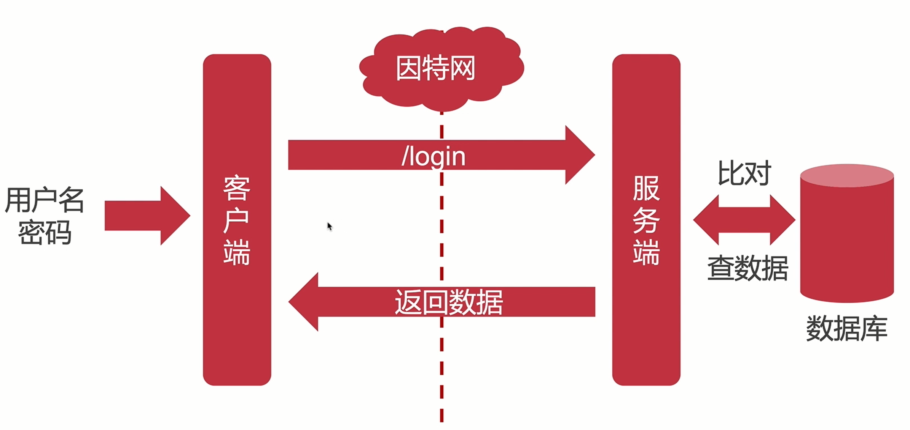
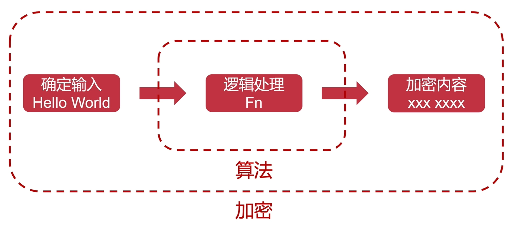
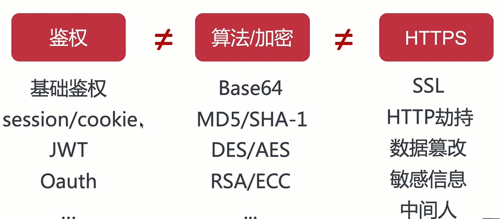
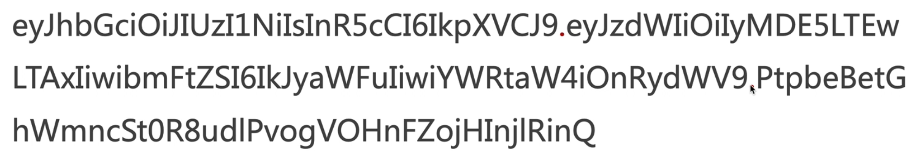
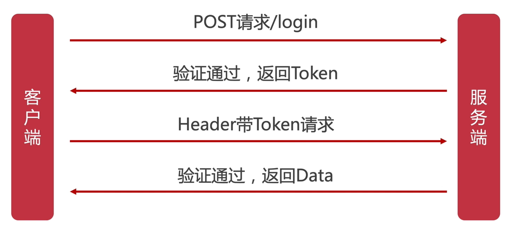

# 登陆鉴权的过程



# 鉴权、算法/加密、`HTTPS`

鉴权针对用户的身份认证，算法/加密针对传输内容的加密，`HTTPS`针对信道的加密；

算法中的指令描述的是一个计算，档期运行时能从一个初始状态和初始输入（可能为空）开始，经过一系列优先而清晰定义的状态最终产生输出并停止于一个终态；

数据加密的基本过程，就是对原来为明文的文件或数据按某种算法进行处理，使其成为一段不可读的代码，通常称为“密文”；通过这样的途径，来达到保护数据不被非法人窃取、阅读的目的；



`HTTPS（HyperText Transfer Protocol Secure）`超文本传输安全协议，常称为`HTTP over TLS`、`HTTP over SSL、HTTP Secure`）是一种通过计算机网络进行安全通信的传输协议，双方使用对称密钥进行通信，使用第三方机构对传输进行签名（对称密钥的生成等）；



# 常见的鉴权方式

常见的鉴权方式主要有：`Session Cookie`、`JWT`、`Oauth`：

+ `Session Cookie`：
  + 优点：较易扩展，简单；
  + 缺点：安全性低、(性能低、服务端存储)、多服务器同步`Session`困难、跨平台困难；

+ `JWT`：
  + 优点：易扩展、支持移动设备、跨应用调用、安全、承载信息丰富（以`JSON`形式存储）;
  + 缺点：刷新与过期处理、`PayLoad`不易过大（过大会导致传输时间过久，占用资源会比较多）、中间人攻击（无状态请求，在`Token`未过期期间，中间人只要截获`Token`即可拥有用户权限）；
+ `Oauth`：
  + 优点：开放（微信、`QQ`登陆）、安全（没有涉及用户核心信息）、简单（容易理解和使用）、权限指定（需要用户授权）；
  + 缺点：需要增加授权服务器、增加网络请求（耗费更多时间）；

# `JWT`

`JWT`全称是`JSON Web Token`，一个`JWT`由三部分组成：`Header`、`PayLoad`、`Signature`；

一个`JWT`的结构可以使用如下的例子进行表示：

+ `Header`部分：

  ```
  {
     "alg":"HS156", //加密算法
     "typ":"JWT"//Token的类型
  }
  ```

+ `PayLoad`部分，记录数据：

  ```
  {
     "sub":"2019-10-01",
     "name":"solingjees",
     "admin":true
  }
  ```

+ `Signature`，使用`Header`、`PayLoad`、`Secret`进行签名；

  ```
  HMACSHA256(
    base64UrlEncode(header) + "." +
  base64UrlEncode(payload),
    secret
  )
  ```
  

`Header`、`PayLoad`、`Signature`分别会再次使用`Header`中的`alg`指定的加密方法进行加密，最终生成一串以`.`分隔`Header`、`PayLoad`、`Signature`的`JWT`字符串；



`JWT`拥有以下的特点：

+ 防`CSRF`（主要是伪造请求，因为没有`Cookie`）；
+ 适合移动应用（移动`App`没有`Cookie`，所以不适合使用`Coookie Session`方案）；
+ 无状态，服务器不存储`JWT`；

`JWT`的工作原理如下：



当客户端发起`login`请求，在服务端验证通过后，会使用一个`secret`来生成一个`Token`来标注一个用户，这个`Token`包藏一些用户的认证信息，接下来每一次该用户发起请求都会带上这个`Token`，然后在服务端每一次都会对传输来的请求中的`Token`进行验证（根据`secret`使用`Header`、`payLoad`的加密后的字符串来算出`Signature`进行匹配验证用户身份）；

为了保证`Token`不会被中间人所获取，一般我们会将这个信道用`HTTPS`进行加密；

# `API`安全设计

+ 通信信道加密：`HTTPS`；
+ 通信数据加密：密文+加密关键数据；
+ 通信安全策略：授权中间层（`oAuth`）、尝试次数、过期策略...；


