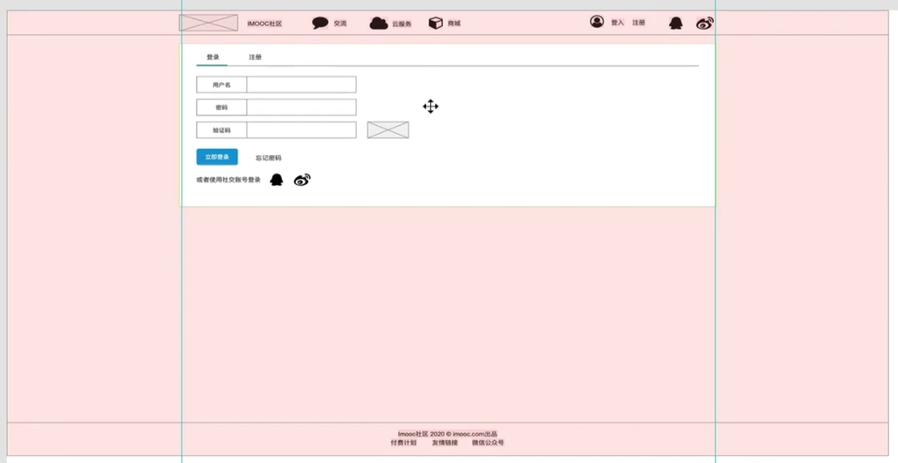

# [`Axure`]图标引用

如果我们需要使用一些图标，如`QQ`、`微博`等，我们可以在`AXURE`左下角的`LIBRARIES`中搜索我们需要的图标，然后拖到画纸上：


然后我们选中拖进来的图标，在右侧的`STYLE`中选中`width`和`height`上的锁来固定比例，接着我们可以修改`width`或`height`将我们的图标缩放到想要的大小；


# [`Axure`]作图参考线、参考方框

在实际绘制线框图、`UI`设计图时，我们一般设计在`1920 * 1080px`的基础上，并且一般社区类网站的主体部分宽度为`1000~1200px（推荐）`；

一般我们会先定下主体的宽度，比如为`1200px`，然后会使用以下两种参考物来约束绘制区域；

我们可以从左侧的标尺栏拖出两条参考线，来约束我们的作图范围，这两条参考线要关于显网页页面中线对称，比如`1200px`的主体，那么左参考线距网页页面左边界`360px`，右参考线距网页页面右边界`360px`：



也可以使用一个空白方框作为参考物，让我们的所有设计都在这个空白方框的范围内，一般空白方框和参考线一样关于网页页面中线对称，宽度为主体宽度，如`1200px`；


一般这两种方法一起使用来约束绘制空间；

# [`Axure`]表单细节的把握

一般`input`输入框高度设计为`35~45px`之间，老年系统、党政系统等系统高度设计为`60px`；

`input`框的输入部分不会定格设计，一般`6~12px`之间；

表单中的不同元素上下一般间隔为`10~16px`之间；

移动端的设计需要使用`rem`而不是`px`；

# [`Axure`]页面模板

对于一些我们需要的底，我们可以将其保存为一个模板，比如`Header`、`Footer`、空白的主体部分几乎在每一个页面中都会使用到，因此我们可以选中这些元素，然后右键`Create Master`来生成一个模板；


然后我们就可以在左下角的`Masters`区域查看到我们新建的`Master`了，然后我们选中新建的`Master`修改`Drop Behavior`为`Lock to Master Location`，这样当我们将`Master`拖拽到一个新的页面设计中时会自动定位到该`Master`在原来的页面中的位置；


比如我们的`Header`、`Footer`、空白主体组成的`Master`本来在`(0,0)`的位置，拖入到主页的页面设计中会自动定位到`(0,0)`的位置；


# [软件结构设计]内容设计

左上角是用户查看的黄金部分，适合放置`logo`、核心导航菜单、登录/注册等等；

接下来就是当前页面的分类、主体等核心导航部分适合放置在靠左的部分，`分类`会放在顶层；

其他比如广告、用户积分非核心业务的部分放置右侧较为合适；

因此一般我们需要根据我们的业务模型分清主次来进行设计，一般社区应用的首页的主要部分都是列表形式的，然后会带上一个标签：用户、积分、讨论量、时间等等，而我们只需要设计一个列表元素即可完成主体列表的设计了；


> 如何去理解数据库的结构设计是一个非常困难的过程，这里只是提供这样的小小的样板，真正要去理解无法使用简单的文档去说明；

# [需求分析]从原型设计中提取数据库结构

以`users`表为例，我们需要确定一个用户他的信息，我们可以从以下几个核心的地方提取核心信息；

第一个是注册页面，我们可以知道用户名、密码、昵称几个字段；


第二个是用户中心，我们可以知道积分、`VIP`状态、签到信息等等；


第三个是设置，我们可以知道头像、城市、性别、签名、账号绑定等等信息：


通过以上的基本分析我们可以基本定下`users`表的核心字段；

因此，实际上要从我们的设计图中得到数据库的字段设计其实并不难，我们需要去理解项目的运营方式，然后去分解项目的需求，最终找到底层的成分：中心成分、边缘成分，实际上对于一个社区类的应用，一直围绕两个中心成分：用户、文章，然后我们需要围绕这两个点去寻找各个设计图中的点，来形成自己一个初步的范围，之后对于一些边缘成分，作进一步展开，比如友情链接这些边缘的成分；

# [数据库结构设计]社区应用的数据库划分范例

对于一个典型的社区`web`应用，我们将它划归为以下几个表，表的扩展基本都是基于该部分的信息比较庞大，所以要拆出来，比较典型的是`comments`表需要从`post`表中拆出来独立成一张表：


# [`ShowDoc`]利用`ShowDoc`制作数据字典

`showDoc`的使用方式不再赘述，新建项目、新建目录、新建文档，然后在文档里使用`markdown`编写文档即可，最后保存退出，其实最主要的不同是我们使用的模板是数据字典，除此之外没什么不同；

数据字典定义数据库中的一张表所保存的字段；

一般我们都是在根目录下新建一个数据库文件夹用于保存所有的数据字典，命名采用`表名+中文解释名`，如下是一个数据字典范例：


# [`SEO`]友情链接的功能：`SEO(Search Engine Optimization)`

友情链接可以提高搜索引擎的排名，当我们的网站存在一个向外的链接，爬虫在爬取页面时，会进一步爬取进这个向外的链接，如果两个网站互为友情链接，那么这两个网站的排名就是互惠的；

我们可以通过以下方法来进行`SEO`优化：

+ 资源的大小影响爬虫的爬取时间和质量评定，因此资源压缩、请求压缩非常重要；
+ `CDN`加速，这个方法主要是服务器只传输静态`html`文件，然后其他文件通过`CDN`进行加速下载，来降低爬虫爬取时间；
+ 设置缓存，设置`DNS`预处理，这个方法也能加速文件的下载，来降低爬虫的爬取时间；

# [接口设计]接口设计原则

+ 简单：高内聚，与业务对应，一个业务的接口请求应当尽量少，精简接口传递数据，不传无关和敏感数据；
+ 高效：属性设计、数据结构，方法抽象，属性要读得懂，结构要简单，数据要精简，尽量用`ID`替代文本；
+ 兼容：尽量保证兼容，进行接口的版本与状态控制，使用扩展字段和新接口来进行接口扩展；

两种典型的接口设计错误：


第一种是传递了敏感数据，如`password`；

第二种是结构复杂不易懂，对于非关系数据库这很容易存储，但是对于关系型数据库，过多的层次嵌套会使得处理很麻烦，比如存储和查询（特别是联合查询），而且如果使用一些没有意义的`key`，会使得整个接口阅读困难，给后端造成一些困扰，因此建议将这样的接口请求拆分成多个请求，来提升可读性和数据库可操作性；

# [`ShowDoc`]利用`ShowDoc`编写接口文档

在我们实际的开发中，我们应当在接口文档的根目录下新建一个文档为`项目说明`，这样当我们第一次进入接口文档 时，首先会载入`项目说明`文档，方便相关干系人的查阅，如下是一个`项目说明`格式范例：


然后我们以设计文章列表接口为例，来设计接口，以下是我们需要参考的`UI`设计师提供的稿子，我们要从这张稿子中来提取一个`list`我们所需要设计的接口，这种技能在于不断地去拆解分析每一个页面上的细节，比如顶部的分类栏目、`list`顶部的分类栏目和排序栏目，都是我们需要考虑的细节；同时要注意接口的数据嵌套等等；

最重要的，还是直接看例子，能够参透很多东西；


详细文章列表的接口`markdown`文档如下：

```markdown
**简要描述：** 

- 文章列表接口

**请求URL：** 
- ` /public/list `
- 在实际的开发中，`/public`接口下的所有接口都被设计为不需要经过`JWT`鉴权，因为这些接口背后的业务本身是公开的不需要登陆权限的，这样设计能充分利用`JWT`来实现接口的权限控制
  
**请求方式：**
- GET 

**参数：** 

|参数名|必选|类型|说明|
|:----    |:---|:----- |-----   |
|type |是  |string |0-普通列表，1-置顶列表   |
|page |是  |string | 第几页    |
|limit     |否  |string | 每页的数量，默认是10    |
|catalog     |否  |string | 分类的名称，默认是`index`    |
|sort |是  |string | 文章的排序，默认按照`created`创建时间倒序排列，否则按照回复数量进行排列    |
|status |是  |string | 文章的状态，''-代表全部，0-未关闭，1-已结帖    |


 **返回示例**

​``` 
  {
    "code": 200
    "data": [{
      "tid": "1",
      "title": "这里是标题",
      "catalog": "index",
      "fav": "20" ,
      "created": "2019-10-01 00:00:00",
	  "isEnd":"0",
	  "isTop":"0",
	  "sort":"0",
	  "answer":"0",
	  "status":"0",
	  "user":{
          "id":"用户ID",
          "isVip":"0",
          "name":"用户昵称",
          "pic":"用户头像"
	  }
    }],
	"msg":"服务端的消息"
  }
​```

 **返回参数说明**

|参数名|类型|说明|
|:-----  |:-----|-----                           |
|code |int   |200-成功，500-服务器返回的异常消息，取msg  |
|data |Array   |文章列表  |
|msg |string   |系统的消息数据  |

`data`中`Array`数据的示例：

|参数名|类型|说明|
|:-----  |:-----|-----   
|tid    |ObjwctId     |  默认产生的ObjectId("")，取的时候使用_id     |
|uid |String | 用户ID  |
|title |String   |   文章标题    |
|content     |String    |    文章内容     |
|created |Date    |   创建时间  |
|catlog | String     |  帖子分类，index-全部，ask-提问，advice-建议，discuss-交流，share-分享 ，news-动态 |
|fav | String |帖子积分|
|isEnd |Number |0-未结束，1-已结帖|
|reads| Number  |阅读计数|
|answer| Number  |回复计数|
|status| Number  |0-打开回复，1-关闭回复|
|isTop| Number  |是否置顶，0-未置顶，1-置顶|
|sort| Number  |置顶排序|
|tags| String  |文章标签，精华，加精，etc|


`user`对象的说明：

|参数名|类型|说明|
|:-----  |:-----|-----  
|id    |string    | 用户ID     |
|name    |string     | 用户昵称   |
|isVip    |string     | 是否是会员，0-普通用户，1-会员   |
|pic    |string     | 用户头像   |
 **备注** 

- 更多返回错误代码请看首页的错误代码描述


欢迎使用ShowDoc！
```

# [组件设计]组件化思想和原则

什么是组件化？一张图告诉你：


那么我们怎么来践行组件化思想来提升网站开发的可操作性呢？有以下几条原则：

+ 独立功能模块（松耦合、扁平化、提炼精华）；
+ 独立的状态变化（统一的状态管理）；
+ 从上而下的逻辑思考，从下而上的组件拆分；

对于一个社区网站的首页来说，我们进行这样的拆分：

+ 页面头、尾通用结构->`Header`、`Footer`；
+ 列表->列表元素->方便后续扩展->`List`；
+ 侧边栏按功能进行组件拆分->`Links`、`Sign`；


如上图，我们的首页中的绝大多数内容的请求接口都应当设计在`/public`接口下；

同时侧边栏部分的组件都应当是公共组件，方便我们的移植；


